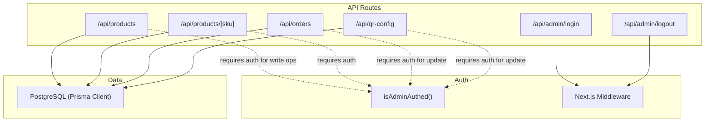
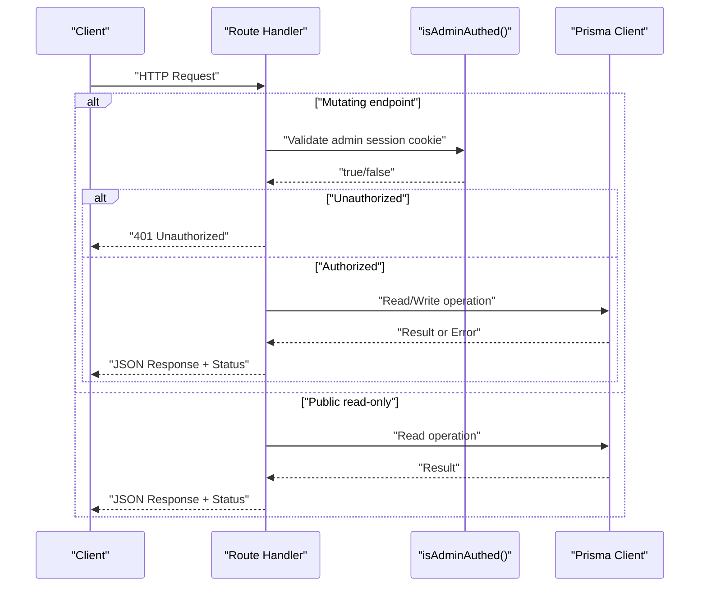
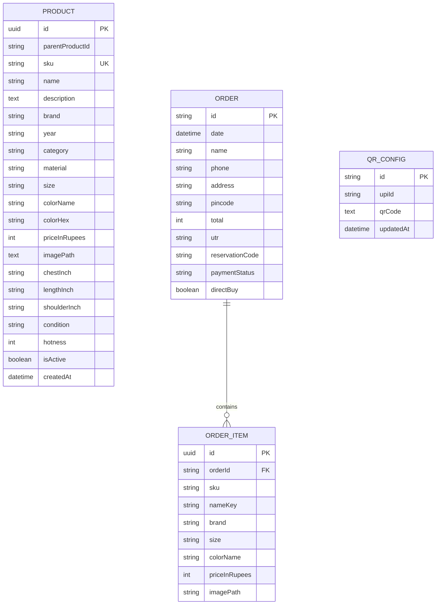
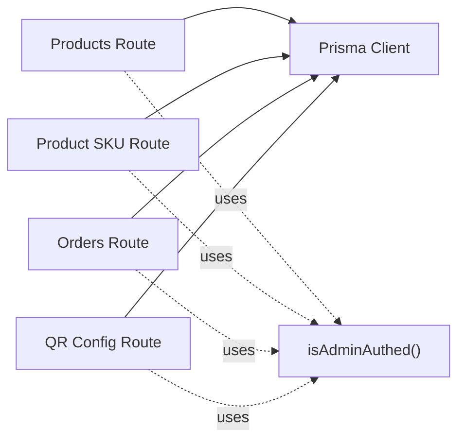

# API Reference

<cite>
**Referenced Files in This Document**
- [products route](file://src/app/api/products/route.ts)
- [product by SKU route](file://src/app/api/products/[sku]/route.ts)
- [orders route](file://src/app/api/orders/route.ts)
- [QR config route](file://src/app/api/qr-config/route.ts)
- [admin login route](file://src/app/api/admin/login/route.ts)
- [admin logout route](file://src/app/api/admin/logout/route.ts)
- [auth helper](file://src/lib/auth.ts)
- [Next.js middleware](file://src/middleware.ts)
- [Prisma schema](file://prisma/schema.prisma)
</cite>

## Table of Contents
1. [Introduction](#introduction)
2. [Project Structure](#project-structure)
3. [Core Components](#core-components)
4. [Architecture Overview](#architecture-overview)
5. [Detailed Component Analysis](#detailed-component-analysis)
6. [Dependency Analysis](#dependency-analysis)
7. [Performance Considerations](#performance-considerations)
8. [Troubleshooting Guide](#troubleshooting-guide)
9. [Conclusion](#conclusion)
10. [Appendices](#appendices)

## Introduction
This document provides a comprehensive reference for the RESTful APIs exposed by the next.in e-commerce platform. It covers:
- Products API: listing, creating, updating, and soft-deleting products
- Orders API: listing orders, placing new orders, and updating payment status
- QR Config API: retrieving and updating UPI and QR code configuration
- Admin Auth API: cookie-based session authentication for admin operations

Authentication is implemented via HTTP-only cookies. Mutating endpoints require a valid admin session token set as a cookie. The documentation includes request/response schemas, parameter specifications, error formats, status codes, and example calls.

## Project Structure
The API routes are organized under Next.js App Router’s /api directory. Each endpoint is implemented as a Route Handler file that exports HTTP method handlers (GET, POST, PUT, PATCH, DELETE). Data persistence uses Prisma with PostgreSQL.

**Diagram sources**
- [products route:1-98](file://src/app/api/products/route.ts#L1-L98)
- [product by SKU route:1-35](file://src/app/api/products/[sku]/route.ts#L1-L35)
- [orders route:1-134](file://src/app/api/orders/route.ts#L1-L134)
- [QR config route:1-71](file://src/app/api/qr-config/route.ts#L1-L71)
- [admin login route:1-29](file://src/app/api/admin/login/route.ts#L1-L29)
- [admin logout route:1-12](file://src/app/api/admin/logout/route.ts#L1-L12)
- [auth helper:1-16](file://src/lib/auth.ts#L1-L16)
- [Next.js middleware:1-27](file://src/middleware.ts#L1-L27)

**Section sources**
- [products route:1-98](file://src/app/api/products/route.ts#L1-L98)
- [product by SKU route:1-35](file://src/app/api/products/[sku]/route.ts#L1-L35)
- [orders route:1-134](file://src/app/api/orders/route.ts#L1-L134)
- [QR config route:1-71](file://src/app/api/qr-config/route.ts#L1-L71)
- [admin login route:1-29](file://src/app/api/admin/login/route.ts#L1-L29)
- [admin logout route:1-12](file://src/app/api/admin/logout/route.ts#L1-L12)
- [auth helper:1-16](file://src/lib/auth.ts#L1-L16)
- [Next.js middleware:1-27](file://src/middleware.ts#L1-L27)
- [Prisma schema:1-67](file://prisma/schema.prisma#L1-L67)

## Core Components
- Authentication helper: validates an admin session cookie against an environment variable.
- Next.js middleware: enforces session checks for protected UI pages (/admin/*).
- Product endpoints: GET list, POST create, PATCH update by SKU, DELETE soft-delete by query param.
- Order endpoints: GET list, POST create, PUT update payment status.
- QR Config endpoints: GET retrieve, POST upsert configuration.

Key security notes:
- All mutating endpoints check for a valid admin session cookie using the helper.
- Session cookie is httpOnly and secure in production; sameSite lax.
- Login endpoint sets the cookie on success; logout clears it.

**Section sources**
- [auth helper:1-16](file://src/lib/auth.ts#L1-L16)
- [Next.js middleware:1-27](file://src/middleware.ts#L1-L27)
- [admin login route:1-29](file://src/app/api/admin/login/route.ts#L1-L29)
- [admin logout route:1-12](file://src/app/api/admin/logout/route.ts#L1-L12)

## Architecture Overview
The API follows a simple serverless-style architecture where each route handler performs validation, authorization, and data access. Responses are JSON. Errors return structured objects with appropriate HTTP status codes.

**Diagram sources**
- [products route:1-98](file://src/app/api/products/route.ts#L1-L98)
- [product by SKU route:1-35](file://src/app/api/products/[sku]/route.ts#L1-L35)
- [orders route:1-134](file://src/app/api/orders/route.ts#L1-L134)
- [QR config route:1-71](file://src/app/api/qr-config/route.ts#L1-L71)
- [auth helper:1-16](file://src/lib/auth.ts#L1-L16)

## Detailed Component Analysis

### Authentication (Admin Cookie-Based Sessions)
- Mechanism:
  - Login sets an httpOnly cookie named admin_session with a value from ADMIN_SESSION_TOKEN.
  - Logout clears the cookie.
  - Mutating endpoints validate the cookie via isAdminAuthed().
  - Next.js middleware protects /admin/* pages by redirecting to login if not authenticated.

- Endpoints:
  - POST /api/admin/login
    - Purpose: Authenticate admin and set session cookie.
    - Request body: { password: string }
    - Success response: { success: boolean }
    - Errors:
      - 401 Invalid password
      - 400 Invalid request
    - Notes: Small delay on failure to mitigate brute-force.

  - POST /api/admin/logout
    - Purpose: Clear session cookie.
    - Success response: { success: boolean }

- Example calls:
  - Login
    - Request:
      - Method: POST
      - URL: /api/admin/login
      - Headers: Content-Type: application/json
      - Body: { "password": "<ADMIN_PASSWORD>" }
    - Response:
      - Status: 200
      - Body: { "success": true }
      - Set-Cookie: admin_session=<TOKEN>; HttpOnly; Secure; SameSite=Lax; Max-Age=604800; Path=/

  - Logout
    - Request:
      - Method: POST
      - URL: /api/admin/logout
    - Response:
      - Status: 200
      - Body: { "success": true }
      - Set-Cookie: admin_session=""; HttpOnly; Max-Age=0; Path=/

**Section sources**
- [admin login route:1-29](file://src/app/api/admin/login/route.ts#L1-L29)
- [admin logout route:1-12](file://src/app/api/admin/logout/route.ts#L1-L12)
- [auth helper:1-16](file://src/lib/auth.ts#L1-L16)
- [Next.js middleware:1-27](file://src/middleware.ts#L1-L27)

### Products API
- Base path: /api/products

- GET /api/products
  - Purpose: List all active products.
  - Authorization: None (public read).
  - Query parameters: none.
  - Response: Array of product objects.
  - Error responses:
    - 500 { error: "Failed to fetch products" }

- POST /api/products
  - Purpose: Create a new product.
  - Authorization: Requires admin session cookie.
  - Request body fields:
    - sku: string (required)
    - parentProductId: string | null (optional)
    - name: string (required)
    - description: string (optional)
    - brand: string (required)
    - year: string (optional; defaults to current year)
    - category: string (required)
    - material: string (optional)
    - size: string (optional)
    - colorName: string (optional)
    - colorHex: string (optional; default "#000000")
    - priceInRupees: number (required)
    - imagePath: string (required)
    - chestInch: string (optional)
    - lengthInch: string (optional)
    - shoulderInch: string (optional)
    - condition: string (optional; default "condVeryGood")
    - hotness: number (optional; default 3)
  - Success response: Created product object.
  - Error responses:
    - 401 Unauthorized
    - 400 Missing required fields
    - 409 SKU already exists
    - 500 Failed to create product

- PATCH /api/products/[sku]
  - Purpose: Update a product by its SKU.
  - Authorization: Requires admin session cookie.
  - Path parameters:
    - sku: string
  - Request body: Partial product fields to update.
  - Success response: Updated product object.
  - Error responses:
    - 401 Unauthorized
    - 409 SKU already exists (if updating to a duplicate SKU)
    - 500 Failed to update product

- DELETE /api/products?sku=xxx
  - Purpose: Soft-delete a product by setting isActive=false.
  - Authorization: Requires admin session cookie.
  - Query parameters:
    - sku: string (required)
  - Success response: { success: boolean }
  - Error responses:
    - 401 Unauthorized
    - 400 SKU is required
    - 500 Failed to delete product

- Example calls:
  - List products
    - Method: GET
    - URL: /api/products
    - Response: 200 OK, array of products

  - Create product
    - Method: POST
    - URL: /api/products
    - Headers: Content-Type: application/json
    - Body: { "sku": "TSHIRT-001", "name": "Vintage Tee", "brand": "BrandX", "category": "tees", "priceInRupees": 1200, "imagePath": "/products/vintage-tee.jpg", ... }
    - Response: 201 Created, product object

  - Update product
    - Method: PATCH
    - URL: /api/products/TSHIRT-001
    - Headers: Content-Type: application/json
    - Body: { "priceInRupees": 1100 }
    - Response: 200 OK, updated product

  - Soft-delete product
    - Method: DELETE
    - URL: /api/products?sku=TSHIRT-001
    - Response: 200 OK, { "success": true }

**Section sources**
- [products route:1-98](file://src/app/api/products/route.ts#L1-L98)
- [product by SKU route:1-35](file://src/app/api/products/[sku]/route.ts#L1-L35)

### Orders API
- Base path: /api/orders

- GET /api/orders
  - Purpose: Retrieve all orders with items, sorted by date descending.
  - Authorization: None (public read).
  - Response: Array of order summaries including customer info and items.
  - Error handling: Returns empty array if database is unavailable.

- POST /api/orders
  - Purpose: Place a new order.
  - Authorization: None (public write).
  - Request body fields:
    - id: string (required)
    - name: string (required)
    - phone: string (required)
    - address: string (required)
    - pincode: string (required)
    - total: number (required)
    - utr: string (required)
    - reservationCode: string (required)
    - directBuy: boolean (optional)
    - items: array of item objects (required)
      - Each item:
        - sku: string
        - nameKey: string
        - brand: string
        - size: string
        - colorName: string (optional)
        - priceInRupees: number
        - imagePath: string
  - Success response: { success: boolean, order: createdOrderWithItems }
  - Error responses:
    - 400 Missing required order fields
    - 500 Database error while placing order

- PUT /api/orders
  - Purpose: Update order payment status.
  - Authorization: Requires admin session cookie.
  - Request body fields:
    - id: string (required)
    - paymentStatus: string (required; e.g., "pending", "verified")
  - Success response: { success: boolean, order: updatedOrderWithItems }
  - Error responses:
    - 401 Unauthorized
    - 400 id and paymentStatus are required
    - 500 Database error while updating order status

- Example calls:
  - Place order
    - Method: POST
    - URL: /api/orders
    - Headers: Content-Type: application/json
    - Body: { "id": "ORD-001", "name": "Jane Doe", "phone": "+919876543210", "address": "123 Main St", "pincode": "560001", "total": 2400, "utr": "UTR123456789", "reservationCode": "RES-ABC", "items": [{ "sku": "TSHIRT-001", "nameKey": "vintage_tee", "brand": "BrandX", "size": "M", "colorName": "Black", "priceInRupees": 1200, "imagePath": "/products/vintage-tee.jpg" }] }
    - Response: 200 OK, { "success": true, "order": {...} }

  - Update payment status
    - Method: PUT
    - URL: /api/orders
    - Headers: Content-Type: application/json
    - Body: { "id": "ORD-001", "paymentStatus": "verified" }
    - Response: 200 OK, { "success": true, "order": {...} }

**Section sources**
- [orders route:1-134](file://src/app/api/orders/route.ts#L1-L134)

### QR Config API
- Base path: /api/qr-config

- GET /api/qr-config
  - Purpose: Retrieve UPI ID and QR code path.
  - Authorization: None (public read).
  - Behavior:
    - If no config exists, returns defaults and marks isDefault=true.
    - If DB unavailable, returns defaults with error flag DB_UNAVAILABLE.
  - Response:
    - upiId: string
    - qrCode: string
    - isDefault: boolean
    - error?: string (only when DB unavailable)

- POST /api/qr-config
  - Purpose: Upsert QR configuration (create or update).
  - Authorization: Requires admin session cookie.
  - Request body fields:
    - upiId: string (required)
    - qrCode: string (required)
  - Success response: { success: boolean, upiId: string, qrCode: string }
  - Error responses:
    - 401 Unauthorized
    - 400 upiId and qrCode are required
    - 500 Database error while updating configuration

- Example calls:
  - Get QR config
    - Method: GET
    - URL: /api/qr-config
    - Response: 200 OK, { "upiId": "...", "qrCode": "/qr_code.jpg", "isDefault": true }

  - Update QR config
    - Method: POST
    - URL: /api/qr-config
    - Headers: Content-Type: application/json
    - Body: { "upiId": "merchant@okicici", "qrCode": "/qr_updated.jpg" }
    - Response: 200 OK, { "success": true, "upiId": "...", "qrCode": "..." }

**Section sources**
- [QR config route:1-71](file://src/app/api/qr-config/route.ts#L1-L71)

### Data Models
The following models are persisted via Prisma. They inform the shape of request/response payloads.

**Diagram sources**
- [Prisma schema:1-67](file://prisma/schema.prisma#L1-L67)

**Section sources**
- [Prisma schema:1-67](file://prisma/schema.prisma#L1-L67)

## Dependency Analysis
- Route handlers depend on:
  - Prisma client for database operations
  - isAdminAuthed() for authorization checks on mutating endpoints
- Next.js middleware protects admin UI routes but does not directly guard API routes; API routes perform their own cookie checks.

**Diagram sources**
- [products route:1-98](file://src/app/api/products/route.ts#L1-L98)
- [product by SKU route:1-35](file://src/app/api/products/[sku]/route.ts#L1-L35)
- [orders route:1-134](file://src/app/api/orders/route.ts#L1-L134)
- [QR config route:1-71](file://src/app/api/qr-config/route.ts#L1-L71)
- [auth helper:1-16](file://src/lib/auth.ts#L1-L16)

**Section sources**
- [products route:1-98](file://src/app/api/products/route.ts#L1-L98)
- [product by SKU route:1-35](file://src/app/api/products/[sku]/route.ts#L1-L35)
- [orders route:1-134](file://src/app/api/orders/route.ts#L1-L134)
- [QR config route:1-71](file://src/app/api/qr-config/route.ts#L1-L71)
- [auth helper:1-16](file://src/lib/auth.ts#L1-L16)

## Performance Considerations
- Database availability:
  - Orders GET gracefully returns an empty array when the database is unavailable.
  - QR Config GET falls back to local defaults and signals DB_UNAVAILABLE.
- Unique constraints:
  - SKU uniqueness is enforced at the database level; clients should handle 409 conflicts.
- Sorting and filtering:
  - Products are returned ordered by creation date descending.
  - Orders are returned ordered by date descending.
- Payload sizes:
  - Avoid sending large images inline; use image paths as shown.

[No sources needed since this section provides general guidance]

## Troubleshooting Guide
Common issues and resolutions:
- 401 Unauthorized on mutating endpoints:
  - Ensure the admin_session cookie is present and matches the expected token.
  - Verify you have successfully logged in via POST /api/admin/login.
- 400 Missing required fields:
  - Validate request bodies against the documented field requirements.
- 409 Conflict (SKU already exists):
  - Choose a unique SKU or update existing product instead of creating a duplicate.
- Database errors:
  - Orders GET may return an empty array if the database is down.
  - QR Config GET may include error: "DB_UNAVAILABLE" when falling back to defaults.
- Brute-force protection:
  - Login endpoint introduces a small delay on invalid password attempts.

**Section sources**
- [products route:1-98](file://src/app/api/products/route.ts#L1-L98)
- [product by SKU route:1-35](file://src/app/api/products/[sku]/route.ts#L1-L35)
- [orders route:1-134](file://src/app/api/orders/route.ts#L1-L134)
- [QR config route:1-71](file://src/app/api/qr-config/route.ts#L1-L71)
- [admin login route:1-29](file://src/app/api/admin/login/route.ts#L1-L29)

## Conclusion
The next.in API provides straightforward endpoints for managing products, orders, and QR payment configuration. Authentication relies on httpOnly cookies validated per-request for mutating operations. Clients should handle standard error responses, respect unique constraints, and ensure proper cookie management across requests.

[No sources needed since this section summarizes without analyzing specific files]

## Appendices

### Security and Best Practices
- Authentication:
  - Always send the admin_session cookie with mutating requests.
  - Use HTTPS in production to benefit from the Secure cookie flag.
- Input validation:
  - Validate all required fields before sending requests.
  - Handle 400 and 409 responses appropriately.
- Rate limiting:
  - No explicit rate limiting is implemented in the provided routes. Consider adding middleware or external rate limiting at the edge/proxy layer to protect endpoints.
- CORS:
  - Ensure your frontend origin is allowed if making cross-origin requests.
- Idempotency:
  - For order placement, consider implementing idempotency keys if retries are possible.

[No sources needed since this section provides general guidance]