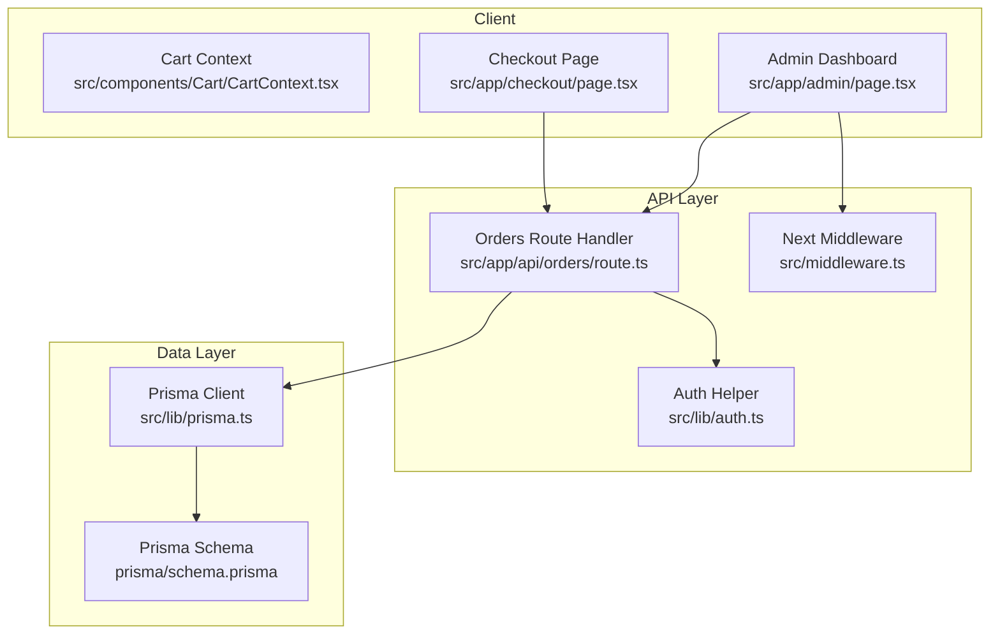
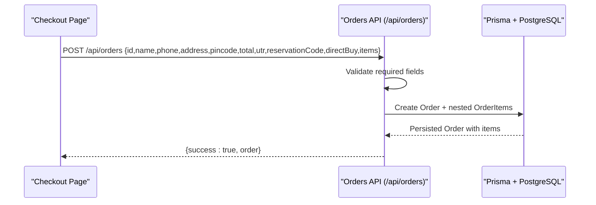
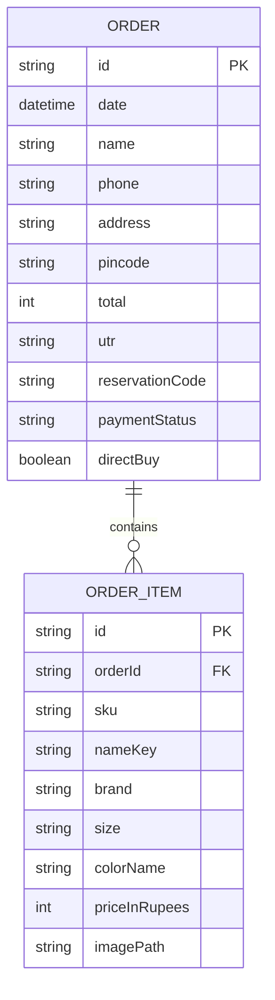
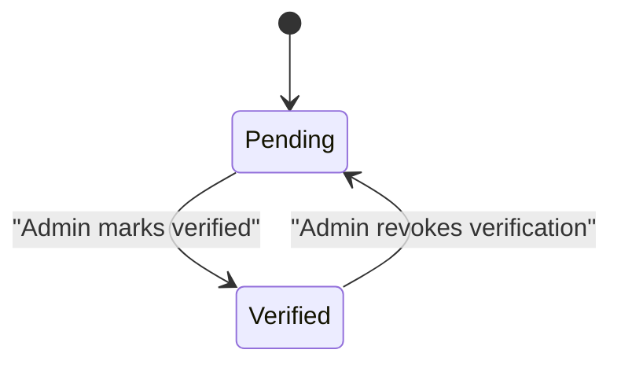
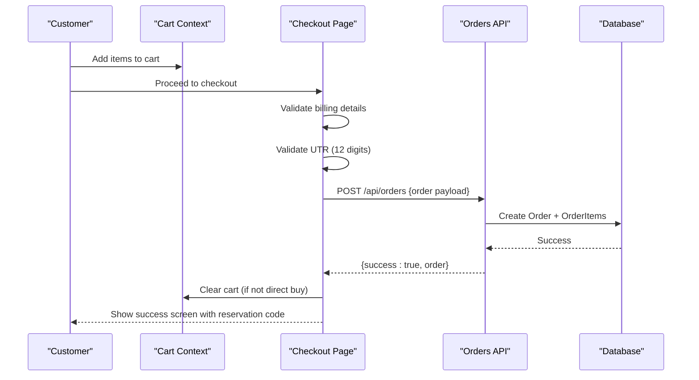
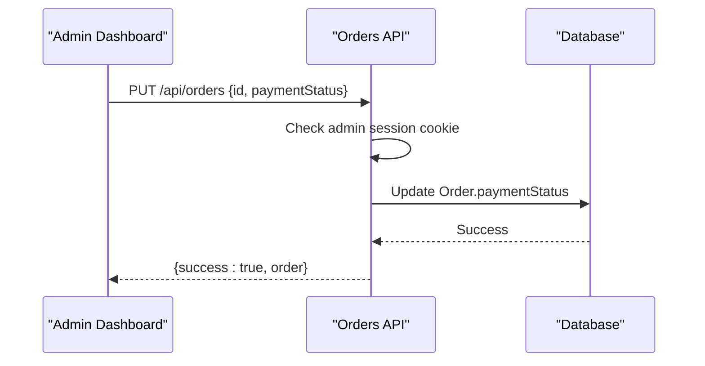
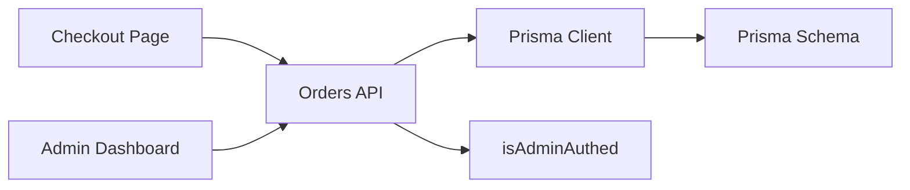

# Orders API

<cite>
**Referenced Files in This Document**
- [route.ts](file://src/app/api/orders/route.ts)
- [schema.prisma](file://prisma/schema.prisma)
- [auth.ts](file://src/lib/auth.ts)
- [middleware.ts](file://src/middleware.ts)
- [page.tsx (Checkout)](file://src/app/checkout/page.tsx)
- [page.tsx (Cart)](file://src/app/cart/page.tsx)
- [page.tsx (Admin)](file://src/app/admin/page.tsx)
- [prisma.ts](file://src/lib/prisma.ts)
</cite>

## Table of Contents
1. [Introduction](#introduction)
2. [Project Structure](#project-structure)
3. [Core Components](#core-components)
4. [Architecture Overview](#architecture-overview)
5. [Detailed Component Analysis](#detailed-component-analysis)
6. [Dependency Analysis](#dependency-analysis)
7. [Performance Considerations](#performance-considerations)
8. [Troubleshooting Guide](#troubleshooting-guide)
9. [Conclusion](#conclusion)

## Introduction
This document provides comprehensive API documentation for the Orders API endpoints used to create, retrieve, and manage order statuses. It covers request/response schemas, authentication requirements, validation rules, error handling patterns, and end-to-end workflows including order placement, payment verification, and status updates. It also explains integration with the shopping cart system and reservation code generation.

## Project Structure
The Orders API is implemented as a Next.js Route Handler under src/app/api/orders/route.ts. The data model is defined in Prisma schema, and admin-only operations are protected by middleware and helper functions. The checkout flow integrates with the cart context to assemble orders and submit them to the API.

**Diagram sources**
- [route.ts:1-134](file://src/app/api/orders/route.ts#L1-L134)
- [schema.prisma:16-42](file://prisma/schema.prisma#L16-L42)
- [auth.ts:1-16](file://src/lib/auth.ts#L1-L16)
- [middleware.ts:1-27](file://src/middleware.ts#L1-L27)
- [page.tsx (Checkout):1-658](file://src/app/checkout/page.tsx#L1-L658)
- [page.tsx (Admin):1-200](file://src/app/admin/page.tsx#L1-L200)
- [prisma.ts:1-23](file://src/lib/prisma.ts#L1-L23)

**Section sources**
- [route.ts:1-134](file://src/app/api/orders/route.ts#L1-L134)
- [schema.prisma:16-42](file://prisma/schema.prisma#L16-L42)
- [auth.ts:1-16](file://src/lib/auth.ts#L1-L16)
- [middleware.ts:1-27](file://src/middleware.ts#L1-L27)
- [page.tsx (Checkout):1-658](file://src/app/checkout/page.tsx#L1-L658)
- [page.tsx (Cart):1-417](file://src/app/cart/page.tsx#L1-L417)
- [page.tsx (Admin):1-200](file://src/app/admin/page.tsx#L1-L200)
- [prisma.ts:1-23](file://src/lib/prisma.ts#L1-L23)

## Core Components
- Orders Route Handler: Provides GET (list), POST (create), and PUT (update payment status).
- Data Model: Order and OrderItem entities with fields for customer info, items, payment details, and tracking codes.
- Authentication: Admin-only protection for mutating operations using cookie-based session token.
- Integration Points: Checkout page constructs orders from cart or direct buy; Admin dashboard toggles payment status.

Key responsibilities:
- Input validation and mapping for order creation.
- Database persistence via Prisma.
- Admin authorization checks for status updates.
- Consistent error responses.

**Section sources**
- [route.ts:1-134](file://src/app/api/orders/route.ts#L1-L134)
- [schema.prisma:16-42](file://prisma/schema.prisma#L16-L42)
- [auth.ts:1-16](file://src/lib/auth.ts#L1-L16)

## Architecture Overview
The Orders API follows a simple client-server architecture:
- Clients (Checkout and Admin UI) call REST endpoints on /api/orders.
- The route handler validates inputs, enforces auth where required, and persists data through Prisma.
- Admin operations require a valid admin session cookie validated by middleware and helper functions.

**Diagram sources**
- [route.ts:40-99](file://src/app/api/orders/route.ts#L40-L99)
- [schema.prisma:16-42](file://prisma/schema.prisma#L16-L42)
- [page.tsx (Checkout):214-241](file://src/app/checkout/page.tsx#L214-L241)

## Detailed Component Analysis

### Orders API Endpoints

#### GET /api/orders
- Purpose: Retrieve all orders with their items, ordered by date descending.
- Authentication: Not required.
- Response: Array of order objects with mapped fields.

Response schema:
- id: string
- date: number (timestamp)
- total: number
- utr: string
- reservationCode: string
- paymentStatus: string ("pending" | "verified")
- directBuy: boolean
- items: array of OrderItem
- customerInfo: object
  - name: string
  - phone: string
  - address: string
  - pincode: string

Error handling:
- On database errors or unconfigured DB, returns an empty array.

**Section sources**
- [route.ts:5-38](file://src/app/api/orders/route.ts#L5-L38)

#### POST /api/orders
- Purpose: Create a new order with customer details, items, and payment reference.
- Authentication: Not required.
- Request body fields:
  - id: string (unique order identifier)
  - name: string
  - phone: string
  - address: string
  - pincode: string
  - total: number
  - utr: string (12-digit UPI transaction reference)
  - reservationCode: string
  - directBuy: boolean
  - items: array of OrderItem
    - sku: string
    - nameKey: string
    - brand: string
    - size: string
    - colorName: string
    - priceInRupees: number
    - imagePath: string

Validation rules:
- All top-level fields are required.
- Items must be provided as an array.

Success response:
- { success: true, order }

Error handling:
- 400 if required fields missing.
- 500 if database error occurs.

**Section sources**
- [route.ts:40-99](file://src/app/api/orders/route.ts#L40-L99)

#### PUT /api/orders
- Purpose: Update order payment status (admin only).
- Authentication: Required. Must include a valid admin session cookie.
- Request body fields:
  - id: string
  - paymentStatus: string ("pending" | "verified")

Success response:
- { success: true, order }

Error handling:
- 401 Unauthorized if not authenticated.
- 400 if required fields missing.
- 500 if database error occurs.

**Section sources**
- [route.ts:101-133](file://src/app/api/orders/route.ts#L101-L133)
- [auth.ts:1-16](file://src/lib/auth.ts#L1-L16)

### Data Models

Order entity:
- id: string (primary key)
- date: DateTime (default now())
- name: String
- phone: String
- address: String
- pincode: String
- total: Int
- utr: String
- reservationCode: String
- paymentStatus: String (default "pending", values "pending" | "verified")
- directBuy: Boolean (default false)
- items: OrderItem[] (relation)

OrderItem entity:
- id: String (primary key)
- orderId: String (foreign key to Order)
- sku: String
- nameKey: String
- brand: String
- size: String
- colorName: String
- priceInRupees: Int
- imagePath: String

**Diagram sources**
- [schema.prisma:16-42](file://prisma/schema.prisma#L16-L42)

**Section sources**
- [schema.prisma:16-42](file://prisma/schema.prisma#L16-L42)

### Authentication and Authorization
- Admin session cookie:
  - Cookie name: admin_session
  - Value: matches environment variable ADMIN_SESSION_TOKEN
- Helper function isAdminAuthed(request) validates the cookie against the expected token.
- Middleware protects admin routes (/admin/*) by redirecting unauthenticated requests to login.

Notes:
- The Orders API’s PUT endpoint uses isAdminAuthed to enforce admin-only access.
- The GET and POST endpoints do not enforce admin authentication.

**Section sources**
- [auth.ts:1-16](file://src/lib/auth.ts#L1-L16)
- [middleware.ts:1-27](file://src/middleware.ts#L1-L27)
- [route.ts:101-104](file://src/app/api/orders/route.ts#L101-L104)

### Validation Rules and Error Handling Patterns
- Missing required fields return 400 with an error message.
- Database failures return 500 with descriptive error messages.
- Unauthenticated attempts to update order status return 401.
- GET endpoint gracefully handles DB issues by returning an empty array.

**Section sources**
- [route.ts:56-61](file://src/app/api/orders/route.ts#L56-L61)
- [route.ts:92-98](file://src/app/api/orders/route.ts#L92-L98)
- [route.ts:108-113](file://src/app/api/orders/route.ts#L108-L113)
- [route.ts:126-132](file://src/app/api/orders/route.ts#L126-L132)
- [route.ts:34-37](file://src/app/api/orders/route.ts#L34-L37)

### Order Lifecycle Management
Lifecycle states:
- pending: Initial state after order creation.
- verified: Updated by admin after verifying UTR.

Workflow:
1. Customer completes checkout and submits payment details (UTR).
2. Order is created with paymentStatus = "pending".
3. Admin verifies UTR and updates paymentStatus to "verified".
4. Verified orders contribute to sales metrics in the admin dashboard.

**Diagram sources**
- [schema.prisma:26](file://prisma/schema.prisma#L26)
- [page.tsx (Admin):249-273](file://src/app/admin/page.tsx#L249-L273)

**Section sources**
- [schema.prisma:26](file://prisma/schema.prisma#L26)
- [page.tsx (Admin):249-273](file://src/app/admin/page.tsx#L249-L273)

### Integration with Shopping Cart System
- Cart Context manages cart items, reservation code generation, and expiration logic.
- Checkout page resolves items from either the cart or direct buy SKU.
- Reservation code is generated once per cart session and reused across checkout unless cleared.
- After successful order submission, standard checkout clears the cart; direct buy does not affect cart.

Key behaviors:
- Reservation code generation: random adjective-color-noun combination.
- Expiration simulation: out-of-stock detection based on expired reservation time.
- Direct buy path: bypasses cart and creates single-item order.

**Section sources**
- [page.tsx (Cart):1-228](file://src/app/cart/page.tsx#L1-L228)
- [page.tsx (Checkout):104-132](file://src/app/checkout/page.tsx#L104-L132)
- [page.tsx (Checkout):214-241](file://src/app/checkout/page.tsx#L214-L241)

### Example Workflows

#### Order Placement (Standard Checkout)

**Diagram sources**
- [page.tsx (Checkout):160-241](file://src/app/checkout/page.tsx#L160-L241)
- [route.ts:40-99](file://src/app/api/orders/route.ts#L40-L99)

#### Payment Verification (Admin)

**Diagram sources**
- [page.tsx (Admin):249-273](file://src/app/admin/page.tsx#L249-L273)
- [route.ts:101-133](file://src/app/api/orders/route.ts#L101-L133)
- [auth.ts:1-16](file://src/lib/auth.ts#L1-L16)

## Dependency Analysis
- Orders Route depends on:
  - Prisma client for database operations.
  - Auth helper for admin authorization.
- Checkout and Admin clients depend on:
  - Orders API endpoints.
  - QR config API (for payment display).
- Prisma adapter configuration ensures Neon-compatible connections.

**Diagram sources**
- [route.ts:1-134](file://src/app/api/orders/route.ts#L1-L134)
- [prisma.ts:1-23](file://src/lib/prisma.ts#L1-L23)
- [auth.ts:1-16](file://src/lib/auth.ts#L1-L16)
- [schema.prisma:16-42](file://prisma/schema.prisma#L16-L42)

**Section sources**
- [route.ts:1-134](file://src/app/api/orders/route.ts#L1-L134)
- [prisma.ts:1-23](file://src/lib/prisma.ts#L1-L23)
- [auth.ts:1-16](file://src/lib/auth.ts#L1-L16)
- [schema.prisma:16-42](file://prisma/schema.prisma#L16-L42)

## Performance Considerations
- GET /api/orders includes related items; consider pagination for large datasets.
- Avoid unnecessary re-renders in admin dashboard by memoizing computed stats.
- Use efficient queries and indexes on frequently filtered fields (e.g., paymentStatus).
- Cache QR configuration responses at the client side to reduce repeated fetches.

[No sources needed since this section provides general guidance]

## Troubleshooting Guide
Common issues and resolutions:
- Missing required fields: Ensure all fields are present when creating or updating orders.
- Unauthorized updates: Verify admin session cookie matches expected token.
- Database connectivity: Confirm DATABASE_URL and Neon adapter configuration.
- Empty orders list: If DB is unavailable, GET returns an empty array; check logs and environment variables.

Operational tips:
- Inspect console logs for detailed error messages.
- Validate UTR format (12 digits) before submission.
- Ensure reservation code is persisted and displayed correctly in success screens.

**Section sources**
- [route.ts:56-61](file://src/app/api/orders/route.ts#L56-L61)
- [route.ts:92-98](file://src/app/api/orders/route.ts#L92-L98)
- [route.ts:101-104](file://src/app/api/orders/route.ts#L101-L104)
- [route.ts:34-37](file://src/app/api/orders/route.ts#L34-L37)
- [prisma.ts:9-13](file://src/lib/prisma.ts#L9-L13)

## Conclusion
The Orders API provides essential capabilities for order creation, retrieval, and status management within a secure, admin-controlled workflow. It integrates seamlessly with the shopping cart system and supports a clear order lifecycle from pending to verified. Proper validation, consistent error handling, and robust authentication ensure reliability and security across the platform.

[No sources needed since this section summarizes without analyzing specific files]