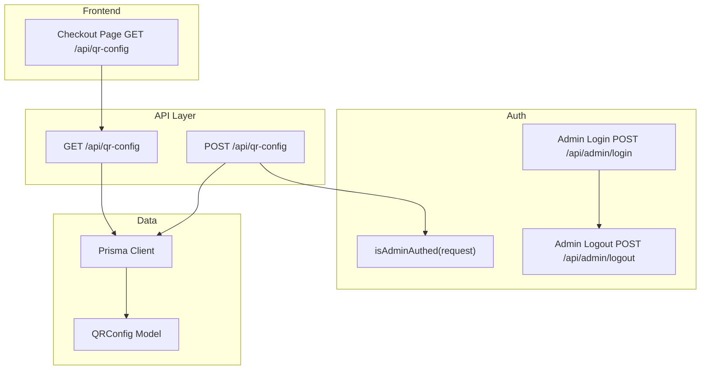
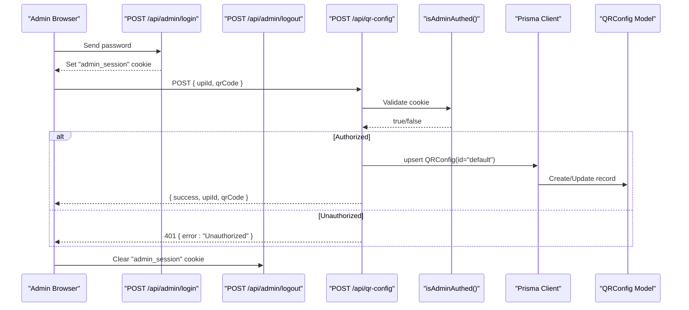
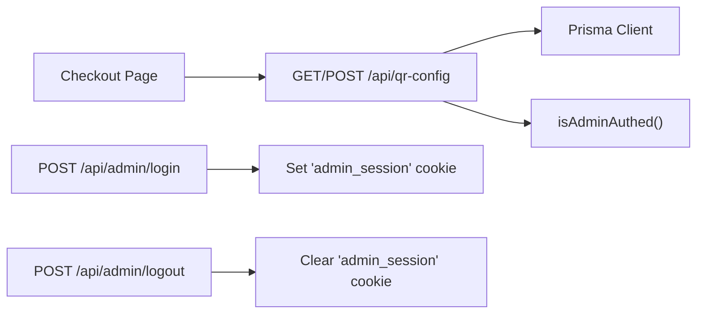

# QR Config API

<cite>
**Referenced Files in This Document**
- [route.ts](file://src/app/api/qr-config/route.ts)
- [auth.ts](file://src/lib/auth.ts)
- [schema.prisma](file://prisma/schema.prisma)
- [middleware.ts](file://src/middleware.ts)
- [page.tsx](file://src/app/checkout/page.tsx)
- [route.ts](file://src/app/api/admin/login/route.ts)
- [route.ts](file://src/app/api/admin/logout/route.ts)
- [prisma.ts](file://src/lib/prisma.ts)
</cite>

## Table of Contents
1. [Introduction](#introduction)
2. [Project Structure](#project-structure)
3. [Core Components](#core-components)
4. [Architecture Overview](#architecture-overview)
5. [Detailed Component Analysis](#detailed-component-analysis)
6. [Dependency Analysis](#dependency-analysis)
7. [Performance Considerations](#performance-considerations)
8. [Troubleshooting Guide](#troubleshooting-guide)
9. [Conclusion](#conclusion)
10. [Appendices](#appendices)

## Introduction
This document provides API documentation for the QR Configuration endpoints used to manage UPI QR code configuration for payments. It covers:
- Setup, retrieval, and updates of payment settings (UPI ID and QR image path)
- Request/response schemas
- Authentication requirements for admin access
- Validation rules for payment configurations
- Error handling patterns
- Example workflows integrating with the checkout process

The QR configuration is stored in a database via Prisma and consumed by the checkout page to display the correct UPI QR code and UPI ID during payment.

## Project Structure
Relevant parts of the project structure for this API:
- API route for QR configuration: src/app/api/qr-config/route.ts
- Admin authentication helpers and routes: src/lib/auth.ts, src/app/api/admin/login/route.ts, src/app/api/admin/logout/route.ts
- Database schema: prisma/schema.prisma
- Middleware protecting admin pages: src/middleware.ts
- Checkout UI consuming the API: src/app/checkout/page.tsx
- Prisma client setup: src/lib/prisma.ts

**Diagram sources**
- [route.ts:1-71](file://src/app/api/qr-config/route.ts#L1-L71)
- [auth.ts:1-16](file://src/lib/auth.ts#L1-L16)
- [schema.prisma:9-14](file://prisma/schema.prisma#L9-L14)
- [page.tsx:80-101](file://src/app/checkout/page.tsx#L80-L101)
- [route.ts:1-29](file://src/app/api/admin/login/route.ts#L1-L29)
- [route.ts:1-12](file://src/app/api/admin/logout/route.ts#L1-L12)

**Section sources**
- [route.ts:1-71](file://src/app/api/qr-config/route.ts#L1-L71)
- [auth.ts:1-16](file://src/lib/auth.ts#L1-L16)
- [schema.prisma:9-14](file://prisma/schema.prisma#L9-L14)
- [page.tsx:80-101](file://src/app/checkout/page.tsx#L80-L101)
- [route.ts:1-29](file://src/app/api/admin/login/route.ts#L1-L29)
- [route.ts:1-12](file://src/app/api/admin/logout/route.ts#L1-L12)
- [prisma.ts:1-23](file://src/lib/prisma.ts#L1-L23)

## Core Components
- QR Config API Route
  - GET /api/qr-config: Returns current QR config or defaults if not found or DB unavailable.
  - POST /api/qr-config: Updates or creates QR config; requires admin session cookie.
- Admin Authentication
  - Cookie-based session token validation using isAdminAuthed.
  - Admin login sets an httpOnly cookie; logout clears it.
- Data Model
  - QRConfig model stores upiId and qrCode fields.
- Frontend Integration
  - Checkout page fetches QR config on mount and displays the QR image and UPI ID.

**Section sources**
- [route.ts:8-70](file://src/app/api/qr-config/route.ts#L8-L70)
- [auth.ts:5-15](file://src/lib/auth.ts#L5-L15)
- [schema.prisma:9-14](file://prisma/schema.prisma#L9-L14)
- [page.tsx:80-101](file://src/app/checkout/page.tsx#L80-L101)

## Architecture Overview
The QR Config API is a simple server-side Next.js API route backed by Prisma. The checkout page reads the configuration at runtime to render the appropriate UPI QR code and UPI ID. Admins update the configuration through the same endpoint after authenticating via the admin login flow.

**Diagram sources**
- [route.ts:1-29](file://src/app/api/admin/login/route.ts#L1-L29)
- [route.ts:1-12](file://src/app/api/admin/logout/route.ts#L1-L12)
- [route.ts:38-70](file://src/app/api/qr-config/route.ts#L38-L70)
- [auth.ts:5-15](file://src/lib/auth.ts#L5-L15)
- [schema.prisma:9-14](file://prisma/schema.prisma#L9-L14)

## Detailed Component Analysis

### API Endpoints

#### GET /api/qr-config
- Purpose: Retrieve the active UPI QR configuration.
- Authentication: Not required.
- Behavior:
  - Attempts to read from the database.
  - If no record exists or DB is unavailable, returns default values.
- Response Schema:
  - Fields:
    - upiId: string — UPI ID used for payments.
    - qrCode: string — Path or URL to the QR image.
    - isDefault: boolean — Indicates whether defaults are being returned.
    - error?: string — Present only when falling back due to DB unavailability.
- Status Codes:
  - 200 OK: Successful response.
  - 500 Internal Server Error: Not used directly here; errors are handled gracefully with fallback.

Example responses:
- With configured data:
  - { upiId: "...", qrCode: "...", isDefault: false }
- Default fallback:
  - { upiId: "...", qrCode: "...", isDefault: true }
- DB unavailable fallback:
  - { upiId: "...", qrCode: "...", isDefault: true, error: "DB_UNAVAILABLE" }

**Section sources**
- [route.ts:8-36](file://src/app/api/qr-config/route.ts#L8-L36)

#### POST /api/qr-config
- Purpose: Update or create the active UPI QR configuration.
- Authentication: Required. Must include a valid admin session cookie set by admin login.
- Request Body:
  - upiId: string — Required.
  - qrCode: string — Required.
- Validation Rules:
  - Both upiId and qrCode must be present.
- Behavior:
  - Validates admin session.
  - Upserts QRConfig record with id "default".
- Response Schema:
  - Fields:
    - success: boolean — Always true on success.
    - upiId: string — Updated UPI ID.
    - qrCode: string — Updated QR image path.
- Status Codes:
  - 200 OK: Success.
  - 400 Bad Request: Missing required fields.
  - 401 Unauthorized: Invalid or missing admin session.
  - 500 Internal Server Error: Database write failure.

Example request:
- { upiId: "merchant@upi", qrCode: "/qr_code.jpg" }

Example responses:
- Success:
  - { success: true, upiId: "...", qrCode: "..." }
- Validation error:
  - { error: "upiId and qrCode are required" }
- Unauthorized:
  - { error: "Unauthorized" }
- Database error:
  - { error: "Database error while updating configuration" }

**Section sources**
- [route.ts:38-70](file://src/app/api/qr-config/route.ts#L38-L70)
- [auth.ts:5-15](file://src/lib/auth.ts#L5-L15)

### Authentication Flow

#### Admin Login
- Endpoint: POST /api/admin/login
- Request Body:
  - password: string — Must match environment variable.
- Behavior:
  - On success, sets an httpOnly cookie named "admin_session" with a token from environment.
- Response:
  - { success: true }
- Status Codes:
  - 200 OK: Login successful.
  - 400 Bad Request: Malformed request.
  - 401 Unauthorized: Invalid password.

#### Admin Logout
- Endpoint: POST /api/admin/logout
- Behavior:
  - Clears the "admin_session" cookie.
- Response:
  - { success: true }

**Section sources**
- [route.ts:1-29](file://src/app/api/admin/login/route.ts#L1-L29)
- [route.ts:1-12](file://src/app/api/admin/logout/route.ts#L1-L12)

### Data Model

#### QRConfig
- Fields:
  - id: string — Primary key, default "default".
  - upiId: string — UPI ID for payments.
  - qrCode: text — Path or URL to QR image.
  - updatedAt: datetime — Last updated timestamp.

Notes:
- The API uses upsert with id "default" to ensure a single active configuration.

**Section sources**
- [schema.prisma:9-14](file://prisma/schema.prisma#L9-L14)

### Frontend Integration (Checkout)
- The checkout page fetches QR configuration on mount and renders the QR image and UPI ID.
- If the API fails, it logs an error and continues with local defaults.

Integration points:
- Fetches GET /api/qr-config.
- Uses returned upiId and qrCode to populate UI state.

**Section sources**
- [page.tsx:80-101](file://src/app/checkout/page.tsx#L80-L101)

## Dependency Analysis
- QR Config API depends on:
  - Prisma client for database operations.
  - Admin auth helper for validating requests.
- Checkout page depends on:
  - QR Config API for dynamic configuration.
- Admin routes depend on:
  - Environment variables for credentials and session tokens.
  - Cookies for session management.

**Diagram sources**
- [route.ts:1-71](file://src/app/api/qr-config/route.ts#L1-L71)
- [auth.ts:1-16](file://src/lib/auth.ts#L1-L16)
- [prisma.ts:1-23](file://src/lib/prisma.ts#L1-L23)
- [page.tsx:80-101](file://src/app/checkout/page.tsx#L80-L101)
- [route.ts:1-29](file://src/app/api/admin/login/route.ts#L1-L29)
- [route.ts:1-12](file://src/app/api/admin/logout/route.ts#L1-L12)

**Section sources**
- [route.ts:1-71](file://src/app/api/qr-config/route.ts#L1-L71)
- [auth.ts:1-16](file://src/lib/auth.ts#L1-L16)
- [prisma.ts:1-23](file://src/lib/prisma.ts#L1-L23)
- [page.tsx:80-101](file://src/app/checkout/page.tsx#L80-L101)
- [route.ts:1-29](file://src/app/api/admin/login/route.ts#L1-L29)
- [route.ts:1-12](file://src/app/api/admin/logout/route.ts#L1-L12)

## Performance Considerations
- Single-record upsert: The API always targets a single row with id "default", minimizing contention and simplifying queries.
- Graceful fallback: GET returns defaults when DB is unavailable, improving resilience and user experience.
- Minimal payload: Request and response bodies are small, reducing network overhead.
- No caching layer: Consider adding server-side caching or edge caching for GET if traffic increases significantly.

[No sources needed since this section provides general guidance]

## Troubleshooting Guide
Common issues and resolutions:
- 401 Unauthorized on POST /api/qr-config
  - Ensure admin login succeeded and "admin_session" cookie is present.
  - Verify environment variable ADMIN_SESSION_TOKEN matches the expected value.
- 400 Bad Request
  - Check that both upiId and qrCode are provided in the request body.
- Database errors
  - Confirm DATABASE_URL and Neon adapter configuration are correct.
  - Review Prisma client logging in development to diagnose connection issues.
- Defaults returned unexpectedly
  - If GET returns isDefault: true, verify that a QRConfig record exists in the database.
  - If error field is present, the service fell back due to DB unavailability.

**Section sources**
- [route.ts:27-35](file://src/app/api/qr-config/route.ts#L27-L35)
- [route.ts:63-69](file://src/app/api/qr-config/route.ts#L63-L69)
- [auth.ts:13-15](file://src/lib/auth.ts#L13-L15)
- [prisma.ts:9-20](file://src/lib/prisma.ts#L9-L20)

## Conclusion
The QR Config API provides a straightforward mechanism to manage UPI QR payment settings. It enforces admin-only writes via cookie-based authentication, offers robust defaults when the database is unavailable, and integrates seamlessly with the checkout flow. For production deployments, ensure secure environment variables, proper cookie flags, and consider additional caching and monitoring.

[No sources needed since this section summarizes without analyzing specific files]

## Appendices

### Request/Response Schemas

- GET /api/qr-config Response
  - Fields:
    - upiId: string
    - qrCode: string
    - isDefault: boolean
    - error?: string

- POST /api/qr-config Request
  - Fields:
    - upiId: string (required)
    - qrCode: string (required)

- POST /api/qr-config Response
  - Fields:
    - success: boolean
    - upiId: string
    - qrCode: string

- POST /api/admin/login Request
  - Fields:
    - password: string (required)

- POST /api/admin/login Response
  - Fields:
    - success: boolean

- POST /api/admin/logout Response
  - Fields:
    - success: boolean

**Section sources**
- [route.ts:8-70](file://src/app/api/qr-config/route.ts#L8-L70)
- [route.ts:1-29](file://src/app/api/admin/login/route.ts#L1-L29)
- [route.ts:1-12](file://src/app/api/admin/logout/route.ts#L1-L12)

### Example Workflows

- Configure QR Code for Payments
  1. Admin logs in via POST /api/admin/login with password.
  2. Admin calls POST /api/qr-config with upiId and qrCode.
  3. Checkout page loads GET /api/qr-config and displays the new QR image and UPI ID.

- Retrieve Current QR Configuration
  1. Checkout page calls GET /api/qr-config on mount.
  2. If DB is unavailable, defaults are returned with isDefault: true.

- Admin Session Management
  1. Admin logs out via POST /api/admin/logout to clear the session cookie.

**Section sources**
- [route.ts:1-29](file://src/app/api/admin/login/route.ts#L1-L29)
- [route.ts:1-12](file://src/app/api/admin/logout/route.ts#L1-L12)
- [route.ts:8-70](file://src/app/api/qr-config/route.ts#L8-L70)
- [page.tsx:80-101](file://src/app/checkout/page.tsx#L80-L101)