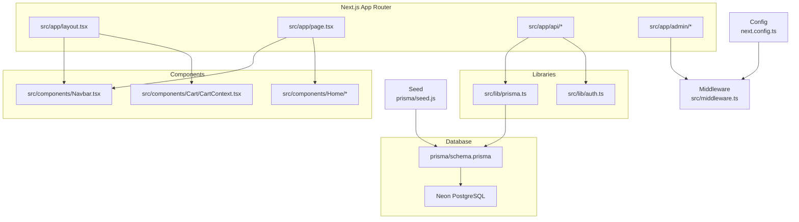
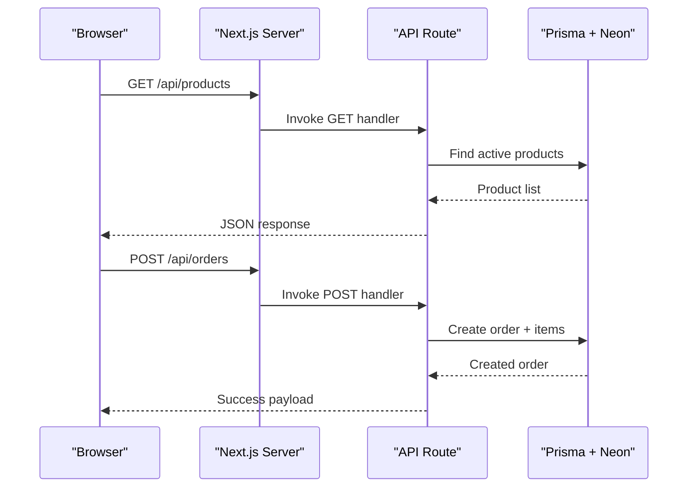
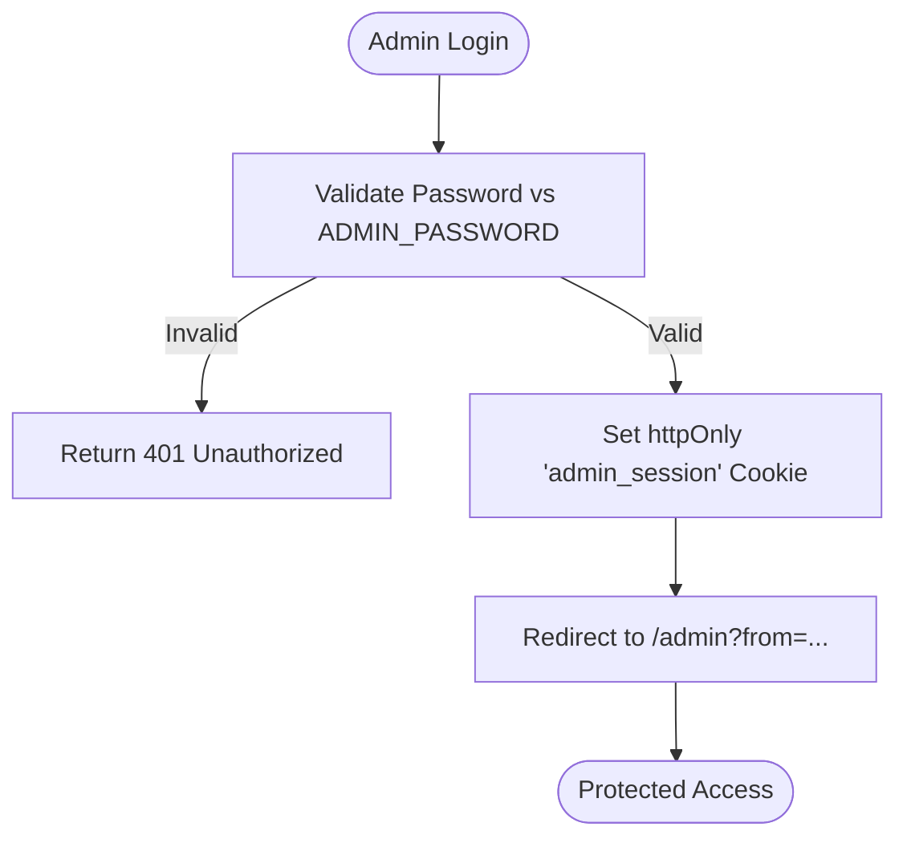
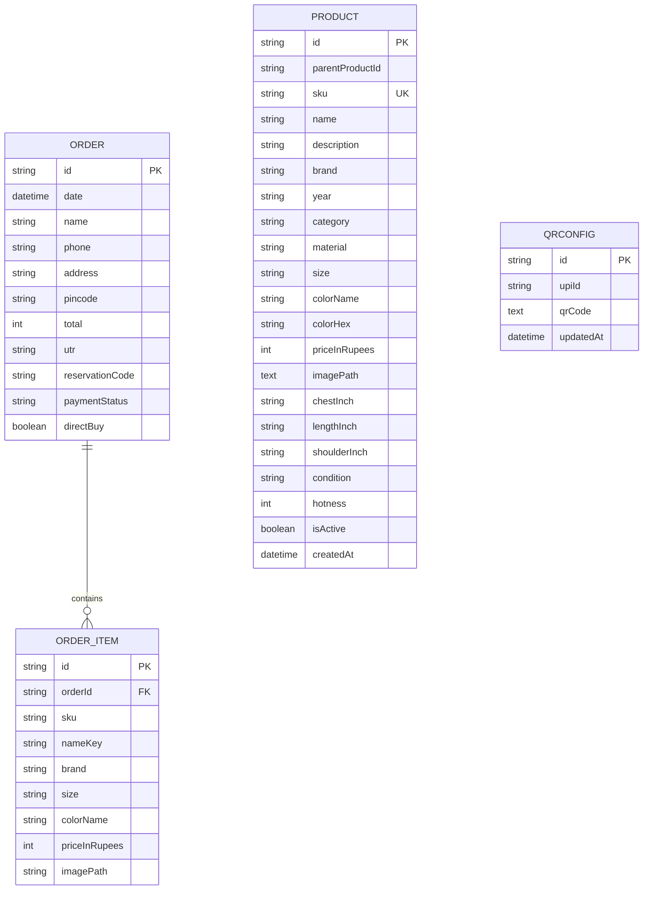
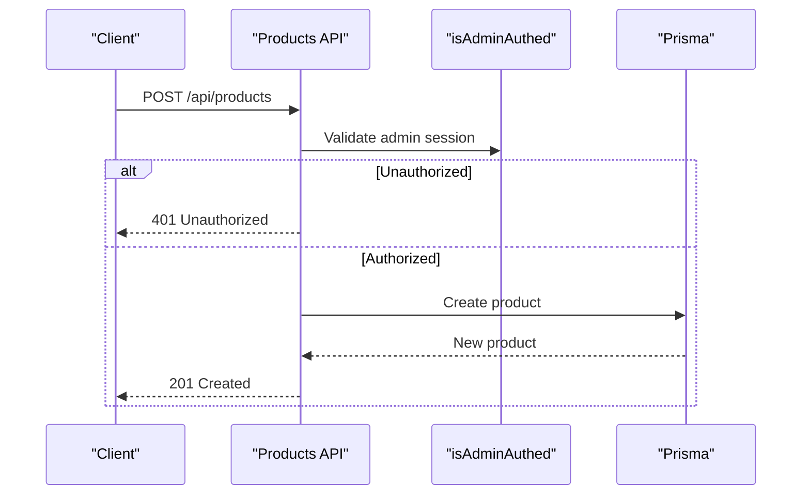
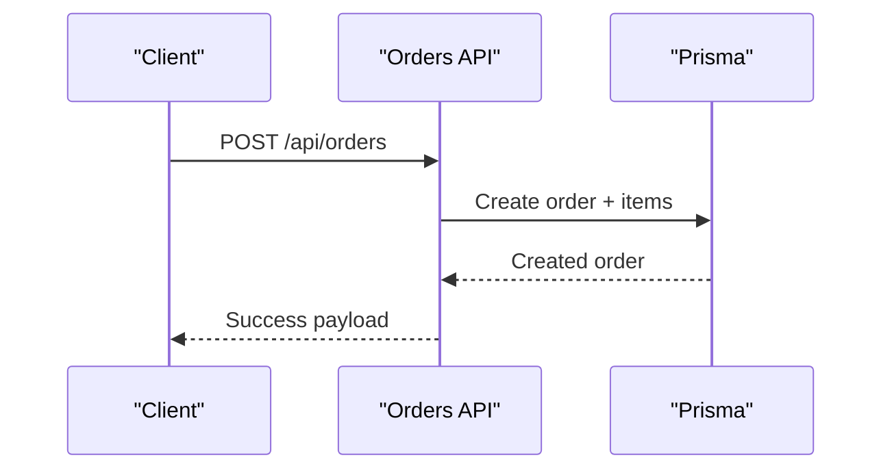
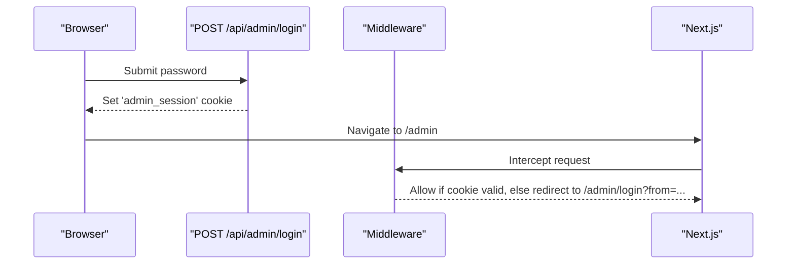
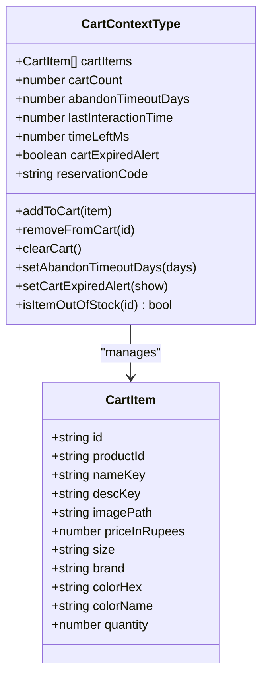
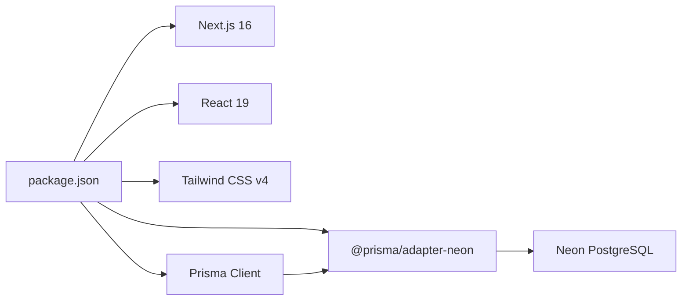

# Architecture Overview

<cite>
**Referenced Files in This Document**
- [package.json](file://package.json)
- [next.config.ts](file://next.config.ts)
- [prisma/schema.prisma](file://prisma/schema.prisma)
- [src/app/layout.tsx](file://src/app/layout.tsx)
- [src/middleware.ts](file://src/middleware.ts)
- [src/lib/prisma.ts](file://src/lib/prisma.ts)
- [src/lib/auth.ts](file://src/lib/auth.ts)
- [src/app/page.tsx](file://src/app/page.tsx)
- [src/components/Navbar.tsx](file://src/components/Navbar.tsx)
- [src/components/Cart/CartContext.tsx](file://src/components/Cart/CartContext.tsx)
- [src/utils/catalog.ts](file://src/utils/catalog.ts)
- [src/app/api/products/route.ts](file://src/app/api/products/route.ts)
- [src/app/api/orders/route.ts](file://src/app/api/orders/route.ts)
- [src/app/api/admin/login/route.ts](file://src/app/api/admin/login/route.ts)
- [prisma/seed.js](file://prisma/seed.js)
</cite>

## Table of Contents
1. Introduction
2. Project Structure
3. Core Components
4. Architecture Overview
5. Detailed Component Analysis
6. Dependency Analysis
7. Performance Considerations
8. Troubleshooting Guide
9. Conclusion

## Introduction
This document presents the architecture of the next.in e-commerce platform, built with Next.js App Router and a full-stack pattern that combines server-side API routes with client components. The system emphasizes:
- File-based routing via Next.js App Router
- Clear separation between frontend UI and backend API logic
- Type-safe database access using Prisma ORM with Neon PostgreSQL adapter
- Modern UI with React 19 and styling via Tailwind CSS
- Admin session protection through middleware and cookie-based authentication

The documentation covers directory organization, data flow from client to API to database, integration points with Neon, and deployment considerations.

## Project Structure
The project follows Next.js App Router conventions:
- src/app: Pages and API routes organized by feature (admin, products, orders, catalog, cart, checkout)
- src/components: Reusable UI components and contexts (Navbar, Cart, Home carousels)
- src/hooks: Shared hooks (e.g., useOutsideClick)
- src/lib: Shared runtime utilities (Prisma client, auth helpers)
- src/utils: Utilities for catalog metadata and i18n
- prisma: Database schema and seed script
- public: Static assets (categories, products images)

**Diagram sources**
- [src/app/layout.tsx:1-62](file://src/app/layout.tsx#L1-L62)
- [src/app/page.tsx:1-501](file://src/app/page.tsx#L1-L501)
- [src/app/api/products/route.ts:1-98](file://src/app/api/products/route.ts#L1-L98)
- [src/app/api/orders/route.ts:1-134](file://src/app/api/orders/route.ts#L1-L134)
- [src/app/api/admin/login/route.ts:1-29](file://src/app/api/admin/login/route.ts#L1-L29)
- [src/components/Navbar.tsx:1-267](file://src/components/Navbar.tsx#L1-L267)
- [src/components/Cart/CartContext.tsx:1-228](file://src/components/Cart/CartContext.tsx#L1-L228)
- [src/lib/prisma.ts:1-23](file://src/lib/prisma.ts#L1-L23)
- [src/lib/auth.ts:1-16](file://src/lib/auth.ts#L1-L16)
- [src/middleware.ts:1-27](file://src/middleware.ts#L1-L27)
- [next.config.ts:1-12](file://next.config.ts#L1-L12)
- [prisma/schema.prisma:1-67](file://prisma/schema.prisma#L1-L67)
- [prisma/seed.js:1-600](file://prisma/seed.js#L1-L600)

**Section sources**
- [package.json:1-37](file://package.json#L1-L37)
- [next.config.ts:1-12](file://next.config.ts#L1-L12)
- [src/app/layout.tsx:1-62](file://src/app/layout.tsx#L1-L62)
- [src/app/page.tsx:1-501](file://src/app/page.tsx#L1-L501)
- [src/components/Navbar.tsx:1-267](file://src/components/Navbar.tsx#L1-L267)
- [src/components/Cart/CartContext.tsx:1-228](file://src/components/Cart/CartContext.tsx#L1-L228)
- [src/lib/prisma.ts:1-23](file://src/lib/prisma.ts#L1-L23)
- [src/lib/auth.ts:1-16](file://src/lib/auth.ts#L1-L16)
- [src/middleware.ts:1-27](file://src/middleware.ts#L1-L27)
- [prisma/schema.prisma:1-67](file://prisma/schema.prisma#L1-L67)
- [prisma/seed.js:1-600](file://prisma/seed.js#L1-L600)

## Core Components
- Root layout and providers:
  - Root layout composes global fonts, Navbar, Footer, and context providers (NavbarProvider, CartProvider).
- Client state management:
  - CartContext manages cart items, reservation code, expiry countdown, and persistence via localStorage.
  - NavbarContext provides theme, locale, and menu state used across the app.
- API layer:
  - Products API supports listing active products, creating new products (admin-only), and soft-deleting by SKU (admin-only).
  - Orders API supports listing orders, creating orders, and updating payment status (admin-only).
  - Admin login route sets an httpOnly session cookie after validating password.
- Data access:
  - Prisma client configured with Neon adapter; connection URL sourced from environment variables.
- Security:
  - Middleware enforces admin session cookie for /admin routes.
  - Auth helper validates cookies on mutating API endpoints.

**Section sources**
- [src/app/layout.tsx:1-62](file://src/app/layout.tsx#L1-L62)
- [src/components/Cart/CartContext.tsx:1-228](file://src/components/Cart/CartContext.tsx#L1-L228)
- [src/components/Navbar.tsx:1-267](file://src/components/Navbar.tsx#L1-L267)
- [src/app/api/products/route.ts:1-98](file://src/app/api/products/route.ts#L1-L98)
- [src/app/api/orders/route.ts:1-134](file://src/app/api/orders/route.ts#L1-L134)
- [src/app/api/admin/login/route.ts:1-29](file://src/app/api/admin/login/route.ts#L1-L29)
- [src/lib/prisma.ts:1-23](file://src/lib/prisma.ts#L1-L23)
- [src/lib/auth.ts:1-16](file://src/lib/auth.ts#L1-L16)
- [src/middleware.ts:1-27](file://src/middleware.ts#L1-L27)

## Architecture Overview
The application uses Next.js App Router for file-based routing and serverless functions for API endpoints. Client components interact with API routes, which use Prisma to query or mutate data in Neon PostgreSQL. Admin routes are protected by middleware and cookie-based sessions.

**Diagram sources**
- [src/app/api/products/route.ts:1-98](file://src/app/api/products/route.ts#L1-L98)
- [src/app/api/orders/route.ts:1-134](file://src/app/api/orders/route.ts#L1-L134)
- [src/lib/prisma.ts:1-23](file://src/lib/prisma.ts#L1-L23)

**Diagram sources**
- [src/app/api/admin/login/route.ts:1-29](file://src/app/api/admin/login/route.ts#L1-L29)
- [src/middleware.ts:1-27](file://src/middleware.ts#L1-L27)

## Detailed Component Analysis

### Data Model and Database Layer
- Models:
  - QRConfig: Stores UPI ID and QR code configuration.
  - Order and OrderItem: Capture customer details, totals, UTR, reservation code, and line items.
  - Product: Represents product variants with attributes like brand, category, size, color, price, measurements, condition, and hotness.
- Adapter:
  - Prisma Neon adapter connects to Neon PostgreSQL using DATABASE_URL.
- Seeding:
  - Seed script populates sample products using upsert by SKU.

**Diagram sources**
- [prisma/schema.prisma:1-67](file://prisma/schema.prisma#L1-L67)

**Section sources**
- [prisma/schema.prisma:1-67](file://prisma/schema.prisma#L1-L67)
- [src/lib/prisma.ts:1-23](file://src/lib/prisma.ts#L1-L23)
- [prisma/seed.js:1-600](file://prisma/seed.js#L1-L600)

### API Routes: Products
- GET /api/products: Returns all active products ordered by creation date.
- POST /api/products: Creates a product (admin-only); validates required fields; handles unique constraint violations.
- DELETE /api/products?sku=xxx: Soft-deletes a product by setting isActive=false (admin-only).

**Diagram sources**
- [src/app/api/products/route.ts:1-98](file://src/app/api/products/route.ts#L1-L98)
- [src/lib/auth.ts:1-16](file://src/lib/auth.ts#L1-L16)

**Section sources**
- [src/app/api/products/route.ts:1-98](file://src/app/api/products/route.ts#L1-L98)
- [src/lib/auth.ts:1-16](file://src/lib/auth.ts#L1-L16)

### API Routes: Orders
- GET /api/orders: Lists orders with items, sorted by date descending.
- POST /api/orders: Creates an order with nested items; validates required fields.
- PUT /api/orders: Updates order payment status (admin-only).

**Diagram sources**
- [src/app/api/orders/route.ts:1-134](file://src/app/api/orders/route.ts#L1-L134)

**Section sources**
- [src/app/api/orders/route.ts:1-134](file://src/app/api/orders/route.ts#L1-L134)

### Admin Authentication Flow
- Login: Validates password against ADMIN_PASSWORD; sets httpOnly cookie admin_session with token from ADMIN_SESSION_TOKEN.
- Middleware: Protects /admin routes by checking cookie presence and value; redirects unauthenticated requests to /admin/login with from parameter.

**Diagram sources**
- [src/app/api/admin/login/route.ts:1-29](file://src/app/api/admin/login/route.ts#L1-L29)
- [src/middleware.ts:1-27](file://src/middleware.ts#L1-L27)

**Section sources**
- [src/app/api/admin/login/route.ts:1-29](file://src/app/api/admin/login/route.ts#L1-L29)
- [src/middleware.ts:1-27](file://src/middleware.ts#L1-L27)

### Frontend Composition and State
- Layout:
  - Provides global fonts, Navbar, Footer, and wraps children with NavbarProvider and CartProvider.
- Navbar:
  - Composed of search bar, profile dropdown, mobile menu, language/theme toggles, and cart badge.
- Cart Context:
  - Persists cart items and reservation code in localStorage; implements expiry countdown and out-of-stock simulation based on expired state.

**Diagram sources**
- [src/components/Cart/CartContext.tsx:1-228](file://src/components/Cart/CartContext.tsx#L1-L228)

**Section sources**
- [src/app/layout.tsx:1-62](file://src/app/layout.tsx#L1-L62)
- [src/components/Navbar.tsx:1-267](file://src/components/Navbar.tsx#L1-L267)
- [src/components/Cart/CartContext.tsx:1-228](file://src/components/Cart/CartContext.tsx#L1-L228)

### Catalog Metadata and Types
- Utility types define product variants, measurements, and categories metadata.
- Placeholder PRODUCTS array is exported for future population or integration.

**Section sources**
- [src/utils/catalog.ts:1-50](file://src/utils/catalog.ts#L1-L50)

## Dependency Analysis
Technology stack decisions:
- Next.js 16 for full-stack capabilities and App Router
- React 19 for modern UI features
- Prisma ORM with Neon adapter for type-safe database access
- Tailwind CSS v4 for styling
- Lucide icons and Three.js dependencies present in package.json

**Diagram sources**
- [package.json:1-37](file://package.json#L1-L37)

**Section sources**
- [package.json:1-37](file://package.json#L1-L37)

## Performance Considerations
- Use server-side rendering and API routes to minimize client-side data fetching overhead.
- Leverage Prisma’s efficient queries and proper filtering (e.g., isActive flag) to reduce payload sizes.
- Avoid unnecessary re-renders by keeping client state minimal and leveraging context only where needed.
- For large catalogs, consider pagination and caching strategies at the API layer.
- Ensure static assets (images) are optimized and served via CDN when deployed.

[No sources needed since this section provides general guidance]

## Troubleshooting Guide
- Database connectivity:
  - Ensure DATABASE_URL is set correctly for Neon; verify adapter initialization and logs.
- Admin access issues:
  - Confirm ADMIN_PASSWORD and ADMIN_SESSION_TOKEN are configured; check cookie settings (httpOnly, secure, sameSite).
- Unique constraints:
  - When creating products, duplicate SKUs will return a conflict error; ensure unique SKU values.
- Orders API errors:
  - Missing required fields result in 400 responses; validate payloads before submission.

**Section sources**
- [src/lib/prisma.ts:1-23](file://src/lib/prisma.ts#L1-L23)
- [src/app/api/products/route.ts:1-98](file://src/app/api/products/route.ts#L1-L98)
- [src/app/api/orders/route.ts:1-134](file://src/app/api/orders/route.ts#L1-L134)
- [src/app/api/admin/login/route.ts:1-29](file://src/app/api/admin/login/route.ts#L1-L29)
- [src/middleware.ts:1-27](file://src/middleware.ts#L1-L27)

## Conclusion
The next.in platform leverages Next.js App Router to provide a cohesive full-stack experience with clear separation of concerns. The combination of Prisma and Neon ensures type-safe, scalable data access, while client components manage interactive state efficiently. Admin security is enforced via middleware and cookie-based sessions. The modular structure and well-defined APIs support maintainability and future enhancements such as advanced search, inventory synchronization, and payment integrations.