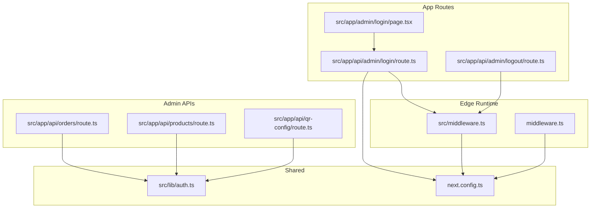
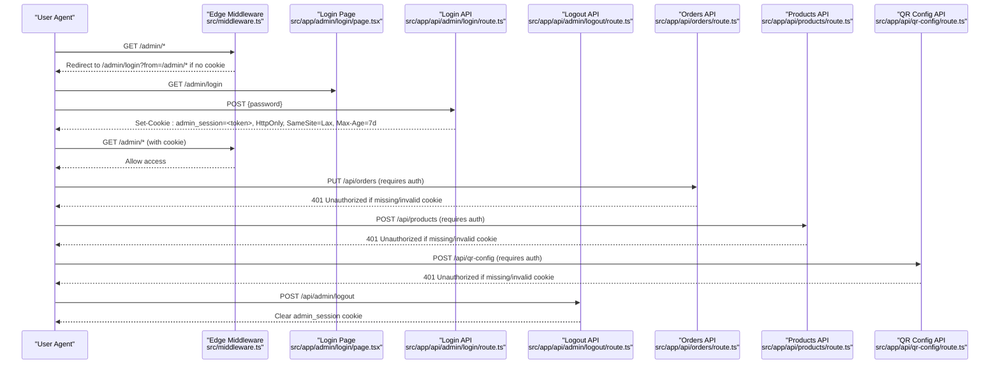
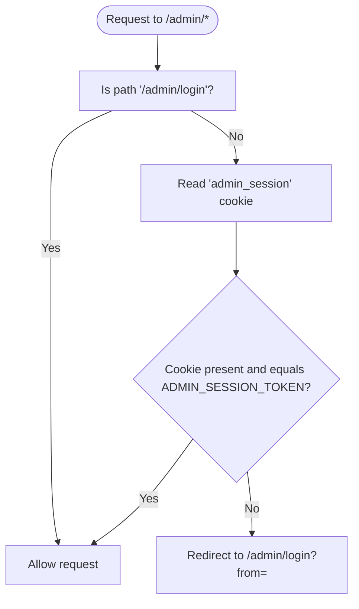
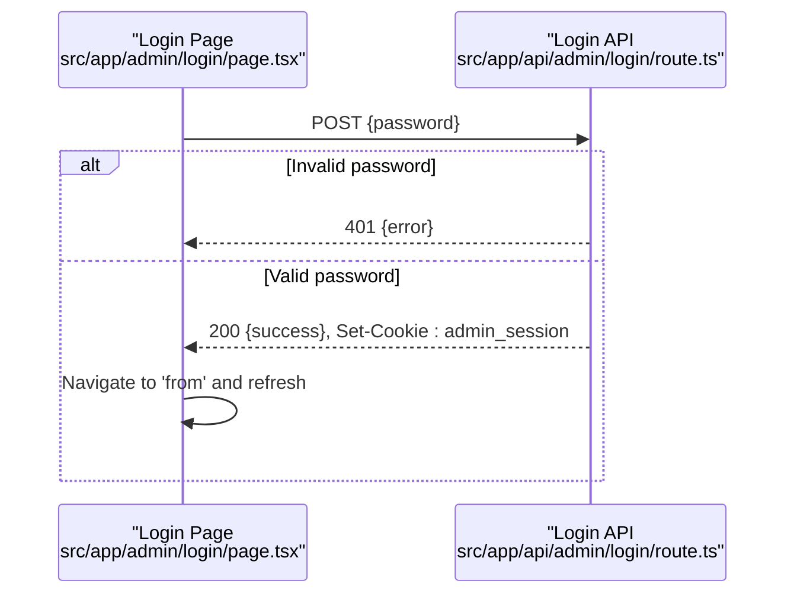
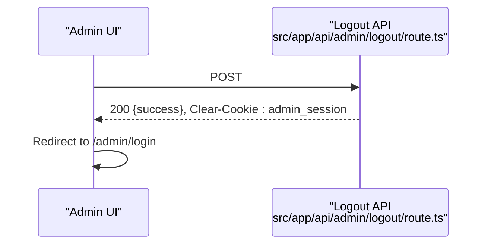
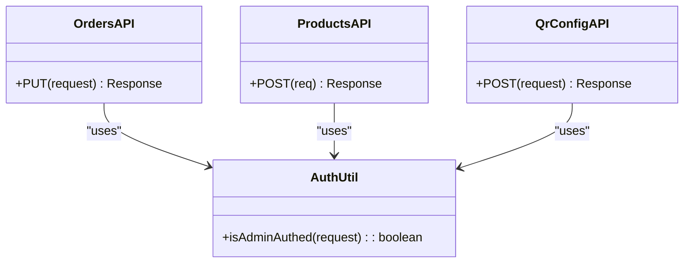
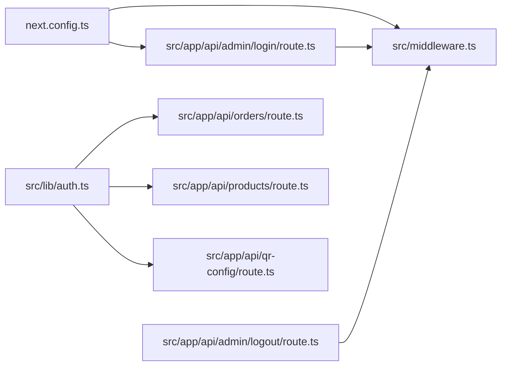

# Authentication & Security

<cite>
**Referenced Files in This Document**
- [src/middleware.ts](file://src/middleware.ts)
- [middleware.ts](file://middleware.ts)
- [next.config.ts](file://next.config.ts)
- [src/lib/auth.ts](file://src/lib/auth.ts)
- [src/app/api/admin/login/route.ts](file://src/app/api/admin/login/route.ts)
- [src/app/api/admin/logout/route.ts](file://src/app/api/admin/logout/route.ts)
- [src/app/admin/login/page.tsx](file://src/app/admin/login/page.tsx)
- [src/app/api/orders/route.ts](file://src/app/api/orders/route.ts)
- [src/app/api/products/route.ts](file://src/app/api/products/route.ts)
- [src/app/api/qr-config/route.ts](file://src/app/api/qr-config/route.ts)
- [prisma/schema.prisma](file://prisma/schema.prisma)
</cite>

## Table of Contents
1. [Introduction](#introduction)
2. [Project Structure](#project-structure)
3. [Core Components](#core-components)
4. [Architecture Overview](#architecture-overview)
5. [Detailed Component Analysis](#detailed-component-analysis)
6. [Dependency Analysis](#dependency-analysis)
7. [Performance Considerations](#performance-considerations)
8. [Troubleshooting Guide](#troubleshooting-guide)
9. [Conclusion](#conclusion)
10. [Appendices](#appendices)

## Introduction
This document explains the authentication and authorization mechanisms used by the next.in platform to protect admin access. It covers:
- Cookie-based session management for admin access control
- Route protection using Next.js middleware
- Secure login and logout flows
- Environment variable handling for sensitive configuration
- Input validation patterns
- Security best practices, production considerations, session timeout policies, and vulnerability mitigation strategies
- Examples of implementing custom authentication guards and securing API endpoints

The implementation uses a simple shared secret model:
- A server-side ADMIN_PASSWORD is validated during login
- On success, a cookie named admin_session is set with a token derived from ADMIN_SESSION_TOKEN
- Middleware enforces the presence of this cookie on protected routes
- Admin-only API endpoints validate the same cookie via a helper function

## Project Structure
Security-related files are organized around three layers:
- Edge runtime middleware for route-level protection
- API routes for authentication and data operations
- Shared utilities for cookie parsing and validation

**Diagram sources**
- [src/middleware.ts:1-27](file://src/middleware.ts#L1-L27)
- [middleware.ts:1-27](file://middleware.ts#L1-L27)
- [src/app/admin/login/page.tsx:1-139](file://src/app/admin/login/page.tsx#L1-L139)
- [src/app/api/admin/login/route.ts:1-29](file://src/app/api/admin/login/route.ts#L1-L29)
- [src/app/api/admin/logout/route.ts:1-12](file://src/app/api/admin/logout/route.ts#L1-L12)
- [src/app/api/orders/route.ts:1-134](file://src/app/api/orders/route.ts#L1-L134)
- [src/app/api/products/route.ts:1-98](file://src/app/api/products/route.ts#L1-L98)
- [src/app/api/qr-config/route.ts:1-71](file://src/app/api/qr-config/route.ts#L1-L71)
- [src/lib/auth.ts:1-16](file://src/lib/auth.ts#L1-L16)
- [next.config.ts:1-12](file://next.config.ts#L1-L12)

**Section sources**
- [src/middleware.ts:1-27](file://src/middleware.ts#L1-L27)
- [middleware.ts:1-27](file://middleware.ts#L1-L27)
- [src/app/admin/login/page.tsx:1-139](file://src/app/admin/login/page.tsx#L1-L139)
- [src/app/api/admin/login/route.ts:1-29](file://src/app/api/admin/login/route.ts#L1-L29)
- [src/app/api/admin/logout/route.ts:1-12](file://src/app/api/admin/logout/route.ts#L1-L12)
- [src/app/api/orders/route.ts:1-134](file://src/app/api/orders/route.ts#L1-L134)
- [src/app/api/products/route.ts:1-98](file://src/app/api/products/route.ts#L1-L98)
- [src/app/api/qr-config/route.ts:1-71](file://src/app/api/qr-config/route.ts#L1-L71)
- [src/lib/auth.ts:1-16](file://src/lib/auth.ts#L1-L16)
- [next.config.ts:1-12](file://next.config.ts#L1-L12)

## Core Components
- Edge middleware protects all /admin routes by requiring a valid admin_session cookie. If missing or invalid, it redirects to /admin/login?from=<original-path>.
- Login page posts password to /api/admin/login. On success, the server sets an httpOnly, secure (in production), sameSite=lax cookie with a 7-day maxAge.
- Logout clears the cookie by setting maxAge=0.
- Admin-only API endpoints use a shared helper to parse cookies and compare against ADMIN_SESSION_TOKEN.

Key behaviors:
- Session token is not cryptographically signed; it is a shared secret stored in ADMIN_SESSION_TOKEN.
- Passwords are compared directly against ADMIN_PASSWORD without hashing.
- Brute-force resistance is implemented as a fixed delay on failed login attempts.

**Section sources**
- [src/middleware.ts:1-27](file://src/middleware.ts#L1-L27)
- [src/app/api/admin/login/route.ts:1-29](file://src/app/api/admin/login/route.ts#L1-L29)
- [src/app/api/admin/logout/route.ts:1-12](file://src/app/api/admin/logout/route.ts#L1-L12)
- [src/lib/auth.ts:1-16](file://src/lib/auth.ts#L1-L16)

## Architecture Overview
The admin authentication flow spans client, middleware, and API layers. The following sequence diagram maps actual code paths:

**Diagram sources**
- [src/middleware.ts:1-27](file://src/middleware.ts#L1-L27)
- [src/app/admin/login/page.tsx:1-139](file://src/app/admin/login/page.tsx#L1-L139)
- [src/app/api/admin/login/route.ts:1-29](file://src/app/api/admin/login/route.ts#L1-L29)
- [src/app/api/admin/logout/route.ts:1-12](file://src/app/api/admin/logout/route.ts#L1-L12)
- [src/app/api/orders/route.ts:1-134](file://src/app/api/orders/route.ts#L1-L134)
- [src/app/api/products/route.ts:1-98](file://src/app/api/products/route.ts#L1-L98)
- [src/app/api/qr-config/route.ts:1-71](file://src/app/api/qr-config/route.ts#L1-L71)

## Detailed Component Analysis

### Edge Middleware (Route Protection)
Responsibilities:
- Allow /admin/login unconditionally
- For other /admin/* requests, require a valid admin_session cookie matching ADMIN_SESSION_TOKEN
- Redirect unauthorized requests back to /admin/login with a from parameter

Implementation notes:
- Uses request.cookies.get("admin_session") and compares with process.env.ADMIN_SESSION_TOKEN
- Exposes env variables to Edge runtime via next.config.ts

**Diagram sources**
- [src/middleware.ts:1-27](file://src/middleware.ts#L1-L27)
- [next.config.ts:1-12](file://next.config.ts#L1-L12)

**Section sources**
- [src/middleware.ts:1-27](file://src/middleware.ts#L1-L27)
- [middleware.ts:1-27](file://middleware.ts#L1-L27)
- [next.config.ts:1-12](file://next.config.ts#L1-L12)

### Login Flow (Client + Server)
Client behavior:
- Renders a form that posts password to /api/admin/login
- On success, navigates to the original protected path and refreshes the page

Server behavior:
- Validates password against ADMIN_PASSWORD
- Adds a small delay on failure to mitigate brute force
- Sets a secure cookie with:
  - name: admin_session
  - value: ADMIN_SESSION_TOKEN
  - httpOnly: true
  - secure: true in production
  - sameSite: lax
  - maxAge: 7 days
  - path: "/"

**Diagram sources**
- [src/app/admin/login/page.tsx:1-139](file://src/app/admin/login/page.tsx#L1-L139)
- [src/app/api/admin/login/route.ts:1-29](file://src/app/api/admin/login/route.ts#L1-L29)

**Section sources**
- [src/app/admin/login/page.tsx:1-139](file://src/app/admin/login/page.tsx#L1-L139)
- [src/app/api/admin/login/route.ts:1-29](file://src/app/api/admin/login/route.ts#L1-L29)

### Logout Flow
Behavior:
- Clears the admin_session cookie by setting maxAge=0 and httpOnly=true

**Diagram sources**
- [src/app/api/admin/logout/route.ts:1-12](file://src/app/api/admin/logout/route.ts#L1-L12)

**Section sources**
- [src/app/api/admin/logout/route.ts:1-12](file://src/app/api/admin/logout/route.ts#L1-L12)

### Admin API Guards (Mutating Endpoints)
Protected endpoints:
- Orders update: PUT /api/orders
- Products create: POST /api/products
- QR config update: POST /api/qr-config

Guard logic:
- Each endpoint calls isAdminAuthed(request) which parses the Cookie header and compares admin_session to ADMIN_SESSION_TOKEN
- Returns 401 Unauthorized if invalid

Input validation examples:
- Required fields checked before database writes
- Unique constraint errors handled (e.g., duplicate SKU)

**Diagram sources**
- [src/lib/auth.ts:1-16](file://src/lib/auth.ts#L1-L16)
- [src/app/api/orders/route.ts:1-134](file://src/app/api/orders/route.ts#L1-L134)
- [src/app/api/products/route.ts:1-98](file://src/app/api/products/route.ts#L1-L98)
- [src/app/api/qr-config/route.ts:1-71](file://src/app/api/qr-config/route.ts#L1-L71)

**Section sources**
- [src/lib/auth.ts:1-16](file://src/lib/auth.ts#L1-L16)
- [src/app/api/orders/route.ts:1-134](file://src/app/api/orders/route.ts#L1-L134)
- [src/app/api/products/route.ts:1-98](file://src/app/api/products/route.ts#L1-L98)
- [src/app/api/qr-config/route.ts:1-71](file://src/app/api/qr-config/route.ts#L1-L71)

### Environment Variables and Configuration
Exposed to Edge runtime:
- ADMIN_SESSION_TOKEN
- ADMIN_PASSWORD

Usage:
- Middleware reads ADMIN_SESSION_TOKEN to validate cookies
- Login API validates ADMIN_PASSWORD and sets admin_session cookie using ADMIN_SESSION_TOKEN

Best practices:
- Store secrets in environment variables only; never commit them to source control
- Use different values per environment (development vs production)
- Rotate tokens periodically

**Section sources**
- [next.config.ts:1-12](file://next.config.ts#L1-L12)
- [src/middleware.ts:1-27](file://src/middleware.ts#L1-L27)
- [src/app/api/admin/login/route.ts:1-29](file://src/app/api/admin/login/route.ts#L1-L29)

## Dependency Analysis
- Middleware depends on next.config.ts for env exposure and on request cookies.
- Login/logout APIs depend on next/server and cookie settings.
- Admin APIs depend on src/lib/auth.ts for cookie validation and Prisma for persistence.
- Data models are defined in prisma/schema.prisma.

**Diagram sources**
- [next.config.ts:1-12](file://next.config.ts#L1-L12)
- [src/middleware.ts:1-27](file://src/middleware.ts#L1-L27)
- [src/app/api/admin/login/route.ts:1-29](file://src/app/api/admin/login/route.ts#L1-L29)
- [src/app/api/admin/logout/route.ts:1-12](file://src/app/api/admin/logout/route.ts#L1-L12)
- [src/lib/auth.ts:1-16](file://src/lib/auth.ts#L1-L16)
- [src/app/api/orders/route.ts:1-134](file://src/app/api/orders/route.ts#L1-L134)
- [src/app/api/products/route.ts:1-98](file://src/app/api/products/route.ts#L1-L98)
- [src/app/api/qr-config/route.ts:1-71](file://src/app/api/qr-config/route.ts#L1-L71)

**Section sources**
- [next.config.ts:1-12](file://next.config.ts#L1-L12)
- [src/middleware.ts:1-27](file://src/middleware.ts#L1-L27)
- [src/app/api/admin/login/route.ts:1-29](file://src/app/api/admin/login/route.ts#L1-L29)
- [src/app/api/admin/logout/route.ts:1-12](file://src/app/api/admin/logout/route.ts#L1-L12)
- [src/lib/auth.ts:1-16](file://src/lib/auth.ts#L1-L16)
- [src/app/api/orders/route.ts:1-134](file://src/app/api/orders/route.ts#L1-L134)
- [src/app/api/products/route.ts:1-98](file://src/app/api/products/route.ts#L1-L98)
- [src/app/api/qr-config/route.ts:1-71](file://src/app/api/qr-config/route.ts#L1-L71)

## Performance Considerations
- Cookie parsing in isAdminAuthed is O(n) over cookie string length; acceptable for single-token checks but consider using a proper cookie parser library for robustness.
- Fixed delay on failed login adds latency; consider rate limiting at the edge or gateway level instead of blocking CPU time.
- Avoid heavy work in middleware; keep checks minimal and fast.

[No sources needed since this section provides general guidance]

## Troubleshooting Guide
Common issues and resolutions:
- Missing or invalid cookie on /admin/*:
  - Ensure login succeeded and cookie was set
  - Verify NODE_ENV is set correctly so secure flag behaves as expected
  - Confirm middleware matcher includes the requested path
- 401 Unauthorized on admin APIs:
  - Ensure the request includes the admin_session cookie
  - Validate ADMIN_SESSION_TOKEN matches the configured value
- CORS or cross-site issues:
  - sameSite=lax allows top-level navigation; ensure your deployment domain matches expectations
- Database fallbacks:
  - Some APIs return empty arrays or defaults when DB is unavailable; check logs and connection strings

**Section sources**
- [src/middleware.ts:1-27](file://src/middleware.ts#L1-L27)
- [src/app/api/admin/login/route.ts:1-29](file://src/app/api/admin/login/route.ts#L1-L29)
- [src/app/api/orders/route.ts:1-134](file://src/app/api/orders/route.ts#L1-L134)
- [src/app/api/products/route.ts:1-98](file://src/app/api/products/route.ts#L1-L98)
- [src/app/api/qr-config/route.ts:1-71](file://src/app/api/qr-config/route.ts#L1-L71)

## Conclusion
The current implementation provides a straightforward admin gate using a shared-secret cookie. While functional, it lacks cryptographic signing, rotation, and robust rate limiting. For production, adopt signed sessions, stronger password handling, and centralized security controls such as WAF and rate limiting.

[No sources needed since this section summarizes without analyzing specific files]

## Appendices

### Security Best Practices and Recommendations
- Prefer signed, encrypted session cookies (e.g., JWT or framework-backed sessions) over plain shared secrets.
- Hash passwords with a strong algorithm (e.g., bcrypt/argon2) and store only hashes.
- Implement rate limiting and account lockout policies at the edge or API gateway.
- Enforce HTTPS everywhere; ensure secure cookie flag is always true in production.
- Reduce cookie lifetime and implement sliding expiration where appropriate.
- Add CSRF protections for state-changing endpoints behind sameSite=lax.
- Centralize input validation with a schema validator (e.g., Zod) across all endpoints.
- Log and monitor authentication failures and suspicious activity.

[No sources needed since this section provides general guidance]

### Example: Custom Authentication Guard Pattern
Use a reusable guard for API endpoints:
- Create a guard function that checks the admin_session cookie against ADMIN_SESSION_TOKEN
- Return 401 Unauthorized early if invalid
- Apply the guard at the start of mutating handlers

Reference implementations:
- [src/lib/auth.ts:1-16](file://src/lib/auth.ts#L1-L16)
- [src/app/api/orders/route.ts:101-104](file://src/app/api/orders/route.ts#L101-L104)
- [src/app/api/products/route.ts:20-23](file://src/app/api/products/route.ts#L20-L23)
- [src/app/api/qr-config/route.ts:38-41](file://src/app/api/qr-config/route.ts#L38-L41)

**Section sources**
- [src/lib/auth.ts:1-16](file://src/lib/auth.ts#L1-L16)
- [src/app/api/orders/route.ts:101-104](file://src/app/api/orders/route.ts#L101-L104)
- [src/app/api/products/route.ts:20-23](file://src/app/api/products/route.ts#L20-L23)
- [src/app/api/qr-config/route.ts:38-41](file://src/app/api/qr-config/route.ts#L38-L41)

### Example: Securing Additional API Endpoints
To secure a new admin-only endpoint:
- Add a guard call similar to existing endpoints
- Validate required fields and sanitize inputs
- Return consistent error responses

References:
- [src/app/api/products/route.ts:20-34](file://src/app/api/products/route.ts#L20-L34)
- [src/app/api/qr-config/route.ts:38-50](file://src/app/api/qr-config/route.ts#L38-L50)

**Section sources**
- [src/app/api/products/route.ts:20-34](file://src/app/api/products/route.ts#L20-L34)
- [src/app/api/qr-config/route.ts:38-50](file://src/app/api/qr-config/route.ts#L38-L50)

### Data Models Reference
Relevant models for admin operations:
- Order and OrderItem for order audit and updates
- Product for catalog management
- QRConfig for payment configuration

**Section sources**
- [prisma/schema.prisma:1-67](file://prisma/schema.prisma#L1-L67)