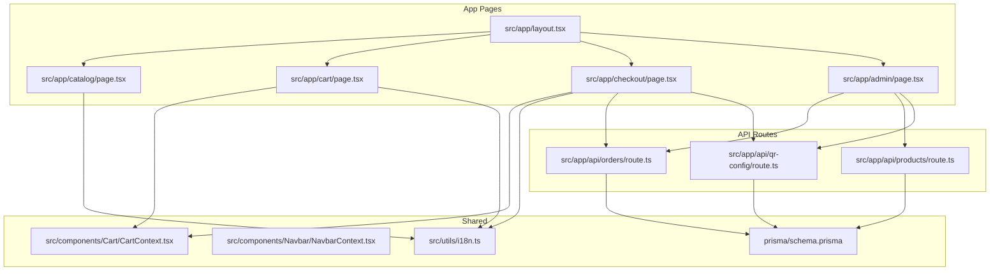
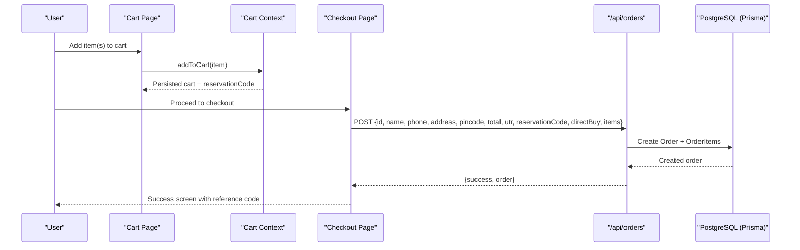
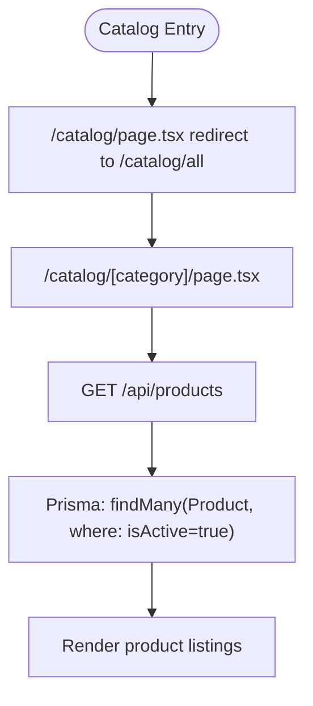
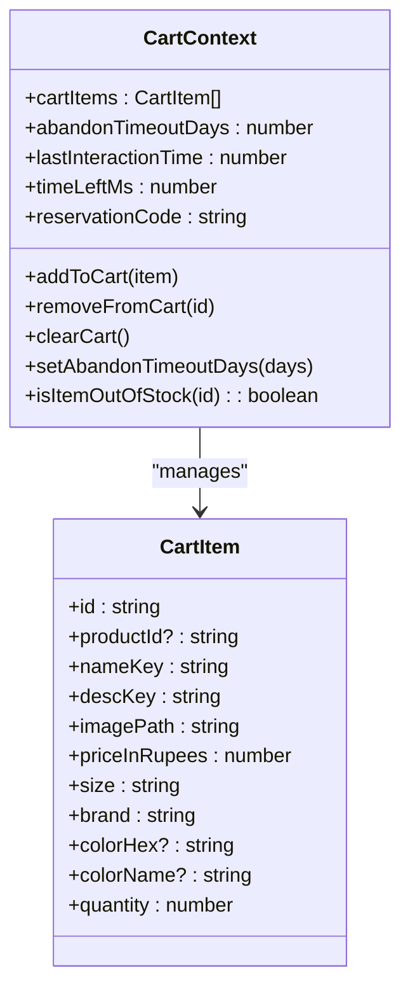
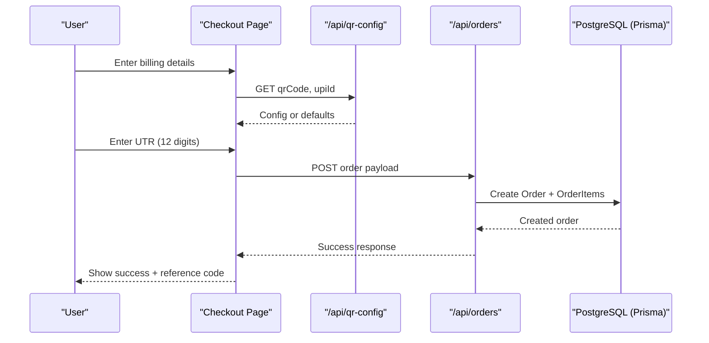
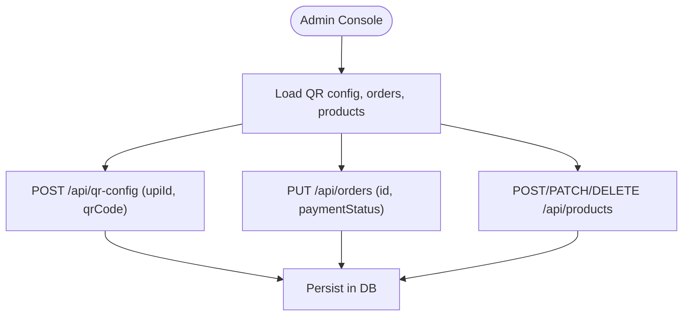
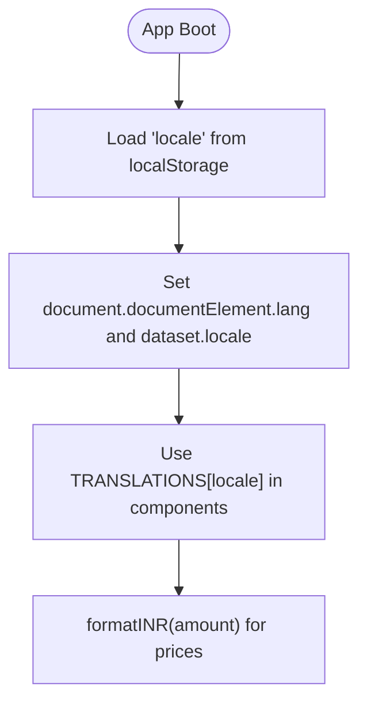
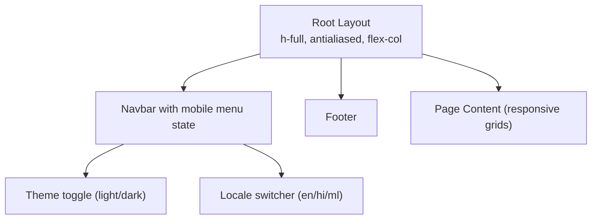
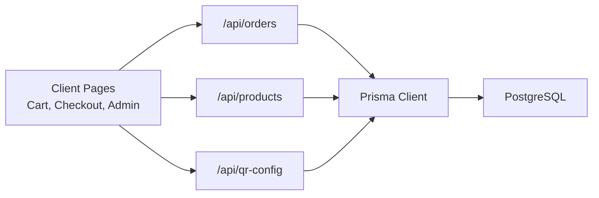

# Core Features

<cite>
**Referenced Files in This Document**
- [README.md](file://README.md)
- [package.json](file://package.json)
- [src/app/layout.tsx](file://src/app/layout.tsx)
- [src/utils/i18n.ts](file://src/utils/i18n.ts)
- [src/components/Navbar/NavbarContext.tsx](file://src/components/Navbar/NavbarContext.tsx)
- [src/components/Cart/CartContext.tsx](file://src/components/Cart/CartContext.tsx)
- [src/app/catalog/page.tsx](file://src/app/catalog/page.tsx)
- [src/app/cart/page.tsx](file://src/app/cart/page.tsx)
- [src/app/checkout/page.tsx](file://src/app/checkout/page.tsx)
- [src/app/api/orders/route.ts](file://src/app/api/orders/route.ts)
- [src/app/api/products/route.ts](file://src/app/api/products/route.ts)
- [src/app/api/qr-config/route.ts](file://src/app/api/qr-config/route.ts)
- [src/app/admin/page.tsx](file://src/app/admin/page.tsx)
- [prisma/schema.prisma](file://prisma/schema.prisma)
</cite>

## Table of Contents
1. [Introduction](#introduction)
2. [Project Structure](#project-structure)
3. [Core Components](#core-components)
4. [Architecture Overview](#architecture-overview)
5. [Detailed Component Analysis](#detailed-component-analysis)
6. [Dependency Analysis](#dependency-analysis)
7. [Performance Considerations](#performance-considerations)
8. [Troubleshooting Guide](#troubleshooting-guide)
9. [Conclusion](#conclusion)
10. [Appendices](#appendices)

## Introduction
This document explains the core features of the next.in e-commerce platform, focusing on:
- Product catalog browsing and filtering
- Shopping cart with persistent state, expiration logic, and reservation codes
- Order processing pipeline from checkout to payment verification
- Admin dashboard for product management, order processing, and system configuration
- Internationalization (i18n) support for English, Hindi, and Malayalam
- Responsive design patterns and mobile-first approach
- Practical examples demonstrating feature usage and integration patterns

The project is a Next.js application using React 19, Tailwind CSS v4, Prisma with PostgreSQL, and client-side contexts for global state.

**Section sources**
- [README.md:1-37](file://README.md#L1-L37)
- [package.json:1-37](file://package.json#L1-L37)

## Project Structure
High-level organization:
- App pages under src/app/: catalog, cart, checkout, admin, API routes under src/app/api/, layout and global styles at root
- Shared UI components under src/components/
- Utilities for i18n and catalog data under src/utils/
- Database schema under prisma/schema.prisma

**Diagram sources**
- [src/app/layout.tsx:1-62](file://src/app/layout.tsx#L1-L62)
- [src/app/catalog/page.tsx:1-6](file://src/app/catalog/page.tsx#L1-L6)
- [src/app/cart/page.tsx:1-417](file://src/app/cart/page.tsx#L1-L417)
- [src/app/checkout/page.tsx:1-658](file://src/app/checkout/page.tsx#L1-L658)
- [src/app/admin/page.tsx:1-800](file://src/app/admin/page.tsx#L1-L800)
- [src/app/api/orders/route.ts:1-134](file://src/app/api/orders/route.ts#L1-L134)
- [src/app/api/products/route.ts:1-98](file://src/app/api/products/route.ts#L1-L98)
- [src/app/api/qr-config/route.ts:1-71](file://src/app/api/qr-config/route.ts#L1-L71)
- [src/components/Cart/CartContext.tsx:1-228](file://src/components/Cart/CartContext.tsx#L1-L228)
- [src/components/Navbar/NavbarContext.tsx:1-124](file://src/components/Navbar/NavbarContext.tsx#L1-L124)
- [src/utils/i18n.ts:1-704](file://src/utils/i18n.ts#L1-L704)
- [prisma/schema.prisma:1-67](file://prisma/schema.prisma#L1-L67)

**Section sources**
- [src/app/layout.tsx:1-62](file://src/app/layout.tsx#L1-L62)
- [src/app/catalog/page.tsx:1-6](file://src/app/catalog/page.tsx#L1-L6)
- [src/app/cart/page.tsx:1-417](file://src/app/cart/page.tsx#L1-L417)
- [src/app/checkout/page.tsx:1-658](file://src/app/checkout/page.tsx#L1-L658)
- [src/app/admin/page.tsx:1-800](file://src/app/admin/page.tsx#L1-L800)
- [src/app/api/orders/route.ts:1-134](file://src/app/api/orders/route.ts#L1-L134)
- [src/app/api/products/route.ts:1-98](file://src/app/api/products/route.ts#L1-L98)
- [src/app/api/qr-config/route.ts:1-71](file://src/app/api/qr-config/route.ts#L1-L71)
- [src/components/Cart/CartContext.tsx:1-228](file://src/components/Cart/CartContext.tsx#L1-L228)
- [src/components/Navbar/NavbarContext.tsx:1-124](file://src/components/Navbar/NavbarContext.tsx#L1-L124)
- [src/utils/i18n.ts:1-704](file://src/utils/i18n.ts#L1-L704)
- [prisma/schema.prisma:1-67](file://prisma/schema.prisma#L1-L67)

## Core Components
- Global Layout and Providers: Root layout injects NavbarProvider and CartProvider, sets fonts for Devanagari and Malayalam scripts, and applies metadata.
- Internationalization: Centralized translation dictionary and INR formatter; locale persisted in localStorage and applied to HTML attributes.
- Navbar Context: Manages theme, locale, search query, user session, and menu state across the app.
- Cart Context: Client-side cart state with persistence via localStorage, abandonment timeout, reservation code generation, and out-of-stock simulation after expiry.
- Catalog Page: Redirects to /catalog/all as index; category pages are implemented via route segments.
- Cart Page: Displays items, handles removal, shows reservation code, calculates totals, and provides developer debug tools for timeout testing.
- Checkout Page: Multi-step flow (billing -> payment -> success), UPI QR display, UTR validation, order submission to API, and clearing cart.
- Admin Dashboard: Payment gateway configuration (UPI ID and QR image), order audit log with verification toggle, and product catalog management (upload, edit, delete).
- API Layer: Orders CRUD (with admin-only status update), Products CRUD (admin-only), QR config upsert/read.
- Data Model: Prisma schema defines Order, OrderItem, Product, and QRConfig entities.

**Section sources**
- [src/app/layout.tsx:1-62](file://src/app/layout.tsx#L1-L62)
- [src/utils/i18n.ts:1-704](file://src/utils/i18n.ts#L1-L704)
- [src/components/Navbar/NavbarContext.tsx:1-124](file://src/components/Navbar/NavbarContext.tsx#L1-L124)
- [src/components/Cart/CartContext.tsx:1-228](file://src/components/Cart/CartContext.tsx#L1-L228)
- [src/app/catalog/page.tsx:1-6](file://src/app/catalog/page.tsx#L1-L6)
- [src/app/cart/page.tsx:1-417](file://src/app/cart/page.tsx#L1-L417)
- [src/app/checkout/page.tsx:1-658](file://src/app/checkout/page.tsx#L1-L658)
- [src/app/admin/page.tsx:1-800](file://src/app/admin/page.tsx#L1-L800)
- [src/app/api/orders/route.ts:1-134](file://src/app/api/orders/route.ts#L1-L134)
- [src/app/api/products/route.ts:1-98](file://src/app/api/products/route.ts#L1-L98)
- [src/app/api/qr-config/route.ts:1-71](file://src/app/api/qr-config/route.ts#L1-L71)
- [prisma/schema.prisma:1-67](file://prisma/schema.prisma#L1-L67)

## Architecture Overview
The system follows a Next.js App Router architecture with serverless API routes and client-side state management.

**Diagram sources**
- [src/app/cart/page.tsx:1-417](file://src/app/cart/page.tsx#L1-L417)
- [src/components/Cart/CartContext.tsx:1-228](file://src/components/Cart/CartContext.tsx#L1-L228)
- [src/app/checkout/page.tsx:1-658](file://src/app/checkout/page.tsx#L1-L658)
- [src/app/api/orders/route.ts:1-134](file://src/app/api/orders/route.ts#L1-L134)
- [prisma/schema.prisma:1-67](file://prisma/schema.prisma#L1-L67)

## Detailed Component Analysis

### Product Catalog System
- Browsing: The catalog index redirects to /catalog/all; category pages are implemented via route segments under /catalog/[category].
- Filtering and Search: Category navigation uses predefined categories meta; search functionality integrates with navbar context for query state.
- Data Source: Active products are fetched from /api/products which queries the database for isActive=true.

**Diagram sources**
- [src/app/catalog/page.tsx:1-6](file://src/app/catalog/page.tsx#L1-L6)
- [src/app/api/products/route.ts:1-98](file://src/app/api/products/route.ts#L1-L98)
- [prisma/schema.prisma:1-67](file://prisma/schema.prisma#L1-L67)

**Section sources**
- [src/app/catalog/page.tsx:1-6](file://src/app/catalog/page.tsx#L1-L6)
- [src/app/api/products/route.ts:1-98](file://src/app/api/products/route.ts#L1-L98)
- [src/components/Navbar/NavbarContext.tsx:1-124](file://src/components/Navbar/NavbarContext.tsx#L1-L124)

### Shopping Cart Implementation
Key behaviors:
- Persistent State: Cart items, last interaction time, abandon timeout, and reservation code are stored in localStorage.
- Expiration Logic: A countdown timer computes remaining time based on configured days; when expired, items may be marked out of stock.
- Reservation Codes: Generated once per cart session and persisted; reused during checkout unless overridden by direct buy flow.
- Out-of-Simulation: After expiry, certain items are considered sold to simulate 1-of-1 inventory constraints.

**Diagram sources**
- [src/components/Cart/CartContext.tsx:1-228](file://src/components/Cart/CartContext.tsx#L1-L228)

**Section sources**
- [src/components/Cart/CartContext.tsx:1-228](file://src/components/Cart/CartContext.tsx#L1-L228)
- [src/app/cart/page.tsx:1-417](file://src/app/cart/page.tsx#L1-L417)

### Order Processing Pipeline
Flow highlights:
- Billing Step: Validates name, phone (10 digits), address, and pincode (6 digits).
- Payment Step: Displays dynamic QR code and UPI ID loaded from /api/qr-config; validates UTR (12 digits).
- Submission: Posts order to /api/orders with items and reservation code; clears cart if not direct buy.
- Verification: Admin toggles paymentStatus between pending and verified via PUT /api/orders.

**Diagram sources**
- [src/app/checkout/page.tsx:1-658](file://src/app/checkout/page.tsx#L1-L658)
- [src/app/api/qr-config/route.ts:1-71](file://src/app/api/qr-config/route.ts#L1-L71)
- [src/app/api/orders/route.ts:1-134](file://src/app/api/orders/route.ts#L1-L134)
- [prisma/schema.prisma:1-67](file://prisma/schema.prisma#L1-L67)

**Section sources**
- [src/app/checkout/page.tsx:1-658](file://src/app/checkout/page.tsx#L1-L658)
- [src/app/api/orders/route.ts:1-134](file://src/app/api/orders/route.ts#L1-L134)
- [src/app/api/qr-config/route.ts:1-71](file://src/app/api/qr-config/route.ts#L1-L71)

### Admin Dashboard Functionality
Capabilities:
- Payment Gateway Configuration: Update UPI ID and QR image; persists via /api/qr-config upsert.
- Order Audit Log: Lists orders with customer info, items, totals, UTR, and reservation code; toggles verification status via PUT /api/orders.
- Product Catalog Management: Upload new SKUs, edit existing entries, soft-delete (deactivate) via DELETE /api/products?sku=xxx.

**Diagram sources**
- [src/app/admin/page.tsx:1-800](file://src/app/admin/page.tsx#L1-L800)
- [src/app/api/qr-config/route.ts:1-71](file://src/app/api/qr-config/route.ts#L1-L71)
- [src/app/api/orders/route.ts:1-134](file://src/app/api/orders/route.ts#L1-L134)
- [src/app/api/products/route.ts:1-98](file://src/app/api/products/route.ts#L1-L98)

**Section sources**
- [src/app/admin/page.tsx:1-800](file://src/app/admin/page.tsx#L1-L800)
- [src/app/api/qr-config/route.ts:1-71](file://src/app/api/qr-config/route.ts#L1-L71)
- [src/app/api/orders/route.ts:1-134](file://src/app/api/orders/route.ts#L1-L134)
- [src/app/api/products/route.ts:1-98](file://src/app/api/products/route.ts#L1-L98)

### Internationalization Support
- Supported Locales: en, hi, ml.
- Translation Dictionary: Comprehensive keys for UI, product names/descriptions, filters, and cart/checkout messages.
- Currency Formatting: formatINR uses Intl.NumberFormat with en-IN and INR currency style.
- Locale Persistence: Stored in localStorage; applied to document.documentElement.dataset.locale and lang attribute.

**Diagram sources**
- [src/utils/i18n.ts:1-704](file://src/utils/i18n.ts#L1-L704)
- [src/components/Navbar/NavbarContext.tsx:1-124](file://src/components/Navbar/NavbarContext.tsx#L1-L124)

**Section sources**
- [src/utils/i18n.ts:1-704](file://src/utils/i18n.ts#L1-L704)
- [src/components/Navbar/NavbarContext.tsx:1-124](file://src/components/Navbar/NavbarContext.tsx#L1-L124)

### Responsive Design Patterns and Mobile-First Approach
- Layout: Root layout uses flex-col body and full-height classes for consistent structure.
- Typography and Fonts: Google fonts include Geist, Geist Mono, Noto Sans Devanagari, and Noto Sans Malayalam with variable weights and swap display.
- Tailwind CSS v4: Utility-first responsive classes used throughout pages and components.
- Navigation: Navbar context manages mobile menu state and scroll behavior.

**Diagram sources**
- [src/app/layout.tsx:1-62](file://src/app/layout.tsx#L1-L62)
- [src/components/Navbar/NavbarContext.tsx:1-124](file://src/components/Navbar/NavbarContext.tsx#L1-L124)

**Section sources**
- [src/app/layout.tsx:1-62](file://src/app/layout.tsx#L1-L62)
- [src/components/Navbar/NavbarContext.tsx:1-124](file://src/components/Navbar/NavbarContext.tsx#L1-L124)

## Dependency Analysis
Client-server interactions and data flows:

**Diagram sources**
- [src/app/api/orders/route.ts:1-134](file://src/app/api/orders/route.ts#L1-L134)
- [src/app/api/products/route.ts:1-98](file://src/app/api/products/route.ts#L1-L98)
- [src/app/api/qr-config/route.ts:1-71](file://src/app/api/qr-config/route.ts#L1-L71)
- [prisma/schema.prisma:1-67](file://prisma/schema.prisma#L1-L67)

**Section sources**
- [src/app/api/orders/route.ts:1-134](file://src/app/api/orders/route.ts#L1-L134)
- [src/app/api/products/route.ts:1-98](file://src/app/api/products/route.ts#L1-L98)
- [src/app/api/qr-config/route.ts:1-71](file://src/app/api/qr-config/route.ts#L1-L71)
- [prisma/schema.prisma:1-67](file://prisma/schema.prisma#L1-L67)

## Performance Considerations
- Client-side cart operations are O(n) for add/remove/clear due to array manipulations; n is typically small.
- Expiry timer runs every 100ms while cart has items; consider throttling or debouncing if cart grows significantly.
- API endpoints return minimal payloads; ensure pagination for large catalogs if needed.
- Image assets should be optimized and served via CDN for faster load times.

## Troubleshooting Guide
Common issues and resolutions:
- Database Unavailable:
  - QR config GET falls back to defaults when DB is unavailable.
  - Orders GET returns empty list with warning logs.
- Unauthorized Access:
  - Admin-only endpoints (/api/products POST/DELETE, /api/orders PUT, /api/qr-config POST) require admin authentication; check middleware and session handling.
- Validation Errors:
  - Checkout requires valid phone (10 digits) and pincode (6 digits); UTR must be exactly 12 digits.
- Unique Constraint Violations:
  - Creating a product with duplicate SKU returns 409 error.

**Section sources**
- [src/app/api/qr-config/route.ts:1-71](file://src/app/api/qr-config/route.ts#L1-L71)
- [src/app/api/orders/route.ts:1-134](file://src/app/api/orders/route.ts#L1-L134)
- [src/app/api/products/route.ts:1-98](file://src/app/api/products/route.ts#L1-L98)
- [src/app/checkout/page.tsx:1-658](file://src/app/checkout/page.tsx#L1-L658)

## Conclusion
The next.in platform implements a robust e-commerce experience with:
- Clear separation of concerns via Next.js App Router and API routes
- Persistent client-side cart with configurable expiration and reservation codes
- Secure admin controls for payment configuration and order verification
- Comprehensive internationalization and responsive design
- Scalable data model with Prisma and PostgreSQL

Adopting these patterns ensures maintainability, clarity, and a smooth user journey across devices and languages.

## Appendices

### Practical Examples and Integration Patterns
- Adding an item to cart:
  - Use addToCart from CartContext; it persists to localStorage and generates a reservation code if missing.
- Proceeding to checkout:
  - Navigate to /checkout; validate billing fields; show UPI QR from /api/qr-config; submit UTR to /api/orders.
- Admin updating QR config:
  - POST /api/qr-config with upiId and qrCode; fetch updated values on client.
- Admin verifying an order:
  - PUT /api/orders with id and paymentStatus; refresh order list to reflect changes.

**Section sources**
- [src/components/Cart/CartContext.tsx:1-228](file://src/components/Cart/CartContext.tsx#L1-L228)
- [src/app/checkout/page.tsx:1-658](file://src/app/checkout/page.tsx#L1-L658)
- [src/app/api/qr-config/route.ts:1-71](file://src/app/api/qr-config/route.ts#L1-L71)
- [src/app/api/orders/route.ts:1-134](file://src/app/api/orders/route.ts#L1-L134)