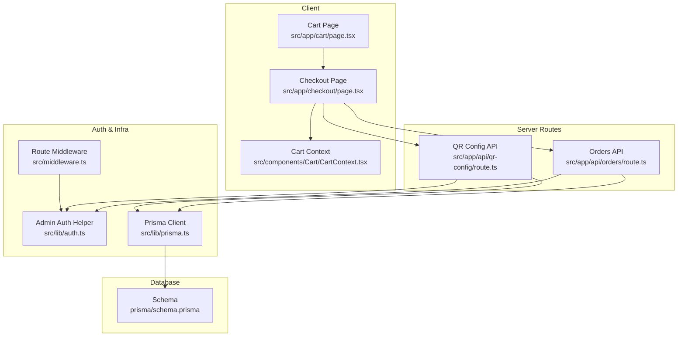
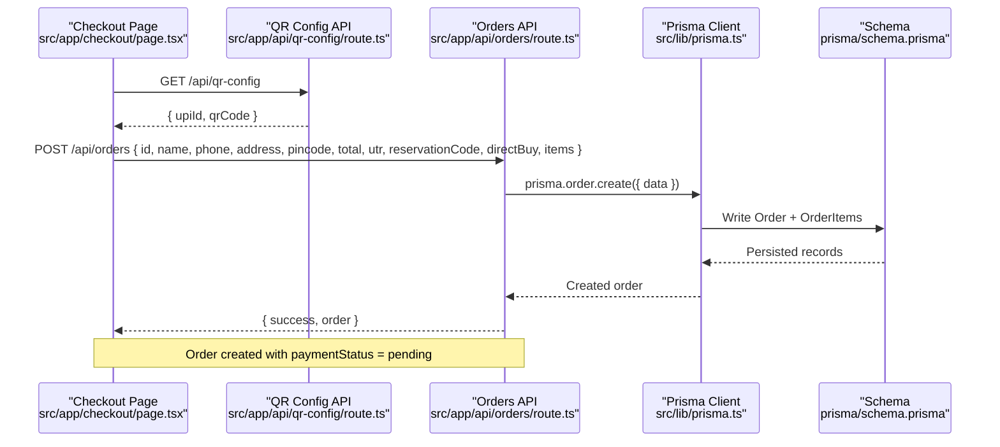
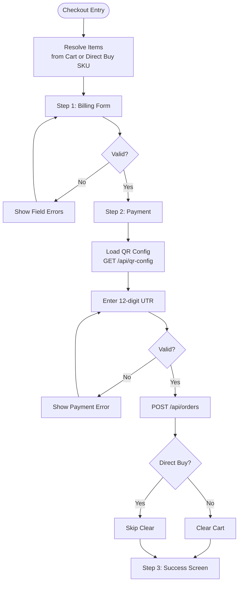
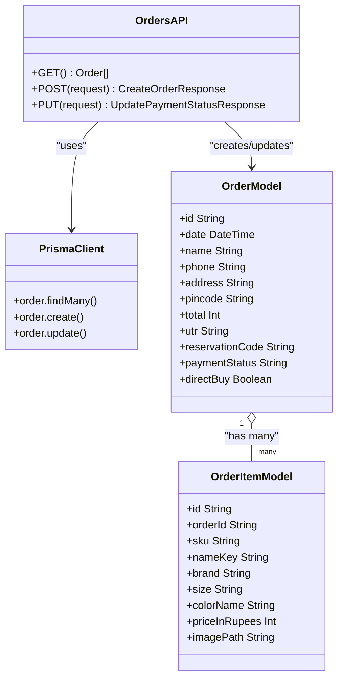
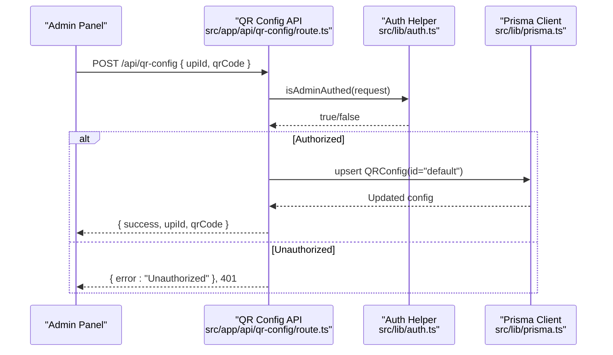
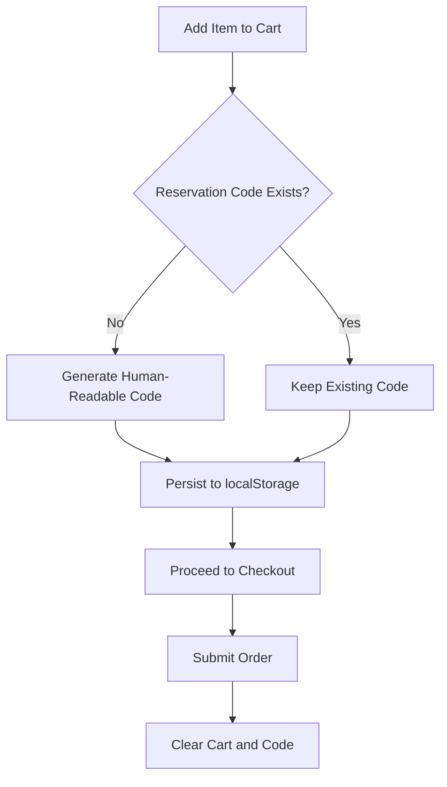
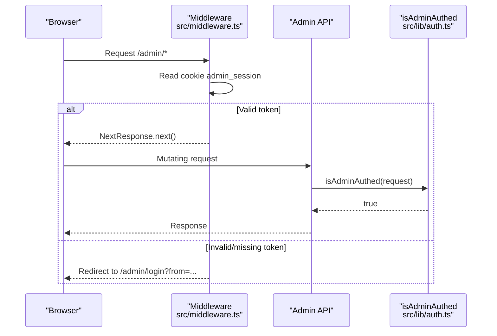
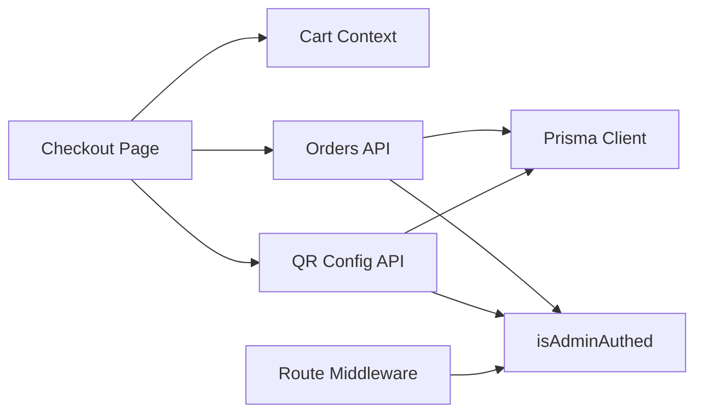

# Order Processing Pipeline

<cite>
**Referenced Files in This Document**
- [src/app/api/orders/route.ts](file://src/app/api/orders/route.ts)
- [src/app/checkout/page.tsx](file://src/app/checkout/page.tsx)
- [src/app/api/qr-config/route.ts](file://src/app/api/qr-config/route.ts)
- [prisma/schema.prisma](file://prisma/schema.prisma)
- [src/components/Cart/CartContext.tsx](file://src/components/Cart/CartContext.tsx)
- [src/app/cart/page.tsx](file://src/app/cart/page.tsx)
- [src/lib/auth.ts](file://src/lib/auth.ts)
- [src/middleware.ts](file://src/middleware.ts)
- [src/lib/prisma.ts](file://src/lib/prisma.ts)
</cite>

## Table of Contents
1. [Introduction](#introduction)
2. [Project Structure](#project-structure)
3. [Core Components](#core-components)
4. [Architecture Overview](#architecture-overview)
5. [Detailed Component Analysis](#detailed-component-analysis)
6. [Dependency Analysis](#dependency-analysis)
7. [Performance Considerations](#performance-considerations)
8. [Troubleshooting Guide](#troubleshooting-guide)
9. [Conclusion](#conclusion)
10. [Appendices](#appendices)

## Introduction
This document explains the end-to-end order processing pipeline from checkout initiation to payment verification and order confirmation. It covers:
- API endpoints for order creation, listing, and status updates
- Payment integration using UPI QR codes and UTR submission
- Checkout page implementation including form validation, order summary, and payment flow
- Data models and data flows
- Error handling strategies and security considerations

The system uses a client-side checkout UI that collects billing details and UPI transaction reference (UTR), persists orders to a PostgreSQL database via Prisma, and exposes admin-only endpoints to update order payment status.

## Project Structure
Key areas involved in the order lifecycle:
- Client pages: Cart and Checkout
- Server routes: Orders API, QR configuration API
- Database schema: Orders, OrderItems, QRConfig
- Authentication and middleware: Admin session checks and route protection

**Diagram sources**
- [src/app/cart/page.tsx:1-417](file://src/app/cart/page.tsx#L1-L417)
- [src/app/checkout/page.tsx:1-658](file://src/app/checkout/page.tsx#L1-L658)
- [src/components/Cart/CartContext.tsx:1-228](file://src/components/Cart/CartContext.tsx#L1-L228)
- [src/app/api/orders/route.ts:1-134](file://src/app/api/orders/route.ts#L1-L134)
- [src/app/api/qr-config/route.ts:1-71](file://src/app/api/qr-config/route.ts#L1-L71)
- [src/lib/auth.ts:1-16](file://src/lib/auth.ts#L1-L16)
- [src/middleware.ts:1-27](file://src/middleware.ts#L1-L27)
- [src/lib/prisma.ts:1-23](file://src/lib/prisma.ts#L1-L23)
- [prisma/schema.prisma:1-67](file://prisma/schema.prisma#L1-L67)

**Section sources**
- [src/app/cart/page.tsx:1-417](file://src/app/cart/page.tsx#L1-L417)
- [src/app/checkout/page.tsx:1-658](file://src/app/checkout/page.tsx#L1-L658)
- [src/components/Cart/CartContext.tsx:1-228](file://src/components/Cart/CartContext.tsx#L1-L228)
- [src/app/api/orders/route.ts:1-134](file://src/app/api/orders/route.ts#L1-L134)
- [src/app/api/qr-config/route.ts:1-71](file://src/app/api/qr-config/route.ts#L1-L71)
- [src/lib/auth.ts:1-16](file://src/lib/auth.ts#L1-L16)
- [src/middleware.ts:1-27](file://src/middleware.ts#L1-L27)
- [src/lib/prisma.ts:1-23](file://src/lib/prisma.ts#L1-L23)
- [prisma/schema.prisma:1-67](file://prisma/schema.prisma#L1-L67)

## Core Components
- Checkout page orchestrates the user journey: billing form, payment step with UPI QR and UTR input, and success screen.
- Orders API provides:
  - GET: list orders with items
  - POST: create an order with items and payment metadata
  - PUT: update order payment status (admin only)
- QR Config API serves dynamic UPI ID and QR image path; supports admin-only updates.
- Cart context manages cart state, reservation code generation, and expiry simulation.
- Prisma schema defines Order, OrderItem, and QRConfig entities.

**Section sources**
- [src/app/checkout/page.tsx:1-658](file://src/app/checkout/page.tsx#L1-L658)
- [src/app/api/orders/route.ts:1-134](file://src/app/api/orders/route.ts#L1-L134)
- [src/app/api/qr-config/route.ts:1-71](file://src/app/api/qr-config/route.ts#L1-L71)
- [src/components/Cart/CartContext.tsx:1-228](file://src/components/Cart/CartContext.tsx#L1-L228)
- [prisma/schema.prisma:1-67](file://prisma/schema.prisma#L1-L67)

## Architecture Overview
The order lifecycle is split into three phases:
1. Checkout Initiation and Billing
   - User enters name, phone, address, pincode on the checkout page.
   - Validation ensures required fields and formats (phone/pincode).
2. Payment Submission
   - The checkout page loads UPI QR and UPI ID from the QR config API.
   - User scans QR, pays via UPI, then submits the 12-digit UTR.
   - The checkout page posts the order to the Orders API with all details.
3. Verification and Confirmation
   - Orders are persisted with paymentStatus set to pending.
   - Admin can verify the UTR and update paymentStatus to verified via the Orders API PUT endpoint.
   - The checkout success screen shows the generated reservation code and receipt summary.

**Diagram sources**
- [src/app/checkout/page.tsx:1-658](file://src/app/checkout/page.tsx#L1-L658)
- [src/app/api/qr-config/route.ts:1-71](file://src/app/api/qr-config/route.ts#L1-L71)
- [src/app/api/orders/route.ts:1-134](file://src/app/api/orders/route.ts#L1-L134)
- [src/lib/prisma.ts:1-23](file://src/lib/prisma.ts#L1-L23)
- [prisma/schema.prisma:1-67](file://prisma/schema.prisma#L1-L67)

## Detailed Component Analysis

### Checkout Page Implementation
Responsibilities:
- Resolve checkout items from either cart or direct buy SKU
- Validate billing inputs (name, phone, address, pincode)
- Load UPI QR and UPI ID from QR config API
- Validate UTR (12 digits) and submit order
- Show success screen with reservation code and receipt summary

Key behaviors:
- Billing validation enforces non-empty fields and format constraints for phone and pincode
- Payment step displays QR image and UPI ID, accepts UTR input, simulates verification delay, then posts order
- Success step shows generated reservation code and itemized receipt

**Diagram sources**
- [src/app/checkout/page.tsx:1-658](file://src/app/checkout/page.tsx#L1-L658)
- [src/app/api/qr-config/route.ts:1-71](file://src/app/api/qr-config/route.ts#L1-L71)
- [src/app/api/orders/route.ts:1-134](file://src/app/api/orders/route.ts#L1-L134)
- [src/components/Cart/CartContext.tsx:1-228](file://src/components/Cart/CartContext.tsx#L1-L228)

**Section sources**
- [src/app/checkout/page.tsx:1-658](file://src/app/checkout/page.tsx#L1-L658)
- [src/components/Cart/CartContext.tsx:1-228](file://src/components/Cart/CartContext.tsx#L1-L228)

### Orders API
Endpoints:
- GET /api/orders
  - Returns all orders with items, ordered by date descending
  - Maps timestamps to epoch milliseconds and aggregates customer info
- POST /api/orders
  - Creates an order with items and payment metadata
  - Validates required fields and returns errors if missing
  - Persists Order and related OrderItems
- PUT /api/orders
  - Updates order paymentStatus (requires admin authentication)
  - Validates request body and returns error responses on failure

Security:
- PUT requires admin session cookie validated by isAdminAuthed helper

Error handling:
- Missing fields return 400
- Database errors return 500 with descriptive messages

**Diagram sources**
- [src/app/api/orders/route.ts:1-134](file://src/app/api/orders/route.ts#L1-L134)
- [prisma/schema.prisma:1-67](file://prisma/schema.prisma#L1-L67)

**Section sources**
- [src/app/api/orders/route.ts:1-134](file://src/app/api/orders/route.ts#L1-L134)
- [src/lib/auth.ts:1-16](file://src/lib/auth.ts#L1-L16)

### QR Configuration API
Endpoints:
- GET /api/qr-config
  - Retrieves configured UPI ID and QR image path
  - Falls back to defaults when database is unavailable
- POST /api/qr-config
  - Upserts default QR config (requires admin authentication)
  - Validates required fields and returns error responses

Security:
- POST requires admin session cookie validated by isAdminAuthed helper

Error handling:
- Missing fields return 400
- Database errors return 500 with descriptive messages

**Diagram sources**
- [src/app/api/qr-config/route.ts:1-71](file://src/app/api/qr-config/route.ts#L1-L71)
- [src/lib/auth.ts:1-16](file://src/lib/auth.ts#L1-L16)
- [src/lib/prisma.ts:1-23](file://src/lib/prisma.ts#L1-L23)

**Section sources**
- [src/app/api/qr-config/route.ts:1-71](file://src/app/api/qr-config/route.ts#L1-L71)
- [src/lib/auth.ts:1-16](file://src/lib/auth.ts#L1-L16)

### Cart and Reservation Code Flow
- Cart context maintains cart items, abandonment timeout, and reservation code
- Generates a human-readable reservation code when adding first item
- Exposes clearCart used by checkout after successful submission
- Provides out-of-stock simulation based on expiration logic

**Diagram sources**
- [src/components/Cart/CartContext.tsx:1-228](file://src/components/Cart/CartContext.tsx#L1-L228)
- [src/app/checkout/page.tsx:1-658](file://src/app/checkout/page.tsx#L1-L658)

**Section sources**
- [src/components/Cart/CartContext.tsx:1-228](file://src/components/Cart/CartContext.tsx#L1-L228)
- [src/app/checkout/page.tsx:1-658](file://src/app/checkout/page.tsx#L1-L658)

### Admin Protection and Middleware
- Route middleware protects /admin paths by checking admin_session cookie against environment variable
- Admin-only API endpoints use isAdminAuthed helper to validate cookies

**Diagram sources**
- [src/middleware.ts:1-27](file://src/middleware.ts#L1-L27)
- [src/lib/auth.ts:1-16](file://src/lib/auth.ts#L1-L16)

**Section sources**
- [src/middleware.ts:1-27](file://src/middleware.ts#L1-L27)
- [src/lib/auth.ts:1-16](file://src/lib/auth.ts#L1-L16)

## Dependency Analysis
- Checkout depends on:
  - Cart context for items and reservation code
  - QR config API for UPI settings
  - Orders API for persistence
- Orders API depends on:
  - Prisma client for database operations
  - Admin auth helper for protected mutations
- QR config API depends on:
  - Prisma client for configuration storage
  - Admin auth helper for protected updates
- Middleware enforces admin access at the route level

**Diagram sources**
- [src/app/checkout/page.tsx:1-658](file://src/app/checkout/page.tsx#L1-L658)
- [src/components/Cart/CartContext.tsx:1-228](file://src/components/Cart/CartContext.tsx#L1-L228)
- [src/app/api/qr-config/route.ts:1-71](file://src/app/api/qr-config/route.ts#L1-L71)
- [src/app/api/orders/route.ts:1-134](file://src/app/api/orders/route.ts#L1-L134)
- [src/lib/auth.ts:1-16](file://src/lib/auth.ts#L1-L16)
- [src/middleware.ts:1-27](file://src/middleware.ts#L1-L27)
- [src/lib/prisma.ts:1-23](file://src/lib/prisma.ts#L1-L23)

**Section sources**
- [src/app/checkout/page.tsx:1-658](file://src/app/checkout/page.tsx#L1-L658)
- [src/components/Cart/CartContext.tsx:1-228](file://src/components/Cart/CartContext.tsx#L1-L228)
- [src/app/api/qr-config/route.ts:1-71](file://src/app/api/qr-config/route.ts#L1-L71)
- [src/app/api/orders/route.ts:1-134](file://src/app/api/orders/route.ts#L1-L134)
- [src/lib/auth.ts:1-16](file://src/lib/auth.ts#L1-L16)
- [src/middleware.ts:1-27](file://src/middleware.ts#L1-L27)
- [src/lib/prisma.ts:1-23](file://src/lib/prisma.ts#L1-L23)

## Performance Considerations
- Avoid unnecessary re-renders by memoizing computed values such as checkout items and totals
- Use efficient queries in server routes (e.g., include only necessary relations)
- Cache QR config responses where appropriate to reduce repeated fetches
- Ensure database indexes on frequently queried fields (e.g., Order.date, Order.paymentStatus)

[No sources needed since this section provides general guidance]

## Troubleshooting Guide
Common issues and resolutions:
- Missing required fields during order creation
  - Symptom: 400 response with error message indicating missing fields
  - Resolution: Ensure id, name, phone, address, pincode, total, utr, reservationCode, and items are provided
- Invalid UTR format
  - Symptom: Payment error displayed on checkout page
  - Resolution: Enter exactly 12 numeric digits
- Database unavailability
  - Symptom: Fallback behavior returning empty orders or default QR config
  - Resolution: Verify DATABASE_URL and Neon adapter configuration
- Unauthorized updates
  - Symptom: 401 Unauthorized when updating order status or QR config
  - Resolution: Ensure admin_session cookie matches ADMIN_SESSION_TOKEN

**Section sources**
- [src/app/api/orders/route.ts:1-134](file://src/app/api/orders/route.ts#L1-L134)
- [src/app/api/qr-config/route.ts:1-71](file://src/app/api/qr-config/route.ts#L1-L71)
- [src/lib/prisma.ts:1-23](file://src/lib/prisma.ts#L1-L23)

## Conclusion
The order processing pipeline integrates a client-side checkout experience with server-side APIs and a PostgreSQL-backed schema. Users submit billing details and UPI UTR, orders are persisted with pending payment status, and admins can verify transactions and update status. Security is enforced via admin session cookies and middleware. Robust error handling and fallbacks ensure resilience during development and production.

[No sources needed since this section summarizes without analyzing specific files]

## Appendices

### API Definitions

- GET /api/orders
  - Purpose: Retrieve all orders with items
  - Response: Array of order objects with mapped fields
  - Notes: Orders sorted by date descending

- POST /api/orders
  - Purpose: Create a new order
  - Request body fields:
    - id: string
    - name: string
    - phone: string
    - address: string
    - pincode: string
    - total: number
    - utr: string
    - reservationCode: string
    - directBuy: boolean
    - items: array of order items
  - Response: { success: boolean, order: object }
  - Errors:
    - 400: Missing required fields
    - 500: Database error

- PUT /api/orders
  - Purpose: Update order payment status (admin only)
  - Request body fields:
    - id: string
    - paymentStatus: string
  - Response: { success: boolean, order: object }
  - Errors:
    - 401: Unauthorized
    - 400: Missing required fields
    - 500: Database error

- GET /api/qr-config
  - Purpose: Retrieve UPI QR and UPI ID configuration
  - Response: { upiId: string, qrCode: string, isDefault?: boolean }
  - Fallback: Returns defaults when database is unavailable

- POST /api/qr-config
  - Purpose: Update QR configuration (admin only)
  - Request body fields:
    - upiId: string
    - qrCode: string
  - Response: { success: boolean, upiId: string, qrCode: string }
  - Errors:
    - 401: Unauthorized
    - 400: Missing required fields
    - 500: Database error

**Section sources**
- [src/app/api/orders/route.ts:1-134](file://src/app/api/orders/route.ts#L1-L134)
- [src/app/api/qr-config/route.ts:1-71](file://src/app/api/qr-config/route.ts#L1-L71)

### Data Models

- Order
  - Fields: id, date, name, phone, address, pincode, total, utr, reservationCode, paymentStatus, directBuy
- OrderItem
  - Fields: id, orderId, sku, nameKey, brand, size, colorName, priceInRupees, imagePath
- QRConfig
  - Fields: id, upiId, qrCode, updatedAt

**Section sources**
- [prisma/schema.prisma:1-67](file://prisma/schema.prisma#L1-L67)

### Security Considerations
- Admin-only endpoints require a valid admin_session cookie matching ADMIN_SESSION_TOKEN
- Middleware enforces authentication for /admin routes
- Input validation on both client and server sides reduces risk of malformed data
- Avoid logging sensitive information like UTR in console outputs

**Section sources**
- [src/lib/auth.ts:1-16](file://src/lib/auth.ts#L1-L16)
- [src/middleware.ts:1-27](file://src/middleware.ts#L1-L27)
- [src/app/api/orders/route.ts:1-134](file://src/app/api/orders/route.ts#L1-L134)
- [src/app/api/qr-config/route.ts:1-71](file://src/app/api/qr-config/route.ts#L1-L71)