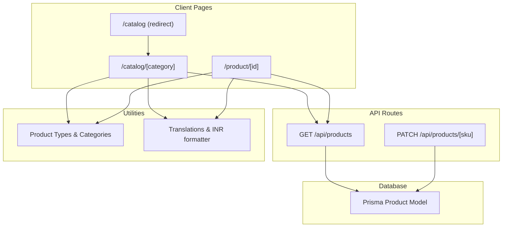
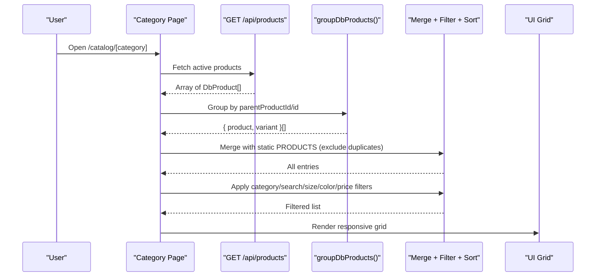
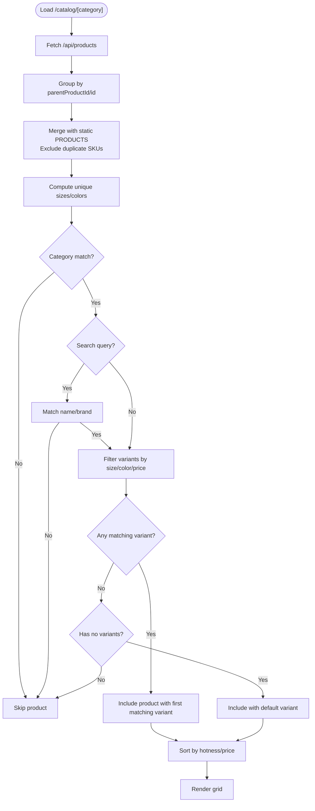
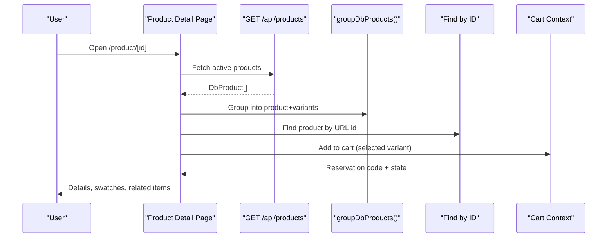
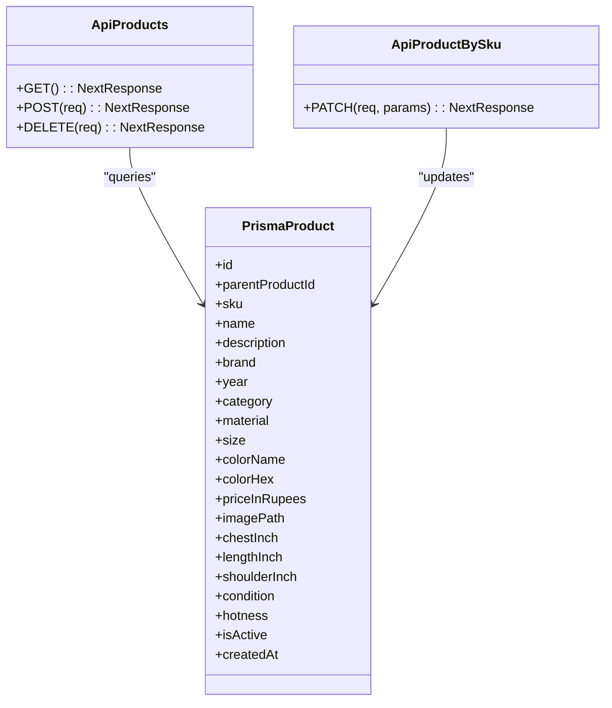
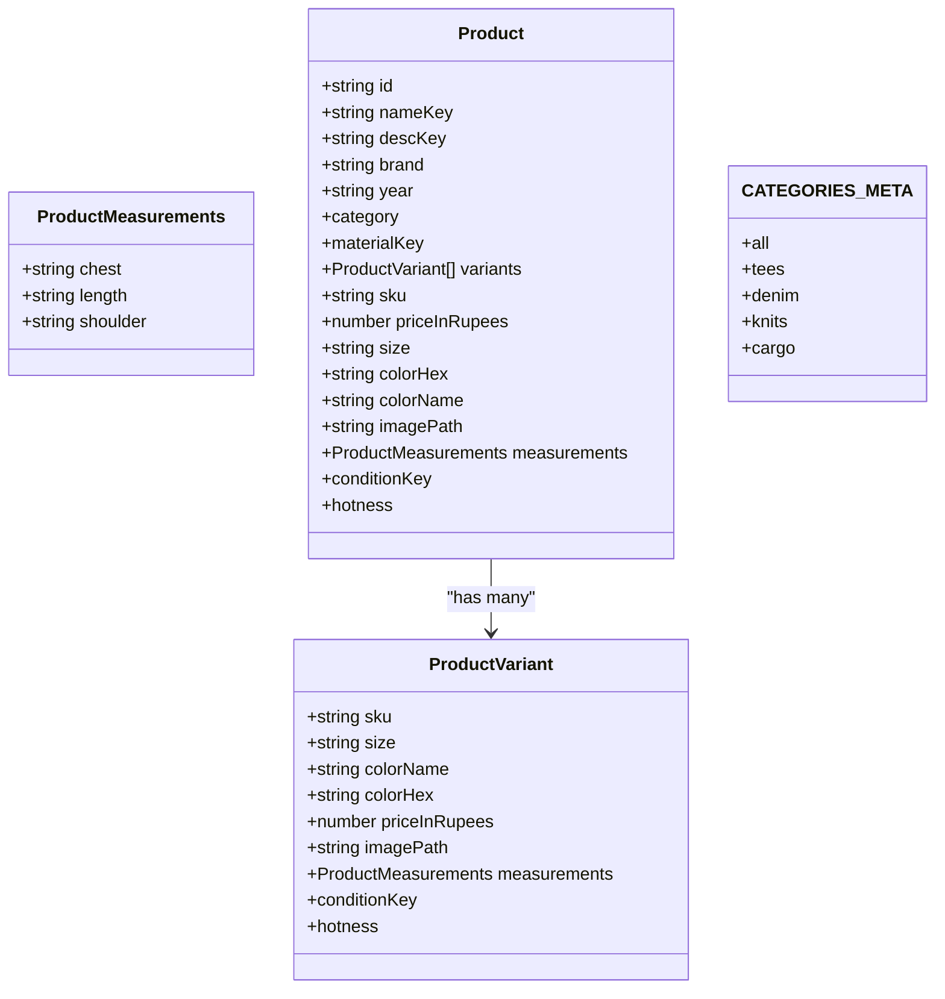
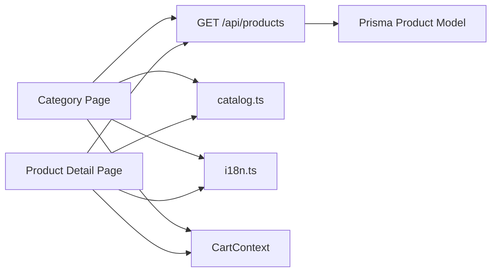

# Product Catalog System

<cite>
**Referenced Files in This Document**
- [route.ts](file://src/app/api/products/route.ts)
- [route.ts](file://src/app/api/products/[sku]/route.ts)
- [page.tsx](file://src/app/catalog/page.tsx)
- [page.tsx](file://src/app/catalog/[category]/page.tsx)
- [page.tsx](file://src/app/product/[id]/page.tsx)
- [catalog.ts](file://src/utils/catalog.ts)
- [i18n.ts](file://src/utils/i18n.ts)
- [schema.prisma](file://prisma/schema.prisma)
- [CartContext.tsx](file://src/components/Cart/CartContext.tsx)
</cite>

## Table of Contents
1. [Introduction](#introduction)
2. [Project Structure](#project-structure)
3. [Core Components](#core-components)
4. [Architecture Overview](#architecture-overview)
5. [Detailed Component Analysis](#detailed-component-analysis)
6. [Dependency Analysis](#dependency-analysis)
7. [Performance Considerations](#performance-considerations)
8. [Troubleshooting Guide](#troubleshooting-guide)
9. [Conclusion](#conclusion)
10. [Appendices](#appendices)

## Introduction
This document explains the product catalog system with a focus on category-based browsing, filtering and search, API endpoints for listing and retrieving products, data utilities, responsive design patterns, and mobile optimization strategies. The system combines server-side APIs with client-side state to present a unified catalog experience across desktop and mobile devices.

## Project Structure
The catalog spans Next.js App Router pages, API routes, shared utilities, and UI components:
- API routes expose GET operations for listing active products and PATCH for updating by SKU (admin-only).
- Client pages implement category navigation, search, filters, sorting, and product detail views.
- Utilities define product types, categories metadata, and formatting helpers.
- Database schema defines the Product model used by the API.

**Diagram sources**
- [page.tsx:1-6](file://src/app/catalog/page.tsx#L1-L6)
- [page.tsx:1-220](file://src/app/catalog/[category]/page.tsx#L1-L220)
- [page.tsx:1-160](file://src/app/product/[id]/page.tsx#L1-L160)
- [route.ts:1-20](file://src/app/api/products/route.ts#L1-L20)
- [route.ts:1-20](file://src/app/api/products/[sku]/route.ts#L1-L20)
- [catalog.ts:1-50](file://src/utils/catalog.ts#L1-L50)
- [i18n.ts:690-704](file://src/utils/i18n.ts#L690-L704)
- [schema.prisma:44-66](file://prisma/schema.prisma#L44-L66)

**Section sources**
- [page.tsx:1-6](file://src/app/catalog/page.tsx#L1-L6)
- [page.tsx:1-220](file://src/app/catalog/[category]/page.tsx#L1-L220)
- [page.tsx:1-160](file://src/app/product/[id]/page.tsx#L1-L160)
- [route.ts:1-20](file://src/app/api/products/route.ts#L1-L20)
- [route.ts:1-20](file://src/app/api/products/[sku]/route.ts#L1-L20)
- [catalog.ts:1-50](file://src/utils/catalog.ts#L1-L50)
- [i18n.ts:690-704](file://src/utils/i18n.ts#L690-L704)
- [schema.prisma:44-66](file://prisma/schema.prisma#L44-L66)

## Core Components
- Category page: Loads all active products from the API, groups variants, merges with static catalog, applies filters/sort, and renders a responsive grid with side filters and mobile drawer.
- Product detail page: Resolves a product by ID, selects variants, shows related items, and integrates cart actions.
- API layer: Provides GET listing of active products and admin-only PATCH update by SKU.
- Utilities: Define Product/ProductVariant interfaces, category metadata, and INR formatting.
- Cart context: Adds items to cart, manages reservation code and expiry, and exposes stock status logic.

Key responsibilities:
- Data loading and grouping into product+variant pairs.
- Filtering by category, search query, size, color, price range.
- Sorting by hotness or price ascending/descending.
- Responsive layout with desktop sidebar and mobile slide-out filter drawer.
- Internationalization via translation keys and currency formatting.

**Section sources**
- [page.tsx:103-220](file://src/app/catalog/[category]/page.tsx#L103-L220)
- [page.tsx:105-160](file://src/app/product/[id]/page.tsx#L105-L160)
- [route.ts:1-20](file://src/app/api/products/route.ts#L1-L20)
- [route.ts:1-20](file://src/app/api/products/[sku]/route.ts#L1-L20)
- [catalog.ts:1-50](file://src/utils/catalog.ts#L1-L50)
- [i18n.ts:690-704](file://src/utils/i18n.ts#L690-L704)
- [CartContext.tsx:1-120](file://src/components/Cart/CartContext.tsx#L1-L120)

## Architecture Overview
The catalog uses a hybrid data model:
- Server returns flat product rows grouped by parentProductId (or id if null) into logical products with multiple variants.
- Client merges DB results with a static PRODUCTS array (excluding duplicates by SKU), then computes dynamic filter options and filtered lists.

**Diagram sources**
- [page.tsx:113-200](file://src/app/catalog/[category]/page.tsx#L113-L200)
- [route.ts:6-17](file://src/app/api/products/route.ts#L6-L17)

## Detailed Component Analysis

### Category Browsing and Filtering
- Category routing: The index redirects to “all” to show the full catalog; dynamic route handles per-category views.
- Data fetching: On mount, fetches active products from the API and groups them into product+variant structures.
- Merging strategy: Combines DB products with static PRODUCTS, excluding any SKUs already present in DB to avoid duplication.
- Dynamic filters: Computes unique sizes and colors from the merged dataset.
- Filtering pipeline: Applies category, search (name/brand), size, color, and price range filters; sorts by hotness or price.
- UI: Desktop sidebar filters; mobile slide-out drawer; responsive grid adapts columns based on viewport.

**Diagram sources**
- [page.tsx:154-200](file://src/app/catalog/[category]/page.tsx#L154-L200)

**Section sources**
- [page.tsx:1-6](file://src/app/catalog/page.tsx#L1-L6)
- [page.tsx:103-220](file://src/app/catalog/[category]/page.tsx#L103-L220)

### Product Detail Page
- Resolves product by ID using the merged dataset.
- Initializes selected variant to the first variant.
- Displays color swatches and size buttons derived from variants.
- Shows related products within the same category.
- Integrates with cart context to add items and display reservation code.

**Diagram sources**
- [page.tsx:118-160](file://src/app/product/[id]/page.tsx#L118-L160)
- [CartContext.tsx:99-120](file://src/components/Cart/CartContext.tsx#L99-L120)

**Section sources**
- [page.tsx:105-160](file://src/app/product/[id]/page.tsx#L105-L160)
- [CartContext.tsx:99-120](file://src/components/Cart/CartContext.tsx#L99-L120)

### API Endpoints
- GET /api/products
  - Returns all active products ordered by creation date descending.
  - Used by both category and product detail pages to build the catalog.
- PATCH /api/products/[sku]
  - Admin-only endpoint to update a product field by SKU.
  - Handles unique constraint errors and returns appropriate status codes.

**Diagram sources**
- [route.ts:6-17](file://src/app/api/products/route.ts#L6-L17)
- [route.ts:6-22](file://src/app/api/products/[sku]/route.ts#L6-L22)
- [schema.prisma:44-66](file://prisma/schema.prisma#L44-L66)

**Section sources**
- [route.ts:1-20](file://src/app/api/products/route.ts#L1-L20)
- [route.ts:1-20](file://src/app/api/products/[sku]/route.ts#L1-L20)
- [schema.prisma:44-66](file://prisma/schema.prisma#L44-L66)

### Catalog Utilities and Data Models
- Product and ProductVariant interfaces define the shape of catalog items, including measurements, condition, and hotness.
- CATEGORIES_META maps category slugs to labels and hrefs for navigation.
- formatINR formats prices in Indian Rupees for consistent display.

**Diagram sources**
- [catalog.ts:1-50](file://src/utils/catalog.ts#L1-L50)

**Section sources**
- [catalog.ts:1-50](file://src/utils/catalog.ts#L1-L50)
- [i18n.ts:690-704](file://src/utils/i18n.ts#L690-L704)

### Responsive Design Patterns and Mobile Optimization
- Layout: Uses a responsive grid that switches from single column on small screens to multi-column on larger screens.
- Filters: Desktop sidebar is hidden on mobile; a slide-out drawer provides the same filtering controls.
- Touch-friendly controls: Larger tap targets for size/color buttons and clear actions.
- Performance: Loading spinner while fetching products; empty state guidance when no matches are found.
- Accessibility: aria-labels for hotness indicators and descriptive placeholders for search.

[No sources needed since this section summarizes UI behavior without analyzing specific files]

## Dependency Analysis
- Category and product pages depend on:
  - API route for product data.
  - Utilities for types, categories, and formatting.
  - Cart context for adding items and managing reservation state.
- API routes depend on Prisma client and authentication helper for admin-only operations.

**Diagram sources**
- [page.tsx:1-20](file://src/app/catalog/[category]/page.tsx#L1-L20)
- [page.tsx:1-22](file://src/app/product/[id]/page.tsx#L1-L22)
- [route.ts:1-10](file://src/app/api/products/route.ts#L1-L10)
- [schema.prisma:44-66](file://prisma/schema.prisma#L44-L66)
- [CartContext.tsx:1-40](file://src/components/Cart/CartContext.tsx#L1-L40)

**Section sources**
- [page.tsx:1-20](file://src/app/catalog/[category]/page.tsx#L1-L20)
- [page.tsx:1-22](file://src/app/product/[id]/page.tsx#L1-L22)
- [route.ts:1-10](file://src/app/api/products/route.ts#L1-L10)
- [schema.prisma:44-66](file://prisma/schema.prisma#L44-L66)
- [CartContext.tsx:1-40](file://src/components/Cart/CartContext.tsx#L1-L40)

## Performance Considerations
- Client-side filtering and sorting operate on an in-memory dataset after initial fetch, minimizing repeated network calls.
- Memoization reduces recomputation of computed values like sizes, colors, and filtered lists.
- Avoid pagination in current implementation; consider implementing server-side pagination for large catalogs to reduce payload size and improve load times.
- Image optimization can be improved by serving appropriately sized images and using lazy loading.

[No sources needed since this section provides general guidance]

## Troubleshooting Guide
- No products shown: Ensure the API returns active products and verify category slug matches product.category.
- Filters not working: Confirm selectedSizes, selectedColors, and selectedPriceRange are correctly applied in the filter pipeline.
- Duplicate items: Check that merging excludes SKUs already present in DB to prevent duplicates.
- Admin updates failing: Verify admin authentication and handle unique constraint errors for SKU conflicts.

**Section sources**
- [page.tsx:154-200](file://src/app/catalog/[category]/page.tsx#L154-L200)
- [route.ts:60-72](file://src/app/api/products/route.ts#L60-L72)
- [route.ts:23-34](file://src/app/api/products/[sku]/route.ts#L23-L34)

## Conclusion
The catalog system delivers a robust, responsive browsing experience with flexible filtering and search, backed by a simple API and well-defined data models. It balances server-side data retrieval with efficient client-side processing, ensuring smooth interactions across devices. Future enhancements could include server-side pagination, richer search indexing, and advanced caching strategies.

[No sources needed since this section summarizes without analyzing specific files]

## Appendices

### API Definitions
- GET /api/products
  - Purpose: List all active products.
  - Response: Array of product records.
  - Status codes: 200 OK, 500 Internal Server Error.
- PATCH /api/products/[sku]
  - Purpose: Update a product field by SKU (admin-only).
  - Request body: Partial product fields.
  - Status codes: 200 OK, 401 Unauthorized, 409 Conflict (SKU exists), 500 Internal Server Error.

**Section sources**
- [route.ts:6-17](file://src/app/api/products/route.ts#L6-L17)
- [route.ts:6-22](file://src/app/api/products/[sku]/route.ts#L6-L22)

### Example Product Data Structure
- Product: Contains identifiers, metadata, and a collection of variants.
- ProductVariant: Represents a specific SKU with size, color, price, image, measurements, condition, and demand score.
- Measurements: Chest, length, shoulder dimensions.

**Section sources**
- [catalog.ts:1-50](file://src/utils/catalog.ts#L1-L50)

### Filtering Parameters
- Category: Matches product.category against the route parameter.
- Search: Case-insensitive substring match on localized name and brand.
- Size: Multi-select filter against variant.size.
- Color: Multi-select filter against variant.colorName.
- Price Range: Discrete ranges under ₹3,500, ₹3,500–₹5,000, over ₹5,000.

**Section sources**
- [page.tsx:154-200](file://src/app/catalog/[category]/page.tsx#L154-L200)

### Pagination Implementation Notes
- Current implementation does not include pagination; all active products are fetched and processed client-side.
- Recommended approach: Implement server-side pagination with query parameters such as page and limit, returning paginated responses and total counts.

[No sources needed since this section provides general guidance]