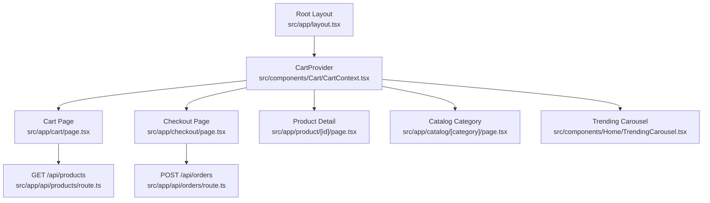
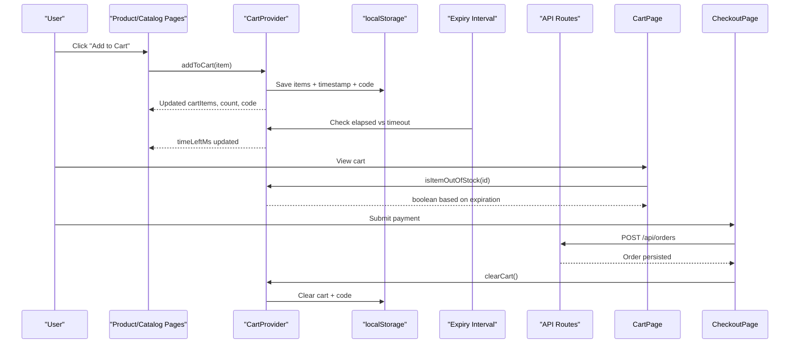
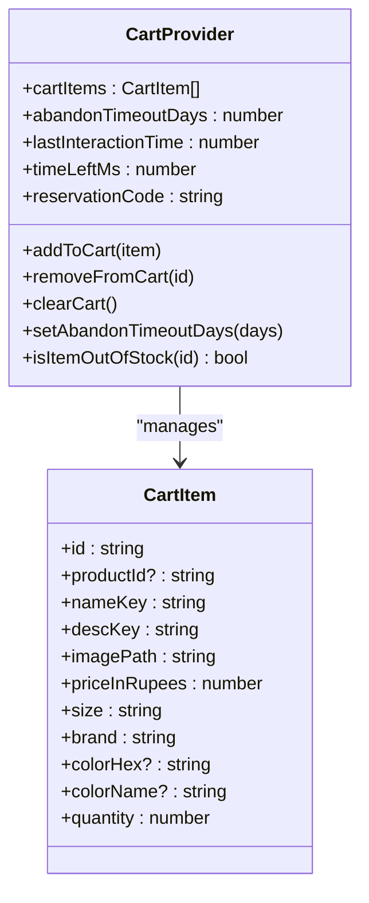
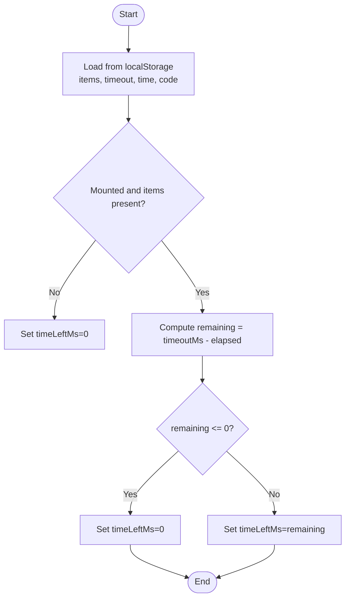
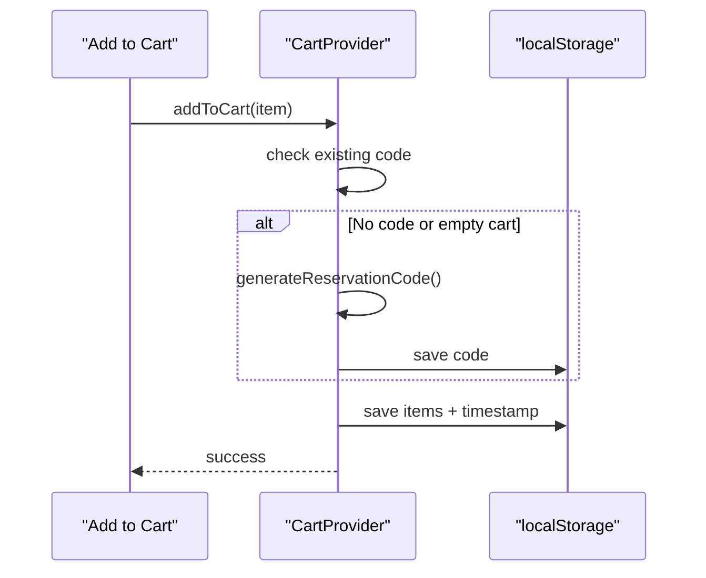
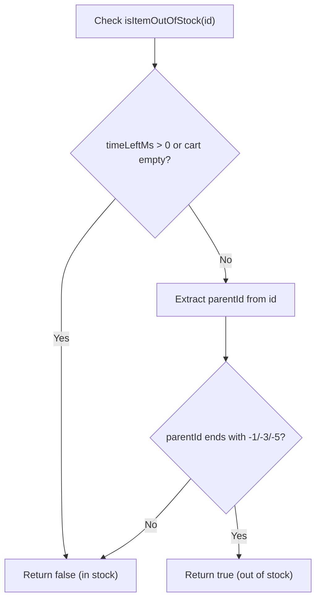
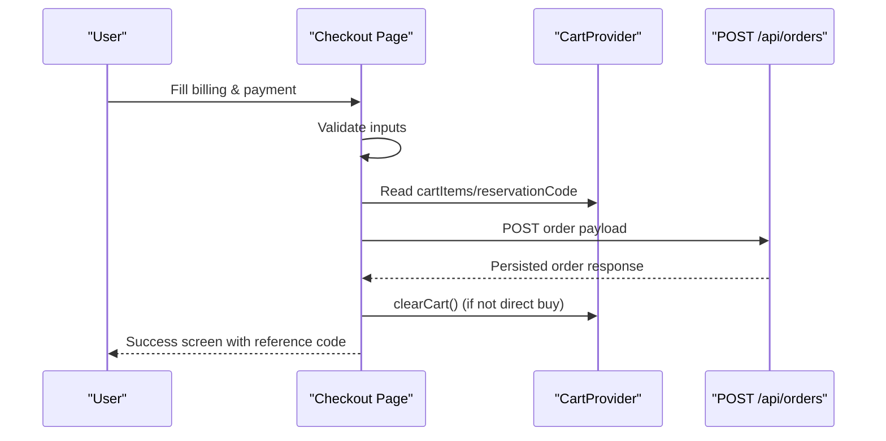
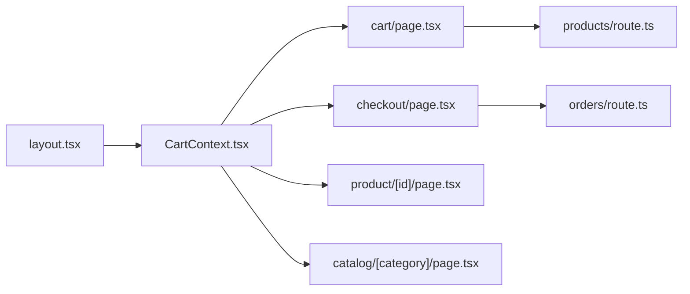

# Shopping Cart System

<cite>
**Referenced Files in This Document**
- [CartContext.tsx](file://src/components/Cart/CartContext.tsx)
- [layout.tsx](file://src/app/layout.tsx)
- [cart/page.tsx](file://src/app/cart/page.tsx)
- [checkout/page.tsx](file://src/app/checkout/page.tsx)
- [product/[id]/page.tsx](file://src/app/product/[id]/page.tsx)
- [catalog/[category]/page.tsx](file://src/app/catalog/[category]/page.tsx)
- [TrendingCarousel.tsx](file://src/components/Home/TrendingCarousel.tsx)
- [products/route.ts](file://src/app/api/products/route.ts)
- [orders/route.ts](file://src/app/api/orders/route.ts)
</cite>

## Table of Contents
1. [Introduction](#introduction)
2. [Project Structure](#project-structure)
3. [Core Components](#core-components)
4. [Architecture Overview](#architecture-overview)
5. [Detailed Component Analysis](#detailed-component-analysis)
6. [Dependency Analysis](#dependency-analysis)
7. [Performance Considerations](#performance-considerations)
8. [Troubleshooting Guide](#troubleshooting-guide)
9. [Conclusion](#conclusion)

## Introduction
This document explains the shopping cart system implemented with React Context, localStorage persistence, and real-time expiration countdowns. It covers:
- Global cart state management via a provider and hook
- Persistence to localStorage for items, timeout configuration, last interaction time, and reservation code
- Real-time updates driven by an interval-based timer
- Cart item structure and operations (add, remove, clear)
- Expiration logic with configurable timeout periods
- Reservation code generation and usage during checkout
- Stock availability simulation based on expiration
- Client-server interactions for product catalog and order placement

## Project Structure
The cart is provided at the application root and consumed across pages and components that need cart functionality.

**Diagram sources**
- [layout.tsx:40-61](file://src/app/layout.tsx#L40-L61)
- [CartContext.tsx:49-218](file://src/components/Cart/CartContext.tsx#L49-L218)
- [cart/page.tsx:1-417](file://src/app/cart/page.tsx#L1-L417)
- [checkout/page.tsx:1-658](file://src/app/checkout/page.tsx#L1-L658)
- [product/[id]/page.tsx:1-200](file://src/app/product/[id]/page.tsx#L1-L200)
- [catalog/[category]/page.tsx:546-561](file://src/app/catalog/[category]/page.tsx#L546-L561)
- [TrendingCarousel.tsx:160-179](file://src/components/Home/TrendingCarousel.tsx#L160-L179)
- [products/route.ts:1-98](file://src/app/api/products/route.ts#L1-L98)
- [orders/route.ts:1-134](file://src/app/api/orders/route.ts#L1-L134)

**Section sources**
- [layout.tsx:40-61](file://src/app/layout.tsx#L40-L61)

## Core Components
- CartProvider: Manages global cart state, persistence, expiration timer, and reservation code lifecycle.
- useCart: Hook to consume cart context from any client component.
- Cart page: Displays cart items, handles removal, shows out-of-stock warnings, and provides developer debug tools for timeout testing.
- Checkout page: Validates billing/payment, generates or reuses reservation code, posts order to server, and clears cart after successful checkout.
- Product detail and catalog pages: Add items to cart using the shared context.
- Trending carousel: Adds items to cart from home page carousels.

Key responsibilities:
- State shape and operations are defined in the context.
- LocalStorage keys persist cart data and settings.
- A high-frequency interval updates the remaining time display.
- Out-of-stock simulation activates when the reservation expires.

**Section sources**
- [CartContext.tsx:5-33](file://src/components/Cart/CartContext.tsx#L5-L33)
- [CartContext.tsx:49-218](file://src/components/Cart/CartContext.tsx#L49-L218)
- [cart/page.tsx:31-417](file://src/app/cart/page.tsx#L31-L417)
- [checkout/page.tsx:47-242](file://src/app/checkout/page.tsx#L47-L242)
- [product/[id]/page.tsx:105-200](file://src/app/product/[id]/page.tsx#L105-L200)
- [catalog/[category]/page.tsx:546-561](file://src/app/catalog/[category]/page.tsx#L546-L561)
- [TrendingCarousel.tsx:160-179](file://src/components/Home/TrendingCarousel.tsx#L160-L179)

## Architecture Overview
The cart uses a client-side provider pattern with local persistence and a periodic timer. The UI subscribes to context changes and reacts to expiration and stock status.

**Diagram sources**
- [CartContext.tsx:99-157](file://src/components/Cart/CartContext.tsx#L99-L157)
- [CartContext.tsx:159-187](file://src/components/Cart/CartContext.tsx#L159-L187)
- [cart/page.tsx:52-82](file://src/app/cart/page.tsx#L52-L82)
- [checkout/page.tsx:186-242](file://src/app/checkout/page.tsx#L186-L242)
- [products/route.ts:6-17](file://src/app/api/products/route.ts#L6-L17)
- [orders/route.ts:40-99](file://src/app/api/orders/route.ts#L40-L99)

## Detailed Component Analysis

### Cart Context Implementation
- State fields:
  - cartItems: array of CartItem objects
  - abandonTimeoutDays: configurable in days (supports decimals for minutes/seconds)
  - lastInteractionTime: epoch ms updated on add/remove/clear and when timeout config changes
  - timeLeftMs: computed remaining time in milliseconds
  - reservationCode: generated once per active cart session
  - isItemOutOfStock: function to simulate stock status based on expiration
- Persistence:
  - Keys used: next_in_cart, next_in_cart_timeout, next_in_cart_time, next_in_cart_code
  - On mount, values are restored from localStorage; if items exist but no time, initializes lastInteractionTime to now
- Operations:
  - addToCart: prevents duplicates, ensures reservation code exists, sets quantity to 1, updates timestamp, resets expired alert
  - removeFromCart: filters item, resets timestamp to 0 if cart becomes empty, clears reservation code
  - clearCart: empties cart, resets timestamp, clears reservation code
  - setAbandonTimeoutDays: persists new timeout and refreshes lastInteractionTime if cart not empty
- Expiration:
  - Interval runs every 100ms to compute remaining time
  - When remaining <= 0, timeLeftMs is set to 0 (no automatic clearing of cart)
- Stock simulation:
  - If expired (timeLeftMs === 0), certain parent IDs are considered sold (odd-numbered variants)
  - Otherwise, items are considered in stock

**Diagram sources**
- [CartContext.tsx:5-33](file://src/components/Cart/CartContext.tsx#L5-L33)
- [CartContext.tsx:49-218](file://src/components/Cart/CartContext.tsx#L49-L218)

**Section sources**
- [CartContext.tsx:5-33](file://src/components/Cart/CartContext.tsx#L5-L33)
- [CartContext.tsx:49-218](file://src/components/Cart/CartContext.tsx#L49-L218)

### Expiration Logic Flow

**Diagram sources**
- [CartContext.tsx:59-87](file://src/components/Cart/CartContext.tsx#L59-L87)
- [CartContext.tsx:159-187](file://src/components/Cart/CartContext.tsx#L159-L187)

**Section sources**
- [CartContext.tsx:59-87](file://src/components/Cart/CartContext.tsx#L59-L87)
- [CartContext.tsx:159-187](file://src/components/Cart/CartContext.tsx#L159-L187)

### Reservation Code Generation
- Generated when adding the first item or if missing
- Stored in localStorage and reused across sessions until cart is cleared
- Reused during checkout unless direct buy flow generates a new one

**Diagram sources**
- [CartContext.tsx:99-121](file://src/components/Cart/CartContext.tsx#L99-L121)
- [CartContext.tsx:42-47](file://src/components/Cart/CartContext.tsx#L42-L47)

**Section sources**
- [CartContext.tsx:99-121](file://src/components/Cart/CartContext.tsx#L99-L121)
- [CartContext.tsx:42-47](file://src/components/Cart/CartContext.tsx#L42-L47)

### Cart Operations Examples
- Add to cart:
  - From product detail page: passes id, nameKey, descKey, imagePath, priceInRupees, size, brand, colorHex, colorName
  - From catalog category page: similar payload using variant details
  - From trending carousel: adds item and shows brief feedback
- Remove from cart:
  - Removes item by id; if cart becomes empty, resets timestamp and clears reservation code
- Clear cart:
  - Empties cart, resets timestamp, clears reservation code

**Section sources**
- [product/[id]/page.tsx:561-600](file://src/app/product/[id]/page.tsx#L561-L600)
- [catalog/[category]/page.tsx:546-561](file://src/app/catalog/[category]/page.tsx#L546-L561)
- [TrendingCarousel.tsx:160-179](file://src/components/Home/TrendingCarousel.tsx#L160-L179)
- [CartContext.tsx:123-143](file://src/components/Cart/CartContext.tsx#L123-L143)

### Stock Availability Simulation
- When reservation is active (timeLeftMs > 0), all items are considered in stock
- When expired (timeLeftMs === 0), odd-numbered parent product IDs are treated as sold
- Cart page disables checkout if any item is out of stock and displays a warning

**Diagram sources**
- [CartContext.tsx:189-194](file://src/components/Cart/CartContext.tsx#L189-L194)
- [cart/page.tsx:52-82](file://src/app/cart/page.tsx#L52-L82)

**Section sources**
- [CartContext.tsx:189-194](file://src/components/Cart/CartContext.tsx#L189-L194)
- [cart/page.tsx:52-82](file://src/app/cart/page.tsx#L52-L82)

### Checkout Interaction with Server-Side Inventory
- Checkout resolves items either from cart or direct buy SKU
- Generates or reuses reservation code
- Posts order to /api/orders with customer info, total, UTR, reservation code, and items
- Clears cart after successful submission (unless direct buy)

**Diagram sources**
- [checkout/page.tsx:104-132](file://src/app/checkout/page.tsx#L104-L132)
- [checkout/page.tsx:186-242](file://src/app/checkout/page.tsx#L186-L242)
- [orders/route.ts:40-99](file://src/app/api/orders/route.ts#L40-L99)

**Section sources**
- [checkout/page.tsx:104-132](file://src/app/checkout/page.tsx#L104-L132)
- [checkout/page.tsx:186-242](file://src/app/checkout/page.tsx#L186-L242)
- [orders/route.ts:40-99](file://src/app/api/orders/route.ts#L40-L99)

## Dependency Analysis
- Root layout wraps the app with CartProvider, making cart state available globally
- Cart page consumes context for listing, removing, and computing totals
- Checkout page consumes context for items and reservation code, then interacts with orders API
- Product and catalog pages call addToCart through the context
- Products API serves active products for catalog and product detail views

**Diagram sources**
- [layout.tsx:40-61](file://src/app/layout.tsx#L40-L61)
- [CartContext.tsx:49-218](file://src/components/Cart/CartContext.tsx#L49-L218)
- [cart/page.tsx:1-417](file://src/app/cart/page.tsx#L1-L417)
- [checkout/page.tsx:1-658](file://src/app/checkout/page.tsx#L1-L658)
- [product/[id]/page.tsx:1-200](file://src/app/product/[id]/page.tsx#L1-L200)
- [catalog/[category]/page.tsx:546-561](file://src/app/catalog/[category]/page.tsx#L546-L561)
- [products/route.ts:1-98](file://src/app/api/products/route.ts#L1-L98)
- [orders/route.ts:1-134](file://src/app/api/orders/route.ts#L1-L134)

**Section sources**
- [layout.tsx:40-61](file://src/app/layout.tsx#L40-L61)
- [products/route.ts:1-98](file://src/app/api/products/route.ts#L1-L98)
- [orders/route.ts:1-134](file://src/app/api/orders/route.ts#L1-L134)

## Performance Considerations
- High-frequency timer: The expiry checker runs every 100ms. Consider increasing the interval (e.g., 500ms–1s) if performance issues arise, especially on low-end devices.
- LocalStorage writes: Each add/remove/clear triggers writes. Batch operations where possible or debounce frequent updates if needed.
- Memoization: Use memoized selectors for derived values like subtotal and totals to avoid unnecessary recalculations.
- Avoid heavy rendering: Keep cart list lightweight; defer expensive computations until checkout.
- Error handling around JSON parsing: Ensure robust error handling when restoring cart from localStorage to prevent crashes.

[No sources needed since this section provides general guidance]

## Troubleshooting Guide
Common issues and resolutions:
- Items not persisting across reloads:
  - Verify localStorage keys are present and valid: next_in_cart, next_in_cart_timeout, next_in_cart_time, next_in_cart_code
  - Check for JSON parse errors when loading cart
- Cart does not expire:
  - Confirm lastInteractionTime is initialized when items exist
  - Ensure abandonTimeoutDays is set correctly (decimals allowed for shorter durations)
- Reservation code missing or inconsistent:
  - Ensure code is generated on first add and stored in localStorage
  - Clearing cart should reset the code; verify behavior on remove leading to empty cart
- Out-of-stock items not updating:
  - Confirm timeLeftMs reaches 0 when expired
  - Validate isItemOutOfStock logic against item ids
- Checkout fails to post order:
  - Inspect network requests to /api/orders
  - Validate required fields: id, name, phone, address, pincode, total, utr, reservationCode, items
  - Handle database errors gracefully and show user-friendly messages

**Section sources**
- [CartContext.tsx:59-87](file://src/components/Cart/CartContext.tsx#L59-L87)
- [CartContext.tsx:159-187](file://src/components/Cart/CartContext.tsx#L159-L187)
- [CartContext.tsx:189-194](file://src/components/Cart/CartContext.tsx#L189-L194)
- [checkout/page.tsx:186-242](file://src/app/checkout/page.tsx#L186-L242)
- [orders/route.ts:40-99](file://src/app/api/orders/route.ts#L40-L99)

## Conclusion
The shopping cart system leverages React Context for global state, localStorage for persistence, and a precise timer for expiration tracking. It integrates with server APIs for product retrieval and order placement while providing a simulated stock model tied to reservation expiration. With careful tuning of the timer and storage writes, the system remains responsive and reliable across typical browsing sessions.