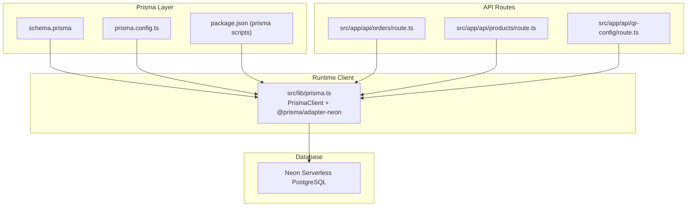
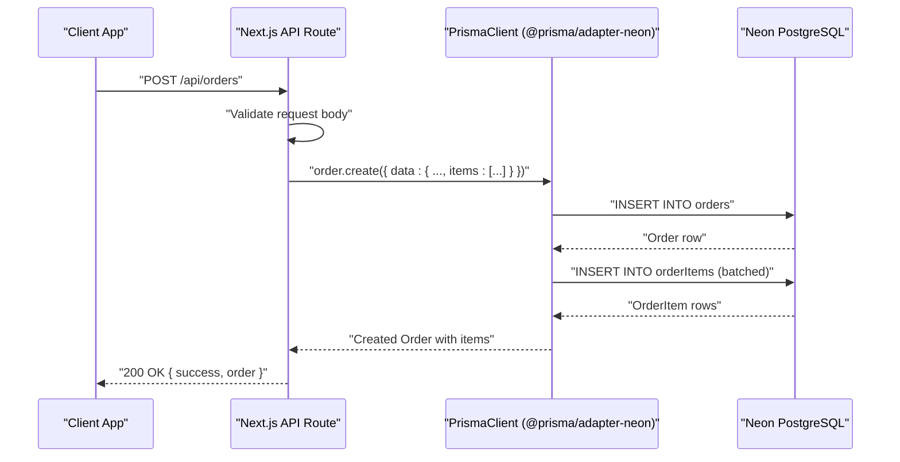
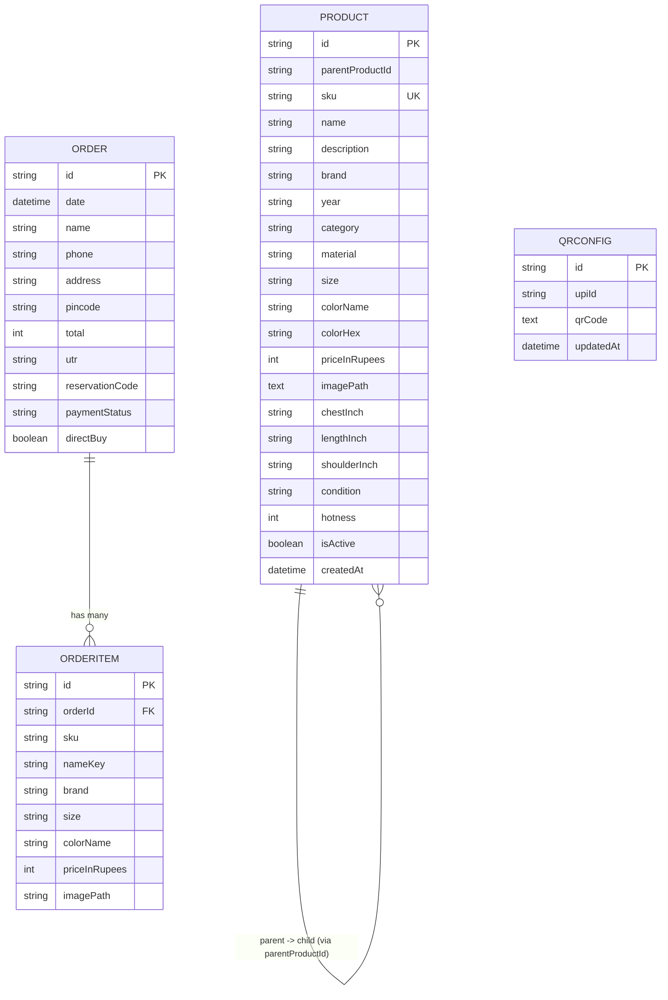
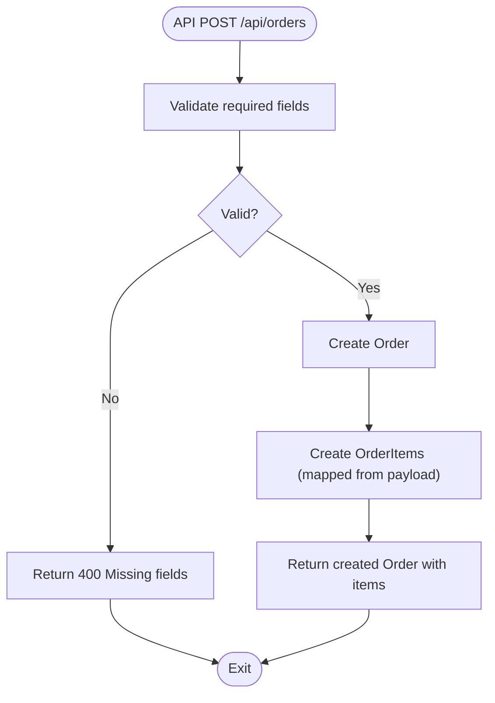
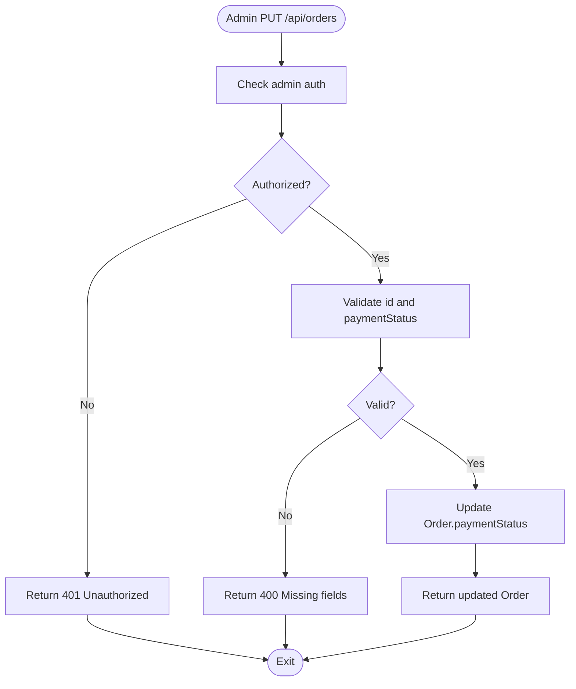
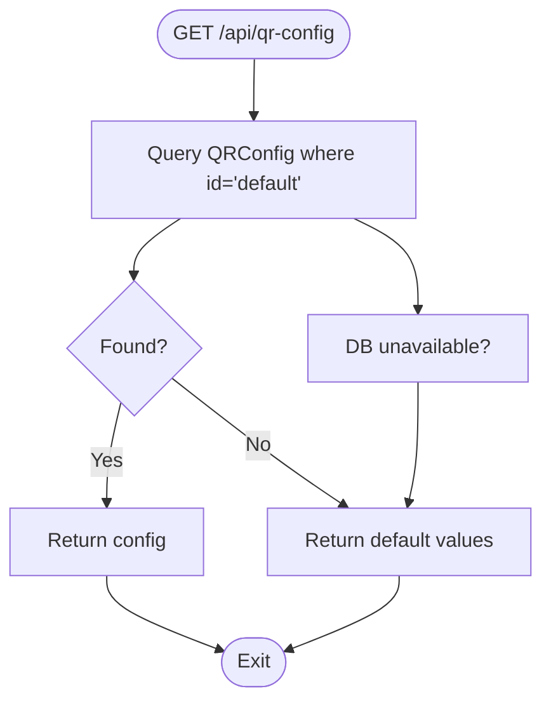
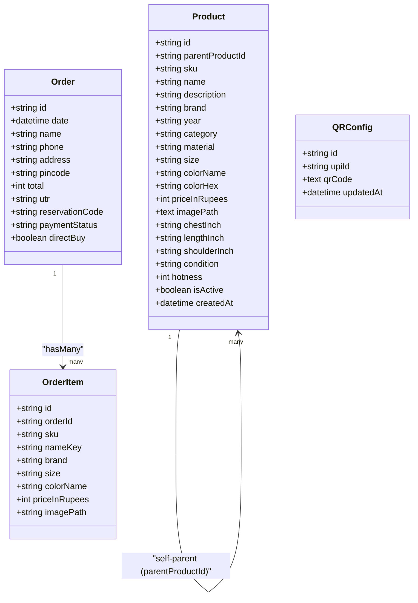
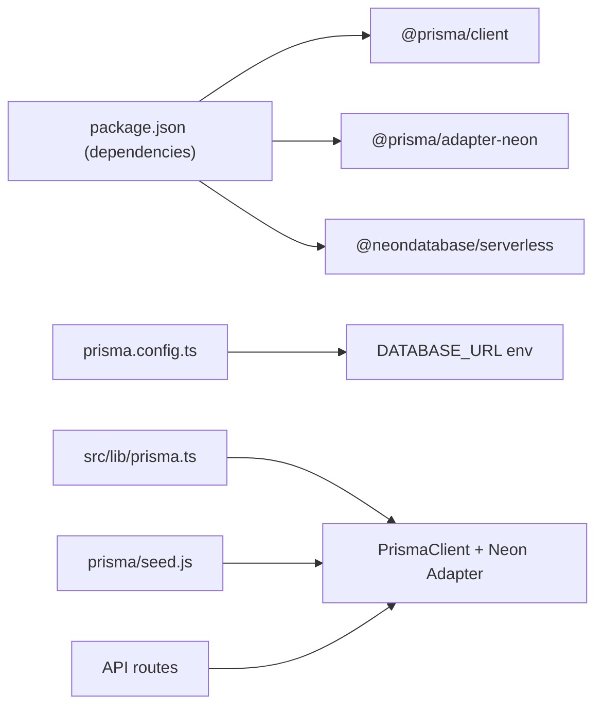

# Database Schema

<cite>
**Referenced Files in This Document**
- [schema.prisma](file://prisma/schema.prisma)
- [seed.js](file://prisma/seed.js)
- [prisma.ts](file://src/lib/prisma.ts)
- [route.ts (orders)](file://src/app/api/orders/route.ts)
- [route.ts (products)](file://src/app/api/products/route.ts)
- [route.ts (qr-config)](file://src/app/api/qr-config/route.ts)
- [package.json](file://package.json)
- [prisma.config.ts](file://prisma.config.ts)
</cite>

## Table of Contents
1. [Introduction](#introduction)
2. [Project Structure](#project-structure)
3. [Core Components](#core-components)
4. [Architecture Overview](#architecture-overview)
5. [Detailed Component Analysis](#detailed-component-analysis)
6. [Dependency Analysis](#dependency-analysis)
7. [Performance Considerations](#performance-considerations)
8. [Troubleshooting Guide](#troubleshooting-guide)
9. [Conclusion](#conclusion)
10. [Appendices](#appendices)

## Introduction
This document provides comprehensive data model documentation for the next.in e-commerce platform database schema. It focuses on the core entities Product, Order, OrderItem, and QRConfig, detailing field definitions, types, constraints, relationships, indexes, and validation rules. It also explains the Prisma ORM implementation with the Neon serverless PostgreSQL adapter, including seed data management, migration strategies, backup procedures, and performance optimization techniques tailored to a serverless architecture.

## Project Structure
The database schema is defined using Prisma in a single schema file. The application uses Next.js API routes to interact with the database via a shared Prisma client configured for Neon serverless PostgreSQL. Seed data is provided for development and testing.

**Diagram sources**
- [schema.prisma:1-67](file://prisma/schema.prisma#L1-L67)
- [prisma.config.ts:1-15](file://prisma.config.ts#L1-L15)
- [package.json:11-13](file://package.json#L11-L13)
- [prisma.ts:1-23](file://src/lib/prisma.ts#L1-L23)
- [route.ts (orders):1-134](file://src/app/api/orders/route.ts#L1-L134)
- [route.ts (products):1-98](file://src/app/api/products/route.ts#L1-L98)
- [route.ts (qr-config):1-71](file://src/app/api/qr-config/route.ts#L1-L71)

**Section sources**
- [schema.prisma:1-67](file://prisma/schema.prisma#L1-L67)
- [prisma.config.ts:1-15](file://prisma.config.ts#L1-L15)
- [package.json:11-13](file://package.json#L11-L13)
- [prisma.ts:1-23](file://src/lib/prisma.ts#L1-L23)

## Core Components
This section documents the four primary models: QRConfig, Order, OrderItem, and Product. For each, we describe fields, types, defaults, constraints, and relationships.

### QRConfig
Purpose: Stores UPI payment configuration and QR code path used by checkout flows.

- id: String, Primary Key, Default "default"
- upiId: String, Default "bothzmannhypo123@okicici"
- qrCode: String, stored as Text
- updatedAt: DateTime, auto-updated on write

Constraints and behavior:
- Single canonical row identified by id = "default". Upsert operations maintain one record.
- No explicit unique index beyond the primary key; access pattern targets the fixed id.

Indexes:
- Primary key on id.

Validation rules:
- Application-level validation ensures non-empty upiId and qrCode when updating.

Relationships:
- None directly. Used by checkout UI/API to retrieve payment details.

**Section sources**
- [schema.prisma:9-14](file://prisma/schema.prisma#L9-L14)
- [route.ts (qr-config):8-36](file://src/app/api/qr-config/route.ts#L8-L36)
- [route.ts (qr-config):38-70](file://src/app/api/qr-config/route.ts#L38-L70)

### Order
Purpose: Represents a customer purchase with shipping and payment metadata.

- id: String, Primary Key
- date: DateTime, Default now()
- name: String
- phone: String
- address: String
- pincode: String
- total: Int
- utr: String
- reservationCode: String
- paymentStatus: String, Default "pending"
- directBuy: Boolean, Default false
- items: Relation to OrderItem[]

Constraints and behavior:
- Each order has a unique id.
- Payment status transitions are managed via API updates.

Indexes:
- Primary key on id.
- Ordering by date desc is common; consider adding an index on date if queries become frequent.

Validation rules:
- API validates presence of required fields before creation.

Relationships:
- One-to-many with OrderItem (Order.items).

**Section sources**
- [schema.prisma:16-29](file://prisma/schema.prisma#L16-L29)
- [route.ts (orders):40-99](file://src/app/api/orders/route.ts#L40-L99)
- [route.ts (orders):101-133](file://src/app/api/orders/route.ts#L101-L133)

### OrderItem
Purpose: Line item snapshot within an Order.

- id: String, Primary Key, Default uuid()
- orderId: String, Foreign Key referencing Order.id
- sku: String
- nameKey: String
- brand: String
- size: String
- colorName: String
- priceInRupees: Int
- imagePath: String

Constraints and behavior:
- onDelete: Cascade from Order to OrderItem. Deleting an order removes its items.
- Snapshot semantics: fields mirror product attributes at time of purchase.

Indexes:
- Primary key on id.
- Foreign key on orderId enforces referential integrity.

Validation rules:
- Required fields enforced by API during creation.

Relationships:
- Many-to-one with Order (OrderItem.order).

**Section sources**
- [schema.prisma:31-42](file://prisma/schema.prisma#L31-L42)
- [route.ts (orders):63-89](file://src/app/api/orders/route.ts#L63-L89)

### Product
Purpose: Catalog entry representing a specific variant (size/color) of a product. Supports parent-child grouping via parentProductId.

- id: String, Primary Key, Default uuid()
- parentProductId: String?, Nullable
- sku: String, Unique
- name: String
- description: String
- brand: String
- year: String
- category: String
- material: String
- size: String
- colorName: String
- colorHex: String
- priceInRupees: Int
- imagePath: String, stored as Text
- chestInch: String
- lengthInch: String
- shoulderInch: String
- condition: String
- hotness: Int, Default 3
- isActive: Boolean, Default true
- createdAt: DateTime, Default now()

Constraints and behavior:
- SKU uniqueness enforced.
- Soft delete via isActive flag.
- Parent-child relationship modeled via nullable parentProductId.

Indexes:
- Primary key on id.
- Unique index on sku.

Validation rules:
- API requires essential fields like sku, name, brand, category, priceInRupees, imagePath.

Relationships:
- Self-referencing via parentProductId (nullable). Not declared as a Prisma relation in schema.

**Section sources**
- [schema.prisma:44-66](file://prisma/schema.prisma#L44-L66)
- [route.ts (products):6-17](file://src/app/api/products/route.ts#L6-L17)
- [route.ts (products):19-72](file://src/app/api/products/route.ts#L19-L72)
- [route.ts (products):74-97](file://src/app/api/products/route.ts#L74-L97)

## Architecture Overview
The system uses Prisma with the Neon serverless adapter to connect to a PostgreSQL database. API routes perform CRUD operations against the models. The Prisma client is globally cached in development to avoid re-initialization overhead.

**Diagram sources**
- [route.ts (orders):40-99](file://src/app/api/orders/route.ts#L40-L99)
- [prisma.ts:1-23](file://src/lib/prisma.ts#L1-L23)

## Detailed Component Analysis

### Entity Relationship Diagram

**Diagram sources**
- [schema.prisma:9-66](file://prisma/schema.prisma#L9-L66)

### Data Flow Patterns

#### Create Order Flow

**Diagram sources**
- [route.ts (orders):40-99](file://src/app/api/orders/route.ts#L40-L99)

#### Update Payment Status Flow

**Diagram sources**
- [route.ts (orders):101-133](file://src/app/api/orders/route.ts#L101-L133)

#### Fetch QR Config Flow

**Diagram sources**
- [route.ts (qr-config):8-36](file://src/app/api/qr-config/route.ts#L8-L36)

### Class-like Model Relationships

**Diagram sources**
- [schema.prisma:9-66](file://prisma/schema.prisma#L9-L66)

## Dependency Analysis
- Prisma client initialization depends on environment variables for DATABASE_URL and uses the Neon adapter.
- API routes depend on the shared prisma instance and authentication helpers.
- Seed script initializes a separate Prisma client with the Neon adapter for seeding.

**Diagram sources**
- [package.json:14-24](file://package.json#L14-L24)
- [prisma.config.ts:6-14](file://prisma.config.ts#L6-L14)
- [prisma.ts:1-23](file://src/lib/prisma.ts#L1-L23)
- [seed.js:1-6](file://prisma/seed.js#L1-L6)

**Section sources**
- [package.json:14-24](file://package.json#L14-L24)
- [prisma.config.ts:6-14](file://prisma.config.ts#L6-L14)
- [prisma.ts:1-23](file://src/lib/prisma.ts#L1-L23)
- [seed.js:1-6](file://prisma/seed.js#L1-L6)

## Performance Considerations
- Connection pooling and serverless:
  - Use the Neon adapter to leverage connection pooling and serverless-friendly connections.
  - Ensure DATABASE_URL points to a Neon serverless endpoint.
- Query patterns:
  - Orders are frequently ordered by date descending; add an index on Order.date if needed.
  - Products are filtered by isActive and sorted by createdAt; consider composite or secondary indexes if query volume grows.
- Payload sizes:
  - Order creation includes nested items; batch inserts are handled by Prisma but keep payloads reasonable.
- Logging:
  - In development, enable query logging; disable in production to reduce overhead.
- Soft deletes:
  - Using isActive avoids heavy cascading deletes and preserves historical data.

[No sources needed since this section provides general guidance]

## Troubleshooting Guide
- Database not ready:
  - API routes return empty results or fallback responses when the database is unavailable. Check DATABASE_URL and Neon connectivity.
- Unique constraint violations:
  - Creating a product with duplicate SKU returns a conflict response. Ensure SKU uniqueness before insert.
- Authentication failures:
  - Admin-only endpoints return 401 if not authenticated. Verify session/token logic.
- Seed errors:
  - The seed script logs failures per SKU and continues; inspect logs to identify problematic records.

**Section sources**
- [route.ts (orders):34-38](file://src/app/api/orders/route.ts#L34-L38)
- [route.ts (products):63-71](file://src/app/api/products/route.ts#L63-L71)
- [route.ts (qr-config):27-35](file://src/app/api/qr-config/route.ts#L27-L35)
- [seed.js:575-590](file://prisma/seed.js#L575-L590)

## Conclusion
The next.in database schema centers around four models that support catalog browsing, checkout, and payment configuration. Prisma with the Neon adapter provides a robust, serverless-ready data layer. Clear validation and error handling in API routes ensure reliability. Recommended indexes and careful query design will optimize performance as usage scales.

[No sources needed since this section summarizes without analyzing specific files]

## Appendices

### Field Definitions and Constraints Summary
- QRConfig
  - id: String, PK, Default "default"
  - upiId: String, Default set
  - qrCode: String (Text)
  - updatedAt: DateTime, auto-update
- Order
  - id: String, PK
  - date: DateTime, Default now()
  - name, phone, address, pincode: String
  - total: Int
  - utr, reservationCode: String
  - paymentStatus: String, Default "pending"
  - directBuy: Boolean, Default false
  - items: Relation to OrderItem[]
- OrderItem
  - id: String, PK, Default uuid()
  - orderId: String, FK to Order.id, onDelete Cascade
  - sku, nameKey, brand, size, colorName: String
  - priceInRupees: Int
  - imagePath: String
- Product
  - id: String, PK, Default uuid()
  - parentProductId: String?, Nullable
  - sku: String, Unique
  - name, description, brand, year, category, material, size, colorName, colorHex: String
  - priceInRupees: Int
  - imagePath: String (Text)
  - chestInch, lengthInch, shoulderInch: String
  - condition: String
  - hotness: Int, Default 3
  - isActive: Boolean, Default true
  - createdAt: DateTime, Default now()

**Section sources**
- [schema.prisma:9-66](file://prisma/schema.prisma#L9-L66)

### Indexes and Keys
- Primary keys:
  - QRConfig.id
  - Order.id
  - OrderItem.id
  - Product.id
- Unique constraints:
  - Product.sku
- Foreign keys:
  - OrderItem.orderId references Order.id (Cascade delete)
- Recommended indexes (if needed):
  - Order.date (for frequent ordering)
  - Product.isActive, Product.createdAt (for listing queries)

**Section sources**
- [schema.prisma:9-66](file://prisma/schema.prisma#L9-L66)

### Validation Rules
- Order creation:
  - Required fields: id, name, phone, address, pincode, total, utr, reservationCode, items
- Product creation:
  - Required fields: sku, name, brand, category, priceInRupees, imagePath
- QRConfig update:
  - Required fields: upiId, qrCode

**Section sources**
- [route.ts (orders):56-61](file://src/app/api/orders/route.ts#L56-L61)
- [route.ts (products):32-34](file://src/app/api/products/route.ts#L32-L34)
- [route.ts (qr-config):45-50](file://src/app/api/qr-config/route.ts#L45-L50)

### Prisma ORM Implementation Details
- Client initialization:
  - Uses global singleton in development to reuse PrismaClient instances.
  - Adapter: @prisma/adapter-neon with DATABASE_URL.
  - Logging: query/error/warn in development; error only in production.
- Configuration:
  - prisma.config.ts sets schema path, datasource URL, and seed command.
- Dependencies:
  - @prisma/client, @prisma/adapter-neon, @neondatabase/serverless.

**Section sources**
- [prisma.ts:1-23](file://src/lib/prisma.ts#L1-L23)
- [prisma.config.ts:1-15](file://prisma.config.ts#L1-L15)
- [package.json:14-24](file://package.json#L14-L24)

### Seed Data Management
- Purpose: Populate initial product catalog for development/testing.
- Behavior:
  - Iterates over predefined products and upserts by SKU.
  - Logs success/failure per SKU and disconnects Prisma client.
- Execution:
  - Configured via prisma.config.ts and package.json prisma scripts.

**Section sources**
- [seed.js:1-6](file://prisma/seed.js#L1-L6)
- [seed.js:575-590](file://prisma/seed.js#L575-L590)
- [prisma.config.ts:11-13](file://prisma.config.ts#L11-L13)
- [package.json:11-13](file://package.json#L11-L13)

### Migration Strategies
- Schema changes:
  - Modify schema.prisma and generate migrations using Prisma CLI.
  - Apply migrations to Neon database in CI/CD pipelines.
- Backward compatibility:
  - Prefer additive changes (new fields, tables) and safe defaults.
  - Avoid destructive changes without migration planning.
- Rollbacks:
  - Maintain migration history; test rollbacks in staging.

[No sources needed since this section provides general guidance]

### Backup Procedures
- Neon-specific:
  - Use Neon console backups or point-in-time recovery features.
  - Schedule automated backups aligned with business needs.
- Export/import:
  - For ad-hoc exports, use pg_dump/pg_restore or Neon’s export tools.
- Verification:
  - Periodically restore backups to a staging environment to validate integrity.

[No sources needed since this section provides general guidance]

### Performance Optimization Techniques
- Indexing:
  - Add indexes on high-selectivity columns (e.g., Order.date, Product.isActive).
- Query shaping:
  - Select only necessary fields; avoid large selects.
- Connection management:
  - Keep DATABASE_URL pointing to Neon serverless; rely on adapter pooling.
- Rate limiting and caching:
  - Cache static configs (QRConfig) at edge or CDN if appropriate.
- Monitoring:
  - Enable slow query logs and monitor Neon metrics.

[No sources needed since this section provides general guidance]