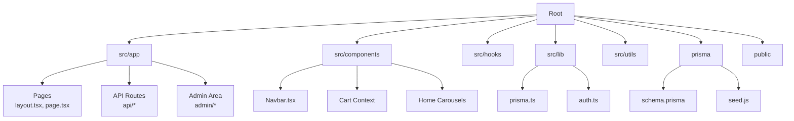
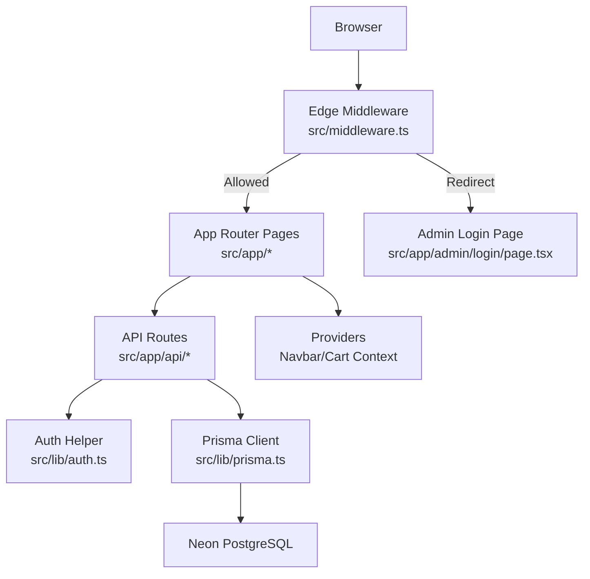
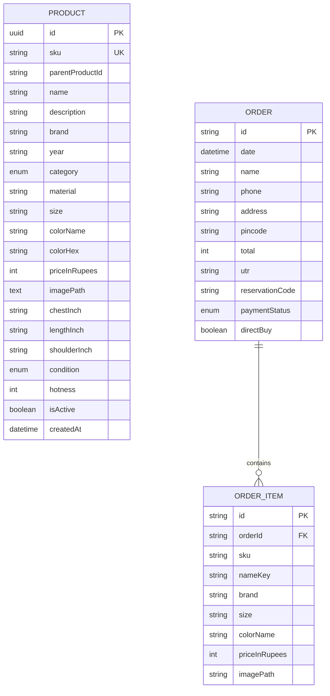
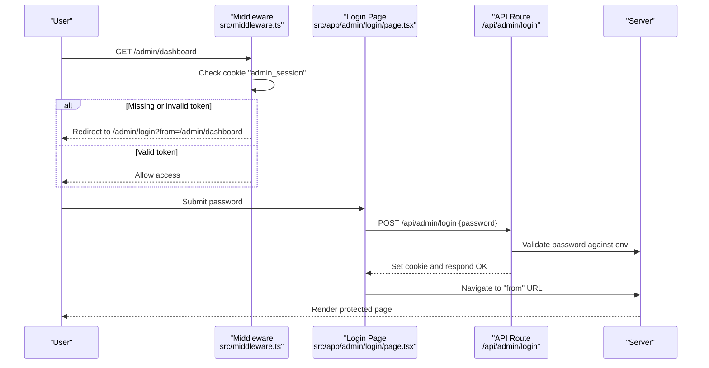
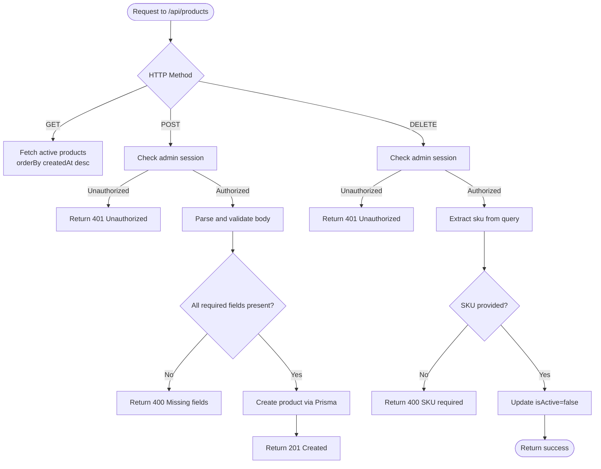
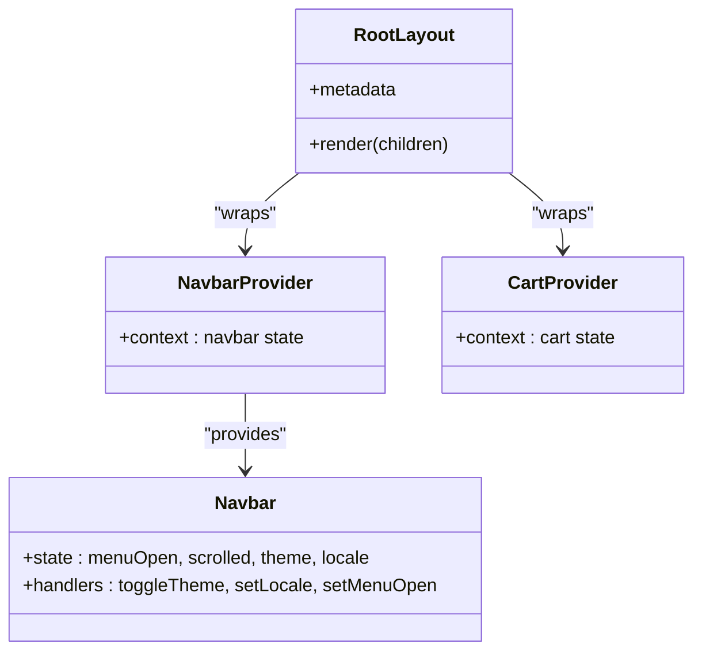
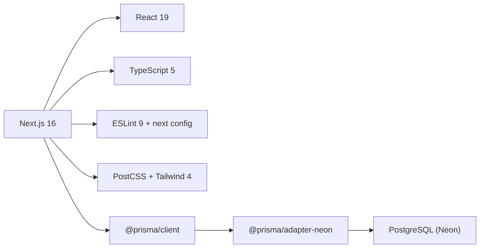

# Development Guide

<cite>
**Referenced Files in This Document**
- [package.json](file://package.json)
- [next.config.ts](file://next.config.ts)
- [tsconfig.json](file://tsconfig.json)
- [eslint.config.mjs](file://eslint.config.mjs)
- [postcss.config.mjs](file://postcss.config.mjs)
- [prisma/schema.prisma](file://prisma/schema.prisma)
- [src/lib/prisma.ts](file://src/lib/prisma.ts)
- [middleware.ts](file://middleware.ts)
- [src/middleware.ts](file://src/middleware.ts)
- [src/app/layout.tsx](file://src/app/layout.tsx)
- [src/components/Navbar.tsx](file://src/components/Navbar.tsx)
- [src/app/api/products/route.ts](file://src/app/api/products/route.ts)
- [src/app/admin/login/page.tsx](file://src/app/admin/login/page.tsx)
- [src/lib/auth.ts](file://src/lib/auth.ts)
- [prisma/seed.js](file://prisma/seed.js)
</cite>

## Table of Contents
1. Introduction
2. Project Structure
3. Core Components
4. Architecture Overview
5. Detailed Component Analysis
6. Dependency Analysis
7. Performance Considerations
8. Troubleshooting Guide
9. Conclusion

## Introduction
This guide explains how to set up the development environment, build and run the project, and contribute effectively. It covers Node.js requirements, package manager usage, local database configuration with Prisma and Neon, Next.js 16 build system, TypeScript compilation, ESLint for code quality, PostCSS processing for Tailwind styles, hot reloading, debugging techniques, testing approaches, code organization patterns, naming conventions, contribution guidelines, examples for adding features and API routes, performance tips, and common pitfalls.

## Project Structure
The project follows a Next.js App Router layout with feature-based directories:
- src/app: Pages and API routes using the App Router
- src/components: Reusable UI components
- src/hooks: Custom React hooks
- src/lib: Shared libraries (database client, auth helpers)
- src/utils: Utilities (catalog helpers, i18n)
- prisma: Database schema and seed script
- public: Static assets

[No sources needed since this diagram shows conceptual structure]

## Core Components
- Application shell and providers: The root layout wires global fonts, providers (navbar, cart), and base CSS.
- Middleware: Protects admin routes via cookie-based session token.
- Data layer: Prisma client configured with Neon adapter; logging tuned per environment.
- API routes: REST endpoints under src/app/api for products and admin operations.
- Admin login: Client-side form that calls admin login API and redirects after success.

Key responsibilities:
- Routing and layout composition live in src/app
- Business logic and data access are isolated in src/lib and API route handlers
- UI state is managed via context providers in src/components

**Section sources**
- [src/app/layout.tsx:1-62](file://src/app/layout.tsx#L1-L62)
- [src/middleware.ts:1-27](file://src/middleware.ts#L1-L27)
- [src/lib/prisma.ts:1-23](file://src/lib/prisma.ts#L1-L23)
- [src/app/api/products/route.ts:1-98](file://src/app/api/products/route.ts#L1-L98)
- [src/app/admin/login/page.tsx:1-139](file://src/app/admin/login/page.tsx#L1-L139)

## Architecture Overview
High-level runtime architecture:
- Browser requests hit Next.js serverless functions or Edge middleware
- Middleware enforces admin access by checking cookies against an environment variable
- API routes validate authorization and interact with the database via Prisma
- The Prisma client uses a Neon adapter for serverless-friendly connections
- Environment variables are exposed to the Edge runtime through Next config

**Diagram sources**
- [src/middleware.ts:1-27](file://src/middleware.ts#L1-L27)
- [src/app/admin/login/page.tsx:1-139](file://src/app/admin/login/page.tsx#L1-L139)
- [src/app/api/products/route.ts:1-98](file://src/app/api/products/route.ts#L1-L98)
- [src/lib/auth.ts:1-16](file://src/lib/auth.ts#L1-L16)
- [src/lib/prisma.ts:1-23](file://src/lib/prisma.ts#L1-L23)

## Detailed Component Analysis

### Development Environment Setup
- Node.js and package manager
  - Use a recent LTS Node.js version compatible with Next.js 16 and TypeScript 5.
  - Install dependencies with your preferred package manager (npm/yarn/pnpm).
  - Scripts available: dev, build, start, lint.

- Local database configuration
  - The app uses Prisma with a Neon adapter. Ensure DATABASE_URL points to a PostgreSQL-compatible endpoint.
  - For local development, configure DATABASE_URL to point to your local or remote Neon instance.
  - Run migrations and generate the client before starting the dev server.
  - Seed the database using the provided seed script.

- Environment variables
  - ADMIN_SESSION_TOKEN: Required for admin authentication and middleware checks.
  - ADMIN_PASSWORD: Exposed to the runtime via Next config for use in admin flows.
  - DATABASE_URL: Connection string for the database.

- Build system and tooling
  - Next.js 16 with App Router
  - TypeScript with strict mode and path aliases (@/* -> ./src/*)
  - ESLint with Next.js recommended rules and core web vitals
  - PostCSS with Tailwind v4 plugin

- Hot reloading and debugging
  - npm run dev starts the Next.js dev server with hot reloading.
  - Use browser DevTools for frontend debugging.
  - Server logs appear in the terminal during development.

- Testing approach
  - No test runner is configured in the repository. Add a framework (e.g., Vitest or Jest) and write unit/integration tests as needed.
  - For API routes, consider testing with http-server utilities or Next’s testing helpers once added.

**Section sources**
- [package.json:1-37](file://package.json#L1-L37)
- [next.config.ts:1-12](file://next.config.ts#L1-L12)
- [tsconfig.json:1-35](file://tsconfig.json#L1-L35)
- [eslint.config.mjs:1-19](file://eslint.config.mjs#L1-L19)
- [postcss.config.mjs:1-8](file://postcss.config.mjs#L1-L8)
- [src/lib/prisma.ts:1-23](file://src/lib/prisma.ts#L1-L23)
- [prisma/seed.js:1-600](file://prisma/seed.js#L1-L600)

### Database Schema and Seeding
- Models include QRConfig, Order, OrderItem, and Product.
- Product supports variants via parentProductId and unique SKU constraints.
- Orders capture buyer details, items, payment status, and optional direct buy flag.
- Seed script populates sample products using upsert by SKU.

**Diagram sources**
- [prisma/schema.prisma:1-67](file://prisma/schema.prisma#L1-L67)

**Section sources**
- [prisma/schema.prisma:1-67](file://prisma/schema.prisma#L1-L67)
- [prisma/seed.js:1-600](file://prisma/seed.js#L1-L600)

### Authentication and Authorization
- Middleware protects /admin routes by validating a cookie against ADMIN_SESSION_TOKEN.
- Admin login page posts credentials to /api/admin/login and sets a session cookie on success.
- API routes check admin authorization using a helper that parses cookies from the request headers.

**Diagram sources**
- [src/middleware.ts:1-27](file://src/middleware.ts#L1-L27)
- [src/app/admin/login/page.tsx:1-139](file://src/app/admin/login/page.tsx#L1-L139)
- [src/lib/auth.ts:1-16](file://src/lib/auth.ts#L1-L16)

**Section sources**
- [src/middleware.ts:1-27](file://src/middleware.ts#L1-L27)
- [src/app/admin/login/page.tsx:1-139](file://src/app/admin/login/page.tsx#L1-L139)
- [src/lib/auth.ts:1-16](file://src/lib/auth.ts#L1-L16)

### API Patterns: Products
- GET /api/products returns active products ordered by creation time.
- POST /api/products creates a new product (admin only) with validation and error handling.
- DELETE /api/products?sku=xxx soft-deletes a product by setting isActive=false (admin only).

**Diagram sources**
- [src/app/api/products/route.ts:1-98](file://src/app/api/products/route.ts#L1-L98)

**Section sources**
- [src/app/api/products/route.ts:1-98](file://src/app/api/products/route.ts#L1-L98)

### UI Components and Layout
- Root layout composes NavbarProvider and CartProvider, sets metadata, and applies global fonts and CSS.
- Navbar integrates search, language switching, theme toggle, cart badge, profile dropdown, and mobile menu.
- Global CSS and Tailwind classes provide consistent styling across pages.

**Diagram sources**
- [src/app/layout.tsx:1-62](file://src/app/layout.tsx#L1-L62)
- [src/components/Navbar.tsx:1-267](file://src/components/Navbar.tsx#L1-L267)

**Section sources**
- [src/app/layout.tsx:1-62](file://src/app/layout.tsx#L1-L62)
- [src/components/Navbar.tsx:1-267](file://src/components/Navbar.tsx#L1-L267)

## Dependency Analysis
Top-level dependencies and toolchain:
- Runtime: next@16, react@19, react-dom@19
- Database: @prisma/client, @prisma/adapter-neon, @neondatabase/serverless
- Styling: tailwindcss@4, @tailwindcss/postcss
- Linting: eslint@9, eslint-config-next
- Types: typescript@5, @types/node, @types/react, @types/react-dom

**Diagram sources**
- [package.json:1-37](file://package.json#L1-L37)

**Section sources**
- [package.json:1-37](file://package.json#L1-L37)

## Performance Considerations
- Prefer server-side data fetching where possible to reduce client bundle size.
- Use Next.js image optimization and lazy loading for heavy assets.
- Keep API responses minimal; paginate large lists.
- Avoid unnecessary re-renders by memoizing expensive computations and splitting contexts.
- Leverage Tailwind’s utility-first approach to minimize custom CSS.
- Monitor database queries; add indexes for frequently filtered columns if needed.

[No sources needed since this section provides general guidance]

## Troubleshooting Guide
Common issues and resolutions:
- Admin routes redirect to login unexpectedly
  - Ensure ADMIN_SESSION_TOKEN is set and matches the cookie value used by the login flow.
  - Verify middleware matcher includes the intended paths.

- API routes return 401 Unauthorized
  - Confirm the admin session cookie is present and valid when calling mutating endpoints.

- Database connection errors
  - Validate DATABASE_URL format and connectivity.
  - Ensure Prisma client is generated and migrations applied.

- Tailwind styles not applying
  - Confirm PostCSS is configured with the Tailwind plugin and that source files are included.

- TypeScript path alias not resolving
  - Ensure tsconfig paths map correctly and IDE cache is refreshed.

**Section sources**
- [src/middleware.ts:1-27](file://src/middleware.ts#L1-L27)
- [src/app/api/products/route.ts:1-98](file://src/app/api/products/route.ts#L1-L98)
- [src/lib/prisma.ts:1-23](file://src/lib/prisma.ts#L1-L23)
- [postcss.config.mjs:1-8](file://postcss.config.mjs#L1-L8)
- [tsconfig.json:1-35](file://tsconfig.json#L1-L35)

## Contribution Guidelines
- Code style and quality
  - Follow TypeScript strict mode and ESLint rules.
  - Use meaningful component and file names; prefer PascalCase for components and kebab-case for files/directories unless otherwise established.

- Feature additions
  - Place new pages under src/app with appropriate route segments.
  - Implement API routes under src/app/api following existing patterns (authorization checks, input validation, error handling).
  - Share reusable logic in src/lib or src/utils.

- Database changes
  - Update prisma/schema.prisma, run migrations, regenerate the client, and update seed data if necessary.

- Testing
  - Add tests alongside features as you introduce them. Start with unit tests for utilities and integration tests for critical API flows.

- Commit hygiene
  - Write clear commit messages describing what changed and why.
  - Keep PRs focused and small for easier review.

[No sources needed since this section doesn't analyze specific files]

## Conclusion
You now have the essentials to set up the environment, understand the architecture, and contribute effectively. Follow the patterns shown in existing components and API routes, keep security and performance in mind, and leverage the provided tooling for a smooth development experience.