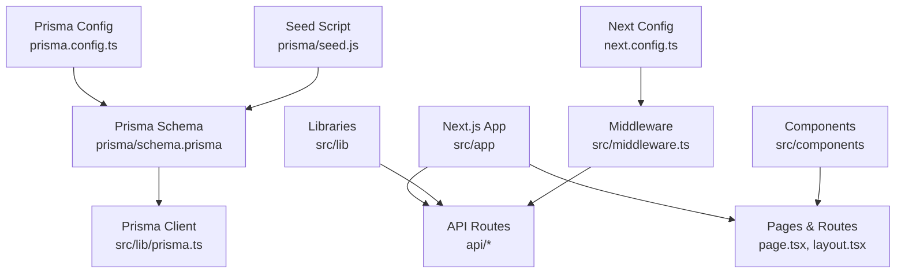
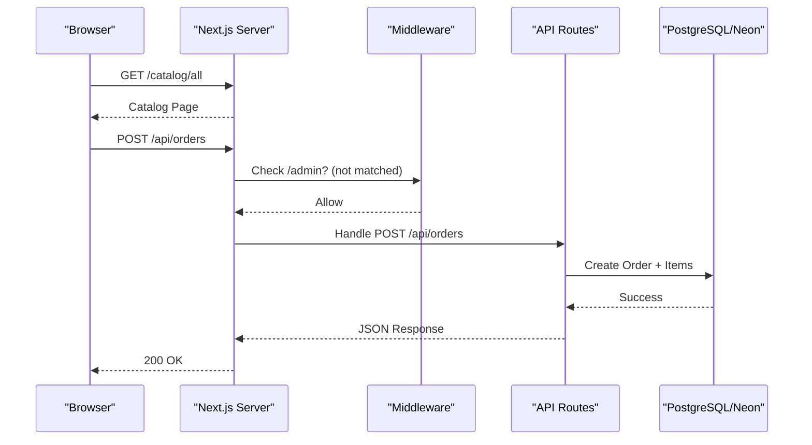
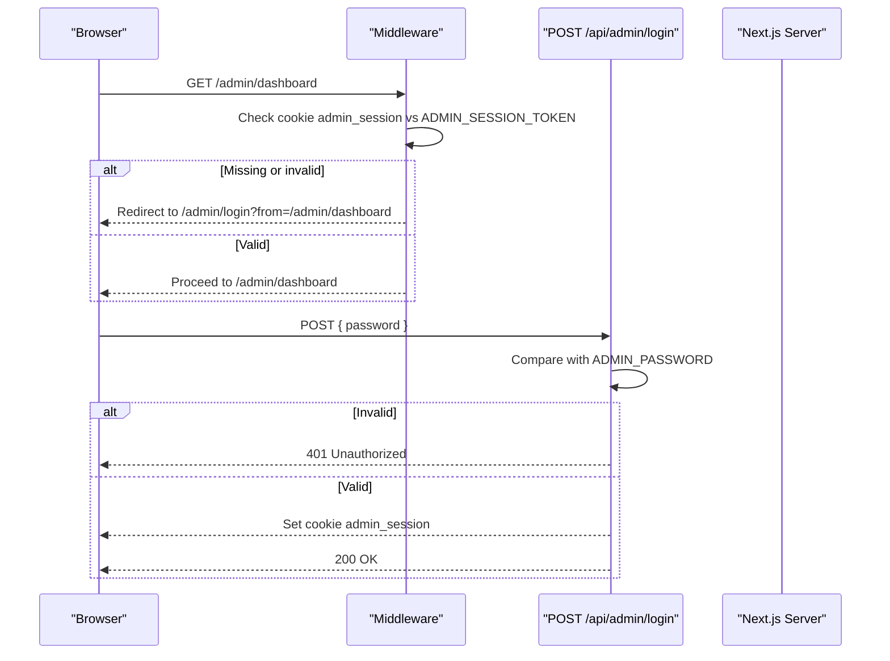
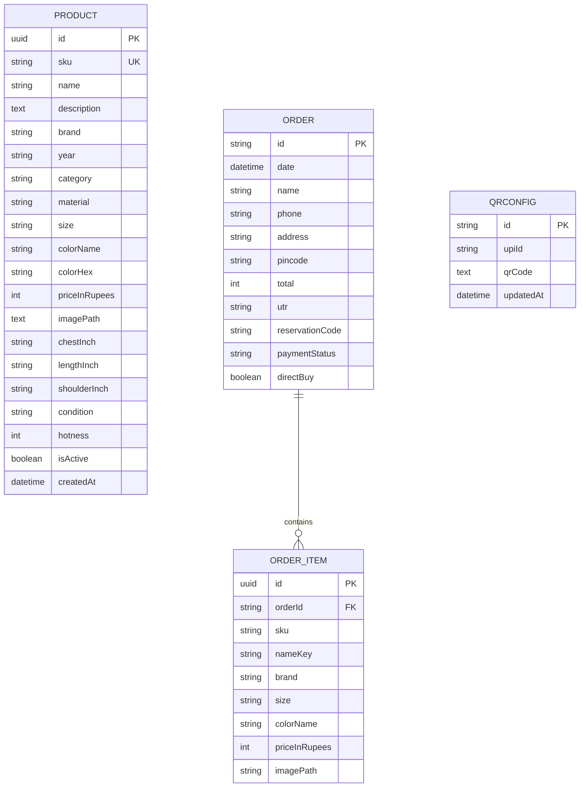
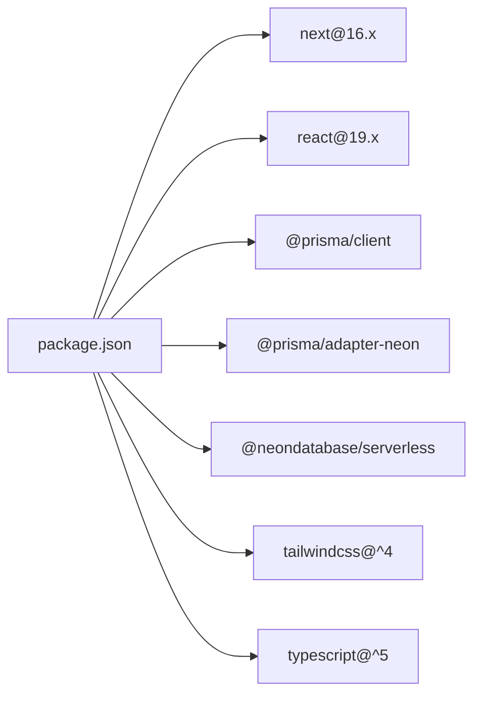

# Getting Started

<cite>
**Referenced Files in This Document**
- [README.md](file://README.md)
- [package.json](file://package.json)
- [prisma.config.ts](file://prisma.config.ts)
- [prisma/schema.prisma](file://prisma/schema.prisma)
- [prisma/seed.js](file://prisma/seed.js)
- [src/lib/prisma.ts](file://src/lib/prisma.ts)
- [next.config.ts](file://next.config.ts)
- [src/middleware.ts](file://src/middleware.ts)
- [src/app/api/admin/login/route.ts](file://src/app/api/admin/login/route.ts)
- [src/lib/auth.ts](file://src/lib/auth.ts)
- [src/app/layout.tsx](file://src/app/layout.tsx)
- [src/app/page.tsx](file://src/app/page.tsx)
- [src/components/Cart/CartContext.tsx](file://src/components/Cart/CartContext.tsx)
- [src/app/cart/page.tsx](file://src/app/cart/page.tsx)
- [src/app/checkout/page.tsx](file://src/app/checkout/page.tsx)
</cite>

## Table of Contents
1. Introduction
2. Project Structure
3. Core Components
4. Architecture Overview
5. Detailed Component Analysis
6. Dependency Analysis
7. Performance Considerations
8. Troubleshooting Guide
9. Conclusion

## Introduction
next.in is a sustainable thrift e-commerce platform focused on pre-loved vintage clothing. It provides a modern, fast, and accessible shopping experience for curated second-hand fashion. The project leverages Next.js 16 with React 19 and uses Prisma ORM to interact with a PostgreSQL database (including Neon serverless). It includes product browsing, cart management, and a checkout flow that simulates UPI payment verification and order creation.

## Project Structure
The application follows the Next.js App Router structure:
- Pages and routes under src/app
- Shared UI components under src/components
- Data access via Prisma client under src/lib
- Admin authentication middleware and API routes under src/app/api and src/middleware
- Database schema and seeding under prisma

**Diagram sources**
- [src/app/layout.tsx:1-62](file://src/app/layout.tsx#L1-L62)
- [src/app/page.tsx:1-501](file://src/app/page.tsx#L1-L501)
- [src/middleware.ts:1-27](file://src/middleware.ts#L1-L27)
- [src/app/api/admin/login/route.ts:1-28](file://src/app/api/admin/login/route.ts#L1-L28)
- [src/lib/prisma.ts:1-23](file://src/lib/prisma.ts#L1-L23)
- [prisma/config.ts:1-15](file://prisma.config.ts#L1-L15)
- [prisma/schema.prisma:1-67](file://prisma/schema.prisma#L1-L67)
- [prisma/seed.js:1-600](file://prisma/seed.js#L1-L600)
- [next.config.ts:1-12](file://next.config.ts#L1-L12)

**Section sources**
- [README.md:1-37](file://README.md#L1-L37)
- [package.json:1-37](file://package.json#L1-L37)
- [src/app/layout.tsx:1-62](file://src/app/layout.tsx#L1-L62)

## Core Components
- Product catalog and home page: The root page showcases categories, trending items, and calls to action.
- Cart context: Provides client-side cart state, persistence, reservation code generation, and expiry simulation.
- Checkout flow: Multi-step billing and payment pages with validation, QR/UPI display, and order submission.
- Admin auth: Middleware protects admin routes; login route sets a session cookie based on environment variables.
- Database layer: Prisma client configured for Neon adapter; schema defines products, orders, and related entities.

Key responsibilities:
- Routing and layout: src/app/layout.tsx wraps app with providers and global styles.
- Cart state and UX: src/components/Cart/CartContext.tsx manages add/remove/clear, localStorage persistence, and reservation codes.
- Checkout: src/app/checkout/page.tsx orchestrates billing/payment steps and posts orders to /api/orders.
- Admin protection: src/middleware.ts enforces session cookie checks for /admin paths; src/app/api/admin/login/route.ts authenticates and sets cookies.
- Data models: prisma/schema.prisma defines Product, Order, OrderItem, and QRConfig.

**Section sources**
- [src/app/page.tsx:1-501](file://src/app/page.tsx#L1-L501)
- [src/components/Cart/CartContext.tsx:1-228](file://src/components/Cart/CartContext.tsx#L1-L228)
- [src/app/checkout/page.tsx:1-658](file://src/app/checkout/page.tsx#L1-L658)
- [src/middleware.ts:1-27](file://src/middleware.ts#L1-L27)
- [src/app/api/admin/login/route.ts:1-28](file://src/app/api/admin/login/route.ts#L1-L28)
- [prisma/schema.prisma:1-67](file://prisma/schema.prisma#L1-L67)

## Architecture Overview
High-level runtime architecture:
- Browser interacts with Next.js App Router pages and API routes.
- Middleware intercepts requests to protected admin routes.
- API routes use Prisma client (Neon adapter) to read/write data.
- Client-side cart state persists in localStorage and drives checkout.

**Diagram sources**
- [src/middleware.ts:1-27](file://src/middleware.ts#L1-L27)
- [src/app/checkout/page.tsx:214-233](file://src/app/checkout/page.tsx#L214-L233)
- [src/lib/prisma.ts:1-23](file://src/lib/prisma.ts#L1-L23)
- [prisma/schema.prisma:16-42](file://prisma/schema.prisma#L16-L42)

## Detailed Component Analysis

### Installation and Setup
- Requirements:
  - Node.js (compatible with Next.js 16)
  - PostgreSQL database (local or Neon serverless)
- Steps:
  1. Install dependencies:
     - npm install
  2. Configure environment variables:
     - DATABASE_URL: Your PostgreSQL connection string (e.g., local or Neon)
     - ADMIN_SESSION_TOKEN: A secret token used by middleware and login route
     - ADMIN_PASSWORD: Password accepted by the admin login API
  3. Initialize database:
     - Generate migrations and apply them using Prisma CLI
     - Seed sample products using the provided seed script
  4. Start development server:
     - npm run dev
  5. Open http://localhost:3000 in your browser

Environment configuration references:
- Prisma config reads DATABASE_URL and defines seed command
- Runtime Prisma client uses DATABASE_URL and Neon adapter
- Next config exposes ADMIN env vars to Edge runtime
- Middleware and login route consume ADMIN_SESSION_TOKEN and ADMIN_PASSWORD

**Section sources**
- [package.json:1-37](file://package.json#L1-L37)
- [prisma.config.ts:1-15](file://prisma.config.ts#L1-L15)
- [src/lib/prisma.ts:1-23](file://src/lib/prisma.ts#L1-L23)
- [next.config.ts:1-12](file://next.config.ts#L1-L12)
- [src/middleware.ts:1-27](file://src/middleware.ts#L1-L27)
- [src/app/api/admin/login/route.ts:1-28](file://src/app/api/admin/login/route.ts#L1-L28)

### Basic Usage Examples
- Browse products:
  - Visit the homepage and navigate to category pages from the hero or category sections.
  - Use the catalog index redirect to /catalog/all.
- Add items to cart:
  - From product listings or detail views, add items to the cart. The cart context persists items and generates a reservation code.
- Complete checkout:
  - Go to the cart page and click “Checkout.”
  - Fill in billing details and proceed to payment.
  - Scan the displayed UPI QR code and enter the 12-digit UTR number.
  - Submit to create an order; you will see a success screen with a reference code.

Relevant flows:
- Home navigation and category links
- Cart context operations (add/remove/clear)
- Checkout steps and order submission

**Section sources**
- [src/app/page.tsx:1-501](file://src/app/page.tsx#L1-L501)
- [src/components/Cart/CartContext.tsx:1-228](file://src/components/Cart/CartContext.tsx#L1-L228)
- [src/app/cart/page.tsx:1-417](file://src/app/cart/page.tsx#L1-L417)
- [src/app/checkout/page.tsx:1-658](file://src/app/checkout/page.tsx#L1-L658)

### Admin Authentication Flow
Admin routes are protected by middleware. Login sets a secure cookie validated by both middleware and API helpers.

**Diagram sources**
- [src/middleware.ts:1-27](file://src/middleware.ts#L1-L27)
- [src/app/api/admin/login/route.ts:1-28](file://src/app/api/admin/login/route.ts#L1-L28)
- [src/lib/auth.ts:1-16](file://src/lib/auth.ts#L1-L16)
- [next.config.ts:1-12](file://next.config.ts#L1-L12)

### Data Models and Seeding
Core models include Product, Order, OrderItem, and QRConfig. The seed script populates sample products for immediate browsing and checkout testing.

**Diagram sources**
- [prisma/schema.prisma:9-66](file://prisma/schema.prisma#L9-L66)

Seeding workflow:
- The seed script connects using DATABASE_URL and upserts multiple products by SKU.

**Section sources**
- [prisma/schema.prisma:1-67](file://prisma/schema.prisma#L1-L67)
- [prisma/seed.js:1-600](file://prisma/seed.js#L1-L600)

## Dependency Analysis
Runtime and build-time dependencies relevant to setup and operation:
- Next.js 16 and React 19 for the web framework and UI
- Prisma client and Neon adapter for database connectivity
- Tailwind CSS and PostCSS for styling
- TypeScript and ESLint for developer tooling

**Diagram sources**
- [package.json:14-35](file://package.json#L14-L35)

**Section sources**
- [package.json:1-37](file://package.json#L1-L37)

## Performance Considerations
- Prefer static or incremental rendering where possible for catalog pages.
- Keep Prisma logging minimal in production; only enable query logs in development.
- Avoid heavy client-side computations during checkout; keep form validations lightweight.
- Use image optimization features provided by Next.js for product images.

[No sources needed since this section provides general guidance]

## Troubleshooting Guide
Common issues and resolutions:
- Cannot connect to database:
  - Ensure DATABASE_URL is set correctly and points to a running PostgreSQL instance or Neon project.
  - Verify network access and credentials if using Neon.
- Prisma commands fail:
  - Confirm DATABASE_URL is available when running Prisma CLI.
  - Re-run migration generation and apply before seeding.
- Admin routes redirect to login unexpectedly:
  - Set ADMIN_SESSION_TOKEN and ensure it matches the value used by the login route.
  - Clear cookies if necessary and re-login.
- Admin login returns invalid password:
  - Ensure ADMIN_PASSWORD is set and matches what you submit.
- Development server does not start:
  - Check Node.js version compatibility with Next.js 16.
  - Remove lock files and reinstall dependencies if corrupted.

Configuration references:
- Prisma datasource and seed command
- Runtime Prisma client initialization
- Next config exposing admin tokens
- Middleware and login route behavior

**Section sources**
- [prisma.config.ts:1-15](file://prisma.config.ts#L1-L15)
- [src/lib/prisma.ts:1-23](file://src/lib/prisma.ts#L1-L23)
- [next.config.ts:1-12](file://next.config.ts#L1-L12)
- [src/middleware.ts:1-27](file://src/middleware.ts#L1-L27)
- [src/app/api/admin/login/route.ts:1-28](file://src/app/api/admin/login/route.ts#L1-L28)

## Conclusion
You now have the essentials to run next.in locally: install dependencies, configure environment variables, initialize the database, and start the development server. Explore the catalog, add items to the cart, and complete a simulated checkout. For admin features, configure the required tokens and authenticate via the login endpoint. Use the troubleshooting guide to resolve common setup issues quickly.