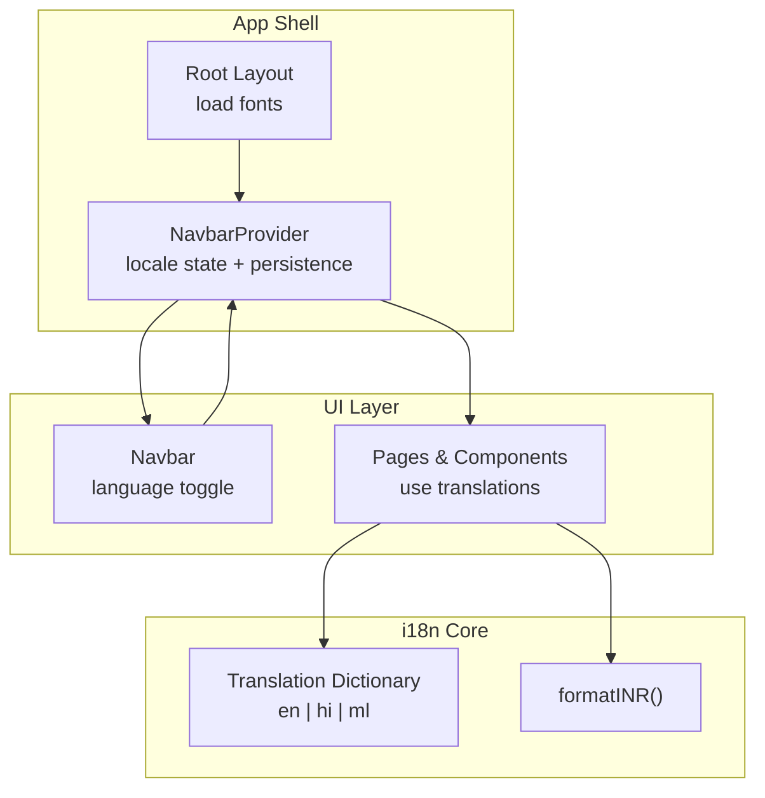
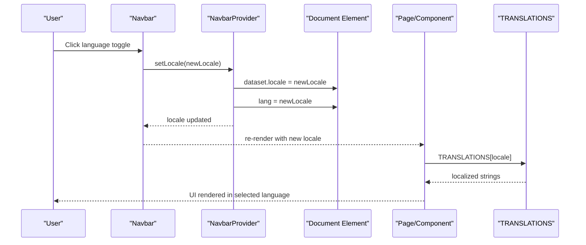
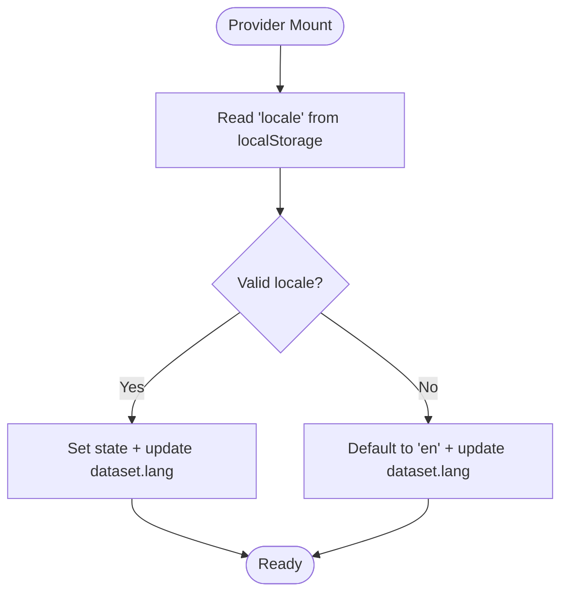
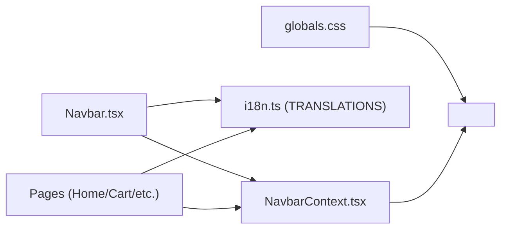

# Internationalization

<cite>
**Referenced Files in This Document**
- [i18n.ts](file://src/utils/i18n.ts)
- [NavbarContext.tsx](file://src/components/Navbar/NavbarContext.tsx)
- [Navbar.tsx](file://src/components/Navbar.tsx)
- [layout.tsx](file://src/app/layout.tsx)
- [globals.css](file://src/app/globals.css)
- [page.tsx (Home)](file://src/app/page.tsx)
- [cart page.tsx](file://src/app/cart/page.tsx)
</cite>

## Table of Contents
1. [Introduction](#introduction)
2. [Project Structure](#project-structure)
3. [Core Components](#core-components)
4. [Architecture Overview](#architecture-overview)
5. [Detailed Component Analysis](#detailed-component-analysis)
6. [Dependency Analysis](#dependency-analysis)
7. [Performance Considerations](#performance-considerations)
8. [Troubleshooting Guide](#troubleshooting-guide)
9. [Conclusion](#conclusion)
10. [Appendices](#appendices)

## Introduction
This document explains the internationalization (i18n) system for next.in, which supports English, Hindi, and Malayalam. It covers:
- Translation key management with a comprehensive dictionary covering UI, product content, and marketing copy
- Runtime language switching without page reloads
- Cultural adaptations for Indian markets (currency formatting, fonts, accessibility)
- Utility functions, context provider implementation, and integration patterns across pages and components
- Guidance on adding new translations, creating language-aware components, and handling right-to-left text if needed

## Project Structure
The i18n system is implemented as a lightweight client-side solution:
- A central translation dictionary and utility function live in a single module
- A React context provides runtime locale state and persistence
- The root layout preloads Google Fonts for Devanagari and Malayalam scripts
- CSS applies script-specific font stacks based on an HTML attribute
- Pages and components consume translations via the context

**Diagram sources**
- [layout.tsx:1-38](file://src/app/layout.tsx#L1-L38)
- [NavbarContext.tsx:33-115](file://src/components/Navbar/NavbarContext.tsx#L33-L115)
- [Navbar.tsx:14-54](file://src/components/Navbar.tsx#L14-L54)
- [i18n.ts:183-704](file://src/utils/i18n.ts#L183-L704)

**Section sources**
- [layout.tsx:1-38](file://src/app/layout.tsx#L1-L38)
- [NavbarContext.tsx:33-115](file://src/components/Navbar/NavbarContext.tsx#L33-L115)
- [Navbar.tsx:14-54](file://src/components/Navbar.tsx#L14-L54)
- [i18n.ts:183-704](file://src/utils/i18n.ts#L183-L704)

## Core Components
- Translation dictionary and types:
  - Centralized keys for UI, product names/descriptions, categories, marketing sections, and cart/checkout messages
  - Strongly typed Locale union and TranslationDictionary interface ensure consistency across languages
- Context provider:
  - Manages current locale, persists it to localStorage, and synchronizes <html> attributes for CSS and accessibility
- Utilities:
  - Currency formatter for INR using Intl.NumberFormat
- Font loading:
  - Preloads Noto Sans Devanagari and Noto Sans Malayalam for correct rendering of Hindi and Malayalam
- Styling:
  - CSS switches font families based on data-locale attribute

**Section sources**
- [i18n.ts:1-182](file://src/utils/i18n.ts#L1-L182)
- [i18n.ts:693-704](file://src/utils/i18n.ts#L693-L704)
- [NavbarContext.tsx:33-115](file://src/components/Navbar/NavbarContext.tsx#L33-L115)
- [layout.tsx:19-33](file://src/app/layout.tsx#L19-L33)
- [globals.css:84-97](file://src/app/globals.css#L84-L97)

## Architecture Overview
The i18n architecture is client-side and context-driven:
- NavbarProvider initializes locale from localStorage and sets document-level attributes
- Components read locale from context and render localized strings from TRANSLATIONS
- Language switching updates state, persists preference, and re-renders instantly without navigation

**Diagram sources**
- [Navbar.tsx:146-156](file://src/components/Navbar.tsx#L146-L156)
- [NavbarContext.tsx:82-89](file://src/components/Navbar/NavbarContext.tsx#L82-L89)
- [i18n.ts:183-704](file://src/utils/i18n.ts#L183-L704)

## Detailed Component Analysis

### Translation Dictionary and Types
- Defines Locale union and a comprehensive TranslationDictionary interface
- Provides TRANSLATIONS object keyed by en, hi, ml with consistent keys across all three locales
- Includes keys for:
  - Navigation, hero, value propositions, categories, newsletter, footer
  - Product cards, product details, catalog filters, condition labels
  - Redesign sections (how it works, testimonials, FAQ)
  - Cart and checkout flows

Best practices reflected:
- Consistent key naming and grouping by feature area
- All three locales include the same keys to prevent missing translations at runtime

**Section sources**
- [i18n.ts:1-182](file://src/utils/i18n.ts#L1-L182)
- [i18n.ts:183-704](file://src/utils/i18n.ts#L183-L704)

### Context Provider (Runtime Locale Management)
Responsibilities:
- Initialize locale from localStorage on mount
- Persist locale changes to localStorage
- Sync <html> data-locale and lang attributes for CSS and accessibility
- Expose locale and setLocale through context

Integration points:
- Navbar uses setLocale to switch languages
- Pages and components use locale to select translations

**Diagram sources**
- [NavbarContext.tsx:43-69](file://src/components/Navbar/NavbarContext.tsx#L43-L69)

**Section sources**
- [NavbarContext.tsx:33-115](file://src/components/Navbar/NavbarContext.tsx#L33-L115)

### Language Toggle in Navbar
Behavior:
- Displays current language code (EN/HI/ML)
- On click, cycles to the next language using NEXT_LOCALE mapping
- Persists selection and triggers immediate re-render

Accessibility:
- Uses aria-label derived from LANG_TOOLTIPS for screen readers

**Section sources**
- [Navbar.tsx:20-42](file://src/components/Navbar.tsx#L20-L42)
- [Navbar.tsx:146-156](file://src/components/Navbar.tsx#L146-L156)

### Font Loading and Script-Specific Typography
- Root layout loads:
  - Geist Sans/Mono for Latin
  - Noto Sans Devanagari for Hindi
  - Noto Sans Malayalam for Malayalam
- CSS applies font-family based on data-locale:
  - [data-locale="hi"] -> Devanagari stack
  - [data-locale="ml"] -> Malayalam stack

Result:
- Instant font switching when locale changes without layout shift due to display: swap

**Section sources**
- [layout.tsx:9-33](file://src/app/layout.tsx#L9-L33)
- [globals.css:84-97](file://src/app/globals.css#L84-L97)

### Usage Patterns Across Pages and Components
- Home page:
  - Reads locale from context and selects t = TRANSLATIONS[locale]
  - Renders section titles, descriptions, and CTAs using t keys
- Cart page:
  - Uses t for headings, empty states, and success messages
  - Uses formatINR for price totals and line items

Examples of integration:
- [Home page usage:133-141](file://src/app/page.tsx#L133-L141)
- [Cart page usage:31-34](file://src/app/cart/page.tsx#L31-L34)

**Section sources**
- [page.tsx (Home):133-141](file://src/app/page.tsx#L133-L141)
- [cart page.tsx:31-34](file://src/app/cart/page.tsx#L31-L34)

### Currency Formatting for INR
- Utility function formatINR(amount) uses Intl.NumberFormat with en-IN locale
- Applied across admin, catalog, cart, and checkout views for consistent pricing display

Usage examples:
- Admin dashboard totals and product prices
- Cart subtotal and total
- Checkout summary

**Section sources**
- [i18n.ts:693-704](file://src/utils/i18n.ts#L693-L704)
- [cart page.tsx:254-323](file://src/app/cart/page.tsx#L254-L323)

## Dependency Analysis
High-level dependencies:
- Navbar depends on NavbarContext for locale state and setter
- Pages depend on NavbarContext and TRANSLATIONS for rendering
- Global styles depend on data-locale attribute for font switching
- Utilities are pure functions used throughout the app

**Diagram sources**
- [Navbar.tsx:14-54](file://src/components/Navbar.tsx#L14-L54)
- [NavbarContext.tsx:82-89](file://src/components/Navbar/NavbarContext.tsx#L82-L89)
- [globals.css:84-97](file://src/app/globals.css#L84-L97)
- [i18n.ts:183-704](file://src/utils/i18n.ts#L183-L704)

**Section sources**
- [Navbar.tsx:14-54](file://src/components/Navbar.tsx#L14-L54)
- [NavbarContext.tsx:82-89](file://src/components/Navbar/NavbarContext.tsx#L82-L89)
- [globals.css:84-97](file://src/app/globals.css#L84-L97)
- [i18n.ts:183-704](file://src/utils/i18n.ts#L183-L704)

## Performance Considerations
- Client-side dictionary:
  - All translations are bundled with the app; keep keys minimal and avoid large dynamic payloads
- No network calls for translations:
  - Avoids latency and ensures instant language switching
- Font loading:
  - Using display: swap reduces layout shifts during font load
- Re-renders:
  - Changing locale updates context and causes targeted re-renders; consider memoizing heavy components that consume many translation keys

[No sources needed since this section provides general guidance]

## Troubleshooting Guide
Common issues and resolutions:
- Missing translation key:
  - Ensure the key exists in all three locales within TRANSLATIONS
- Incorrect locale applied:
  - Verify localStorage contains a valid key ("en", "hi", or "ml")
  - Check that <html> has correct data-locale and lang attributes after switching
- Fonts not switching:
  - Confirm CSS selectors for [data-locale="hi"] and [data-locale="ml"] are present
  - Ensure fonts are loaded in the root layout
- Currency formatting:
  - Use formatINR for all monetary values to maintain consistent INR formatting

**Section sources**
- [NavbarContext.tsx:58-69](file://src/components/Navbar/NavbarContext.tsx#L58-L69)
- [globals.css:84-97](file://src/app/globals.css#L84-L97)
- [i18n.ts:693-704](file://src/utils/i18n.ts#L693-L704)

## Conclusion
The i18n system provides a simple, robust, and performant way to support English, Hindi, and Malayalam across next.in. It leverages a centralized dictionary, a lightweight context provider, and CSS-driven font switching to deliver seamless localization. With clear integration patterns and utilities like formatINR, teams can extend coverage confidently while maintaining consistency and performance.

[No sources needed since this section summarizes without analyzing specific files]

## Appendices

### How to Add New Translations
Steps:
1. Open the translation dictionary file and add the new key(s) to the TranslationDictionary interface
2. Add the corresponding string for each locale under TRANSLATIONS.en, TRANSLATIONS.hi, and TRANSLATIONS.ml
3. Use the new key in components/pages via TRANSLATIONS[locale].newKey
4. If the key includes placeholders, pass variables at render time

References:
- [TranslationDictionary interface:5-181](file://src/utils/i18n.ts#L5-L181)
- [TRANSLATIONS object:183-704](file://src/utils/i18n.ts#L183-L704)

**Section sources**
- [i18n.ts:5-181](file://src/utils/i18n.ts#L5-L181)
- [i18n.ts:183-704](file://src/utils/i18n.ts#L183-L704)

### Creating a Language-Aware Component
Pattern:
- Consume locale from useNavbar
- Select t = TRANSLATIONS[locale]
- Render localized strings using t keys

Example references:
- [Home page pattern:133-141](file://src/app/page.tsx#L133-L141)
- [Cart page pattern:31-34](file://src/app/cart/page.tsx#L31-L34)

**Section sources**
- [page.tsx (Home):133-141](file://src/app/page.tsx#L133-L141)
- [cart page.tsx:31-34](file://src/app/cart/page.tsx#L31-L34)

### Handling Right-to-Left Text (If Needed)
Recommendations:
- Extend Locale type to include RTL codes if required
- Update NavbarContext to set dir="rtl" on <html> when locale is RTL
- Adjust CSS to mirror layouts for RTL (e.g., flex-direction, text-align)
- Provide translations for RTL locales in TRANSLATIONS

[No sources needed since this section provides general guidance]

### Date and Time Localization
Guidance:
- Use Intl.DateTimeFormat with appropriate locale options for date/time display
- For India-focused formats, prefer "en-IN" or the user’s chosen locale where supported
- Keep formatting consistent across pages (e.g., order dates, timestamps)

[No sources needed since this section provides general guidance]