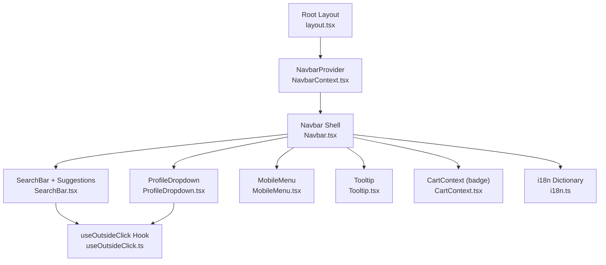
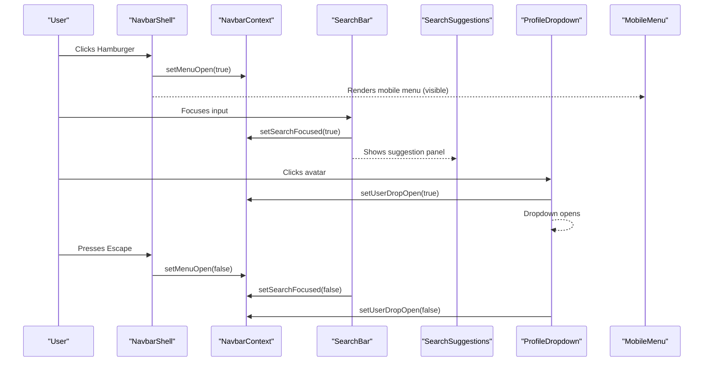
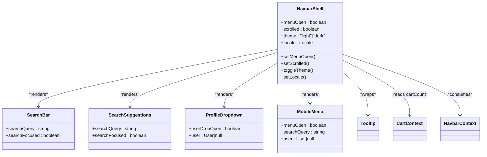
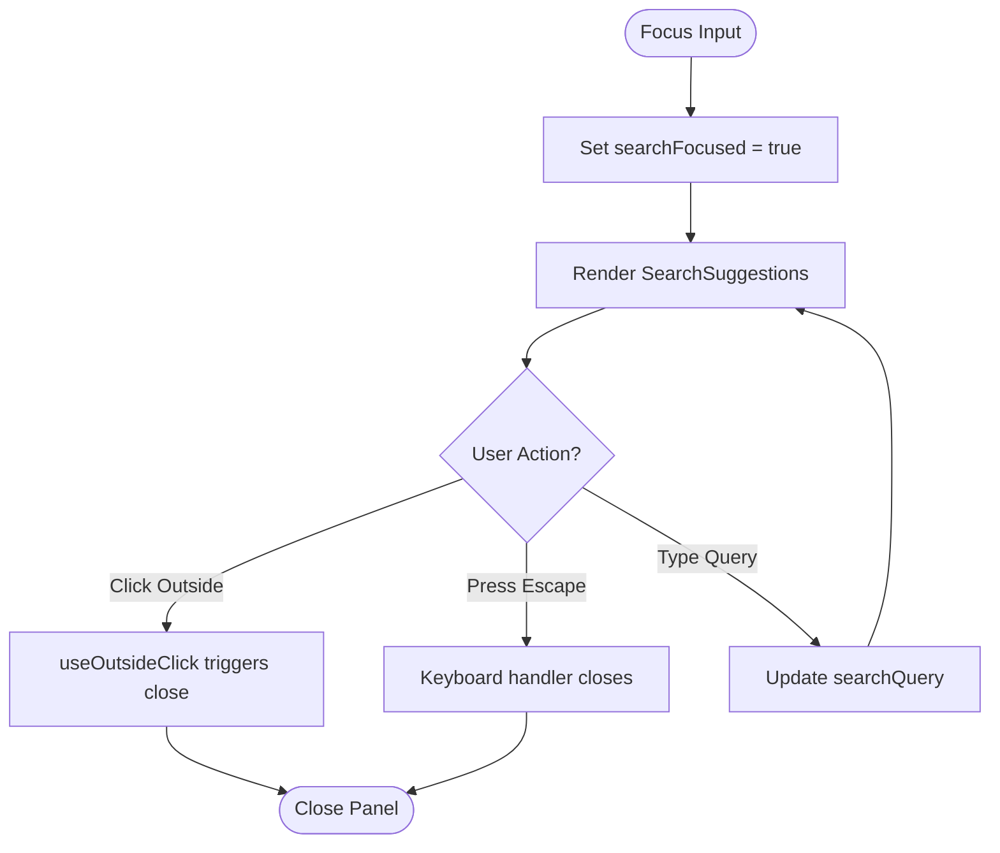
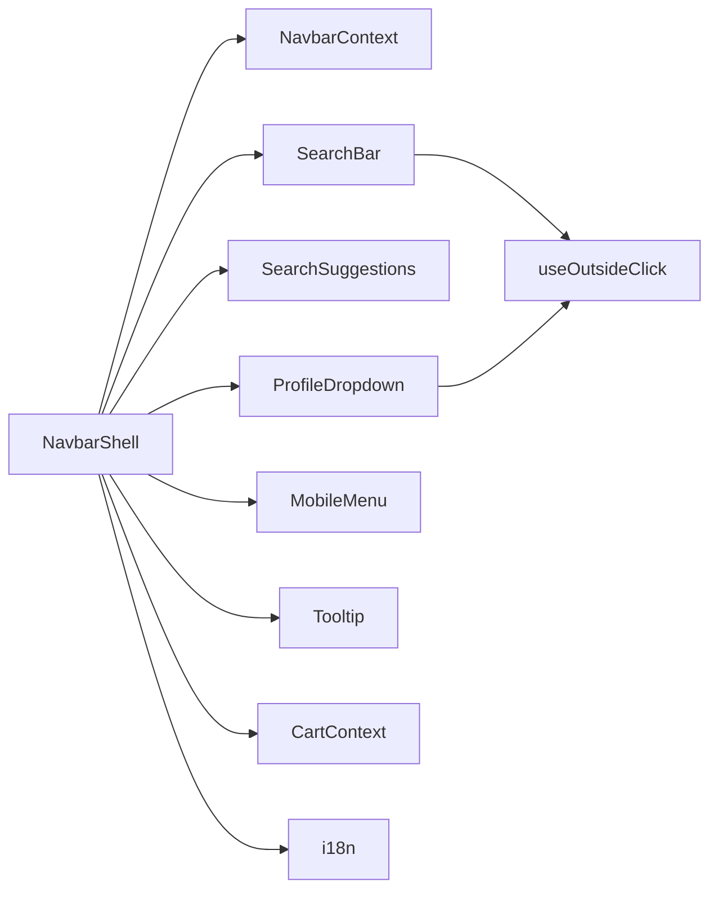

# Navbar Component

<cite>
**Referenced Files in This Document**
- [Navbar.tsx](file://src/components/Navbar.tsx)
- [NavbarContext.tsx](file://src/components/Navbar/NavbarContext.tsx)
- [SearchBar.tsx](file://src/components/Navbar/SearchBar.tsx)
- [MobileMenu.tsx](file://src/components/Navbar/MobileMenu.tsx)
- [ProfileDropdown.tsx](file://src/components/Navbar/ProfileDropdown.tsx)
- [i18n.ts](file://src/utils/i18n.ts)
- [useOutsideClick.ts](file://src/hooks/useOutsideClick.ts)
- [CartContext.tsx](file://src/components/Cart/CartContext.tsx)
- [layout.tsx](file://src/app/layout.tsx)
- [Tooltip.tsx](file://src/components/Tooltip.tsx)
</cite>

## Table of Contents
1. [Introduction](#introduction)
2. [Project Structure](#project-structure)
3. [Core Components](#core-components)
4. [Architecture Overview](#architecture-overview)
5. [Detailed Component Analysis](#detailed-component-analysis)
6. [Dependency Analysis](#dependency-analysis)
7. [Performance Considerations](#performance-considerations)
8. [Troubleshooting Guide](#troubleshooting-guide)
9. [Conclusion](#conclusion)
10. [Appendices](#appendices)

## Introduction
This document provides comprehensive documentation for the Navbar component system in the next.in platform. It covers the main Navbar component, its responsive design, scroll behavior, theme switching, internationalization (i18n), accessibility features, and integration with search suggestions, mobile menu, and profile dropdown. It also explains the NavbarContext provider for global navigation state management, usage patterns, props/attributes, events, customization options, and styling approaches using Tailwind CSS.

## Project Structure
The Navbar system is organized into a primary shell component and several focused subcomponents:
- Main shell: Navbar.tsx
- Global state provider: NavbarContext.tsx
- Search input and suggestions: SearchBar.tsx
- Mobile slide-down menu: MobileMenu.tsx
- Profile dropdown: ProfileDropdown.tsx
- Internationalization dictionary: i18n.ts
- Utility hook for outside click handling: useOutsideClick.ts
- Cart badge integration: CartContext.tsx
- Root layout wiring providers: layout.tsx
- Tooltip utility used by Navbar: Tooltip.tsx

**Diagram sources**
- [layout.tsx:44-61](file://src/app/layout.tsx#L44-L61)
- [NavbarContext.tsx:33-115](file://src/components/Navbar/NavbarContext.tsx#L33-L115)
- [Navbar.tsx:44-220](file://src/components/Navbar.tsx#L44-L220)
- [SearchBar.tsx:20-157](file://src/components/Navbar/SearchBar.tsx#L20-L157)
- [ProfileDropdown.tsx:9-184](file://src/components/Navbar/ProfileDropdown.tsx#L9-L184)
- [MobileMenu.tsx:13-163](file://src/components/Navbar/MobileMenu.tsx#L13-L163)
- [useOutsideClick.ts:3-26](file://src/hooks/useOutsideClick.ts#L3-L26)
- [CartContext.tsx:199-218](file://src/components/Cart/CartContext.tsx#L199-L218)
- [i18n.ts:183-352](file://src/utils/i18n.ts#L183-L352)
- [Tooltip.tsx:58-228](file://src/components/Tooltip.tsx#L58-L228)

**Section sources**
- [layout.tsx:44-61](file://src/app/layout.tsx#L44-L61)
- [Navbar.tsx:44-220](file://src/components/Navbar.tsx#L44-L220)
- [NavbarContext.tsx:33-115](file://src/components/Navbar/NavbarContext.tsx#L33-L115)

## Core Components
- NavbarShell (in Navbar.tsx): The main visible navbar that composes logo, desktop nav links, inline search bar, language toggle, theme toggle, cart icon with badge, profile dropdown, and hamburger button. It manages scroll detection, responsive menu closing on resize, and Escape key to close mobile menu.
- NavbarContext: Provides global state for menu open/close, scroll status, search query/focus, user profile, theme, and locale. Persists theme and locale to localStorage and applies them to the document element.
- SearchBar: Desktop-only inline search input with focus ring and clear/go actions. Exports SearchSuggestions panel for quick categories and trending tags.
- MobileMenu: Slide-down mobile menu with search, navigation links, and user section (guest vs logged-in).
- ProfileDropdown: Desktop-only user menu with guest and logged-in flows, including sign-in demo, account pages, admin console, and sign-out.
- Tooltip: Lightweight tooltip with positioning and ARIA support used across the navbar.
- useOutsideClick: Reusable hook to detect clicks outside specified refs and trigger handlers.
- CartContext: Supplies cart count for the cart badge in the navbar.
- i18n: Translation dictionary and Locale type used for UI text and HTML lang/data attributes.

Key responsibilities:
- Responsive behavior: Hide/show elements based on breakpoints; collapse to mobile menu below md.
- Scroll behavior: Add shadow when scrolled beyond threshold.
- Theme switching: Toggle light/dark and persist preference.
- Internationalization: Cycle locales and update document attributes.
- Accessibility: ARIA labels, expanded states, keyboard handling (Escape), aria-hidden toggles.

**Section sources**
- [Navbar.tsx:44-220](file://src/components/Navbar.tsx#L44-L220)
- [NavbarContext.tsx:33-115](file://src/components/Navbar/NavbarContext.tsx#L33-L115)
- [SearchBar.tsx:20-157](file://src/components/Navbar/SearchBar.tsx#L20-L157)
- [MobileMenu.tsx:13-163](file://src/components/Navbar/MobileMenu.tsx#L13-L163)
- [ProfileDropdown.tsx:9-184](file://src/components/Navbar/ProfileDropdown.tsx#L9-L184)
- [useOutsideClick.ts:3-26](file://src/hooks/useOutsideClick.ts#L3-L26)
- [CartContext.tsx:199-218](file://src/components/Cart/CartContext.tsx#L199-L218)
- [i18n.ts:183-352](file://src/utils/i18n.ts#L183-L352)
- [Tooltip.tsx:58-228](file://src/components/Tooltip.tsx#L58-L228)

## Architecture Overview
The Navbar system uses React Context for shared state and composition to keep components small and focused. Providers are mounted at the root layout so all pages can access navigation state.

**Diagram sources**
- [Navbar.tsx:74-82](file://src/components/Navbar.tsx#L74-L82)
- [SearchBar.tsx:35-44](file://src/components/Navbar/SearchBar.tsx#L35-L44)
- [ProfileDropdown.tsx:23-31](file://src/components/Navbar/ProfileDropdown.tsx#L23-L31)
- [NavbarContext.tsx:33-115](file://src/components/Navbar/NavbarContext.tsx#L33-L115)

## Detailed Component Analysis

### NavbarShell (Main Navbar)
Responsibilities:
- Compose logo, desktop nav links, inline search, right-side controls (language, theme, cart, profile), and mobile hamburger.
- Manage scroll state to enhance visual feedback.
- Close mobile menu on window resize to desktop width.
- Handle Escape key to close mobile menu.
- Render SearchSuggestions and MobileMenu within the same fixed wrapper to align suggestion panel.

Props/Attributes:
- No external props; consumes context via useNavbar.

Events:
- Scroll listener updates scrolled state.
- Resize listener closes mobile menu above md breakpoint.
- Keyboard Escape closes mobile menu.

Customization:
- Styling via Tailwind classes; easily adjustable spacing, colors, shadows, and transitions.
- Nav links array can be extended or localized via TRANSLATIONS.

Accessibility:
- aria-label on logo link and buttons.
- aria-expanded on hamburger.
- aria-hidden on decorative icons and hidden panels.

Responsive Breakpoints:
- Hidden on mobile for desktop-only elements (md:hidden, hidden md:block).
- Mobile menu appears only below md.

Styling approach:
- Glassmorphism-like backgrounds with backdrop-blur and translucent rings/shadows.
- Smooth transitions for hover and active states.

Integration points:
- Uses useCart for cartCount badge.
- Uses TRANSLATIONS for localized labels.
- Wraps elements with Tooltip for contextual hints.

**Section sources**
- [Navbar.tsx:44-220](file://src/components/Navbar.tsx#L44-L220)
- [Navbar.tsx:84-216](file://src/components/Navbar.tsx#L84-L216)
- [Navbar.tsx:121-139](file://src/components/Navbar.tsx#L121-L139)
- [Navbar.tsx:145-200](file://src/components/Navbar.tsx#L145-L200)
- [Navbar.tsx:59-82](file://src/components/Navbar.tsx#L59-L82)
- [CartContext.tsx:199-218](file://src/components/Cart/CartContext.tsx#L199-L218)
- [i18n.ts:183-352](file://src/utils/i18n.ts#L183-L352)
- [Tooltip.tsx:58-228](file://src/components/Tooltip.tsx#L58-L228)

#### Class Diagram (NavbarShell Composition)

**Diagram sources**
- [Navbar.tsx:44-220](file://src/components/Navbar.tsx#L44-L220)
- [SearchBar.tsx:20-157](file://src/components/Navbar/SearchBar.tsx#L20-L157)
- [ProfileDropdown.tsx:9-184](file://src/components/Navbar/ProfileDropdown.tsx#L9-L184)
- [MobileMenu.tsx:13-163](file://src/components/Navbar/MobileMenu.tsx#L13-L163)
- [NavbarContext.tsx:33-115](file://src/components/Navbar/NavbarContext.tsx#L33-L115)
- [CartContext.tsx:199-218](file://src/components/Cart/CartContext.tsx#L199-L218)
- [Tooltip.tsx:58-228](file://src/components/Tooltip.tsx#L58-L228)

### NavbarContext Provider
Responsibilities:
- Provide global state for navigation: menuOpen, scrolled, searchFocused, searchQuery, userDropOpen, user, theme, locale.
- Persist theme and locale to localStorage and apply to document.documentElement (class and data/locale attributes).
- Provide toggleTheme and setLocale functions.

State shape:
- menuOpen: boolean
- scrolled: boolean
- searchFocused: boolean
- searchQuery: string
- userDropOpen: boolean
- user: User | null
- theme: "light" | "dark"
- locale: Locale ("en" | "hi" | "ml")

Persistence:
- On mount, reads stored theme and locale from localStorage and applies them.
- On change, writes new values to localStorage and updates DOM attributes.

Usage:
- All Navbar subcomponents consume via useNavbar().

**Section sources**
- [NavbarContext.tsx:33-115](file://src/components/Navbar/NavbarContext.tsx#L33-L115)
- [NavbarContext.tsx:43-89](file://src/components/Navbar/NavbarContext.tsx#L43-L89)

### SearchBar and SearchSuggestions
Responsibilities:
- SearchBar: Inline search input for desktop with focus ring, clear button, and optional Go action.
- SearchSuggestions: Panel shown when search is focused, containing quick category chips and trending tags.

Behavior:
- Outside click closes suggestions.
- Escape key closes suggestions and blurs input.
- Updates searchQuery and searchFocused via context.

Accessibility:
- aria-hidden toggled on suggestions panel based on visibility.
- Clear button has aria-label.

Styling:
- Rounded container with dynamic background and ring on focus.
- Chips styled with subtle borders and hover effects.

**Section sources**
- [SearchBar.tsx:20-86](file://src/components/Navbar/SearchBar.tsx#L20-L86)
- [SearchBar.tsx:88-157](file://src/components/Navbar/SearchBar.tsx#L88-L157)
- [SearchBar.tsx:35-44](file://src/components/Navbar/SearchBar.tsx#L35-L44)
- [useOutsideClick.ts:3-26](file://src/hooks/useOutsideClick.ts#L3-L26)

#### Flowchart: Search Suggestions Visibility

**Diagram sources**
- [SearchBar.tsx:35-44](file://src/components/Navbar/SearchBar.tsx#L35-L44)
- [SearchBar.tsx:32](file://src/components/Navbar/SearchBar.tsx#L32)
- [useOutsideClick.ts:3-26](file://src/hooks/useOutsideClick.ts#L3-L26)

### MobileMenu
Responsibilities:
- Slide-down menu below md breakpoint.
- Contains mobile search input bound to context searchQuery.
- Navigation links that close menu on click.
- User section showing guest or logged-in state with actions.

Behavior:
- Controlled by menuOpen state.
- Sets user via setUser for demo purposes.

Accessibility:
- aria-hidden toggled based on menuOpen.

Styling:
- Backdrop blur, rounded container, smooth opacity and transform transitions.

**Section sources**
- [MobileMenu.tsx:13-163](file://src/components/Navbar/MobileMenu.tsx#L13-L163)
- [MobileMenu.tsx:23-31](file://src/components/Navbar/MobileMenu.tsx#L23-L31)

### ProfileDropdown
Responsibilities:
- Desktop-only user menu with avatar/name pill and chevron indicator.
- Guest flow: Sign in (Demo), Create account, Admin Console, Start selling.
- Logged-in flow: My Profile, My Orders, My Listings, Admin Console, Sign out.

Behavior:
- Toggles userDropOpen via context.
- Outside click closes dropdown.
- Escape key closes dropdown.

Accessibility:
- aria-expanded reflects open state.
- aria-label on trigger button.

Styling:
- Pill-shaped trigger with hover/active states.
- Dropdown panel with backdrop blur and ring/shadow.

**Section sources**
- [ProfileDropdown.tsx:9-184](file://src/components/Navbar/ProfileDropdown.tsx#L9-L184)
- [ProfileDropdown.tsx:23-31](file://src/components/Navbar/ProfileDropdown.tsx#L23-L31)
- [useOutsideClick.ts:3-26](file://src/hooks/useOutsideClick.ts#L3-L26)

### Theme Switching and Internationalization
Theme:
- Toggle between light and dark by updating context and adding/removing "dark" class on documentElement.
- Persists selection to localStorage.

Internationalization:
- Locale cycles among en, hi, ml.
- Persists locale to localStorage and sets document.documentElement.dataset.locale and lang accordingly.
- Translations accessed via TRANSLATIONS[locale] for nav labels and tooltips.

Fonts:
- Root layout loads Noto Sans Devanagari and Noto Sans Malayalam for proper rendering of Hindi and Malayalam scripts.

**Section sources**
- [NavbarContext.tsx:43-89](file://src/components/Navbar/NavbarContext.tsx#L43-L89)
- [i18n.ts:183-352](file://src/utils/i18n.ts#L183-L352)
- [layout.tsx:19-33](file://src/app/layout.tsx#L19-L33)

### Integration Points
- Cart Badge: Reads cartCount from CartContext to display a numeric badge on the cart icon.
- Tooltip: Wraps interactive elements to provide contextual help and accessible descriptions.
- useOutsideClick: Used by SearchBar and ProfileDropdown to dismiss overlays on outside clicks.

**Section sources**
- [CartContext.tsx:199-218](file://src/components/Cart/CartContext.tsx#L199-L218)
- [Navbar.tsx:171-185](file://src/components/Navbar.tsx#L171-L185)
- [SearchBar.tsx:32](file://src/components/Navbar/SearchBar.tsx#L32)
- [ProfileDropdown.tsx:20](file://src/components/Navbar/ProfileDropdown.tsx#L20)
- [useOutsideClick.ts:3-26](file://src/hooks/useOutsideClick.ts#L3-L26)

## Dependency Analysis
High-level dependencies:
- NavbarShell depends on NavbarContext, SearchBar, SearchSuggestions, ProfileDropdown, MobileMenu, Tooltip, CartContext, and i18n.
- SearchBar and ProfileDropdown depend on useOutsideClick.
- NavbarContext persists state to localStorage and manipulates documentElement attributes.
- Root layout mounts NavbarProvider and CartProvider.

**Diagram sources**
- [Navbar.tsx:44-220](file://src/components/Navbar.tsx#L44-L220)
- [SearchBar.tsx:20-157](file://src/components/Navbar/SearchBar.tsx#L20-L157)
- [ProfileDropdown.tsx:9-184](file://src/components/Navbar/ProfileDropdown.tsx#L9-L184)
- [useOutsideClick.ts:3-26](file://src/hooks/useOutsideClick.ts#L3-L26)
- [CartContext.tsx:199-218](file://src/components/Cart/CartContext.tsx#L199-L218)
- [i18n.ts:183-352](file://src/utils/i18n.ts#L183-L352)

**Section sources**
- [Navbar.tsx:44-220](file://src/components/Navbar.tsx#L44-L220)
- [NavbarContext.tsx:33-115](file://src/components/Navbar/NavbarContext.tsx#L33-L115)
- [SearchBar.tsx:20-157](file://src/components/Navbar/SearchBar.tsx#L20-L157)
- [ProfileDropdown.tsx:9-184](file://src/components/Navbar/ProfileDropdown.tsx#L9-L184)
- [MobileMenu.tsx:13-163](file://src/components/Navbar/MobileMenu.tsx#L13-L163)
- [useOutsideClick.ts:3-26](file://src/hooks/useOutsideClick.ts#L3-L26)
- [CartContext.tsx:199-218](file://src/components/Cart/CartContext.tsx#L199-L218)
- [i18n.ts:183-352](file://src/utils/i18n.ts#L183-L352)
- [layout.tsx:44-61](file://src/app/layout.tsx#L44-L61)

## Performance Considerations
- Scroll and resize listeners are attached with passive options where applicable to avoid blocking main thread.
- State updates are minimal and co-located in context; consider debouncing frequent updates if search becomes more complex.
- Use of backdrop-blur and shadows may impact performance on low-end devices; monitor reflows during interactions.
- Avoid unnecessary re-renders by keeping context consumers scoped to needed fields.

## Troubleshooting Guide
Common issues and resolutions:
- Menu does not close on Escape: Ensure keyboard event listeners are attached and context setters are called. Verify no other listeners prevent default behavior.
- Suggestions panel remains open after clicking outside: Confirm useOutsideClick is provided with correct refs and that the handler calls setSearchFocused(false).
- Theme not persisting: Check localStorage availability and ensure documentElement class is updated correctly.
- Locale not applied: Validate documentElement dataset and lang attributes are set; confirm font variables are loaded in layout.
- Cart badge not updating: Ensure CartProvider wraps Navbar and that cartCount is read from context.

**Section sources**
- [Navbar.tsx:74-82](file://src/components/Navbar.tsx#L74-L82)
- [SearchBar.tsx:35-44](file://src/components/Navbar/SearchBar.tsx#L35-L44)
- [ProfileDropdown.tsx:23-31](file://src/components/Navbar/ProfileDropdown.tsx#L23-L31)
- [NavbarContext.tsx:43-89](file://src/components/Navbar/NavbarContext.tsx#L43-L89)
- [CartContext.tsx:199-218](file://src/components/Cart/CartContext.tsx#L199-L218)

## Conclusion
The Navbar system provides a cohesive, accessible, and responsive navigation experience for next.in. It leverages React Context for global state, integrates seamlessly with search, mobile menu, and profile dropdown, and supports theme and internationalization. With Tailwind CSS utilities, it achieves a modern glassmorphic aesthetic while maintaining strong accessibility standards.

## Appendices

### Props and Attributes Summary
- NavbarShell: Consumes context; no external props.
- SearchBar: Consumes context; renders input and actions.
- SearchSuggestions: Consumes context; renders chips and trending tags.
- ProfileDropdown: Consumes context; renders user menu.
- MobileMenu: Consumes context; renders mobile navigation and user section.
- Tooltip: Accepts content, placement, delay, children, className.

### Events
- Scroll: Updates scrolled state.
- Resize: Closes mobile menu on desktop width.
- Keyboard Escape: Closes mobile menu, search suggestions, and profile dropdown.
- Outside Click: Closes search suggestions and profile dropdown.

### Customization Options
- Extend NAV_LINKS in NavbarShell to add routes.
- Customize QUICK_CATEGORIES and TRENDING in SearchBar.
- Adjust Tailwind classes for styling changes.
- Modify locale cycle mapping and labels in NavbarShell.

### Usage Patterns
- Wrap application with NavbarProvider and CartProvider in root layout.
- Import and render Navbar in layout.
- Consume useNavbar in any component needing navigation state.

### Styling Approaches (Tailwind CSS)
- Use backdrop-blur, ring, shadow, and transition utilities for glassmorphism and smooth interactions.
- Apply responsive prefixes (hidden/md:block, md:hidden) for layout adaptation.
- Use group-hover and scale transforms for interactive feedback.

### Accessibility Features
- ARIA labels on actionable elements.
- aria-expanded on toggles.
- aria-hidden on non-visible panels and decorative icons.
- Keyboard support for Escape to dismiss overlays.

### Responsive Breakpoints
- md breakpoint used to switch between desktop and mobile layouts.
- Elements hidden below md for desktop-only features; mobile menu shown only below md.