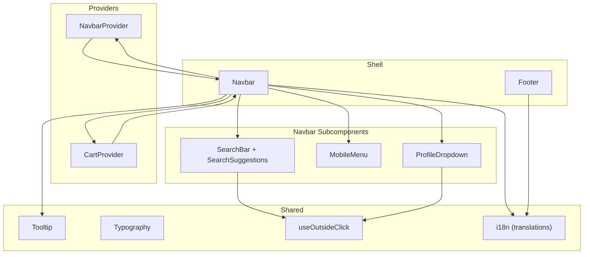
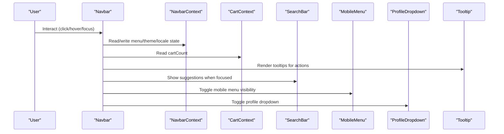
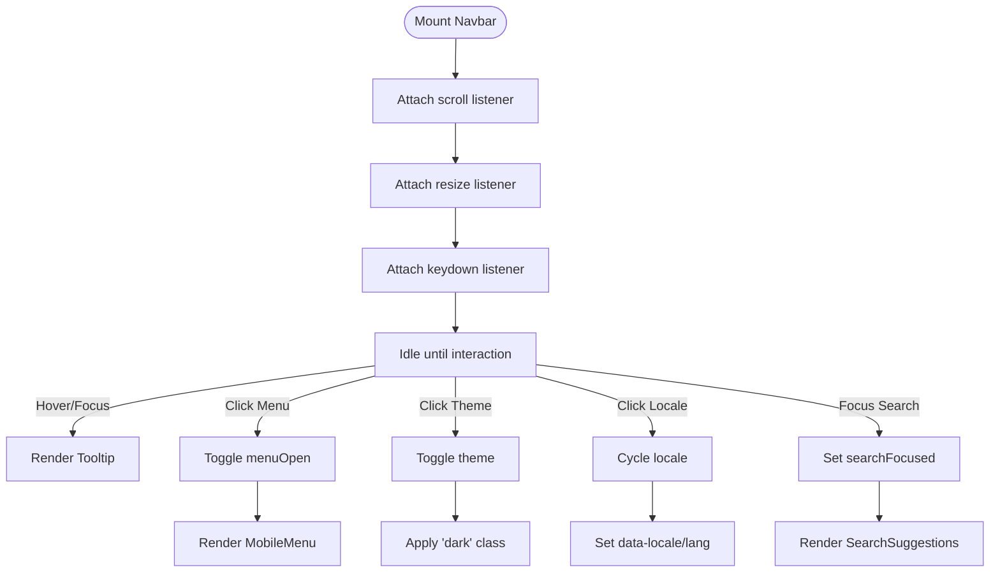
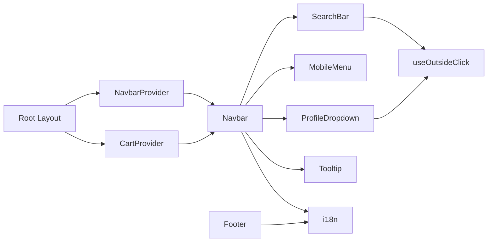

# UI Components

<cite>
**Referenced Files in This Document**
- [Navbar.tsx](file://src/components/Navbar.tsx)
- [NavbarContext.tsx](file://src/components/Navbar/NavbarContext.tsx)
- [SearchBar.tsx](file://src/components/Navbar/SearchBar.tsx)
- [MobileMenu.tsx](file://src/components/Navbar/MobileMenu.tsx)
- [ProfileDropdown.tsx](file://src/components/Navbar/ProfileDropdown.tsx)
- [CartContext.tsx](file://src/components/Cart/CartContext.tsx)
- [Typography.tsx](file://src/components/Typography.tsx)
- [Tooltip.tsx](file://src/components/Tooltip.tsx)
- [Footer.tsx](file://src/components/Footer.tsx)
- [useOutsideClick.ts](file://src/hooks/useOutsideClick.ts)
- [i18n.ts](file://src/utils/i18n.ts)
- [layout.tsx](file://src/app/layout.tsx)
</cite>

## Table of Contents
1. [Introduction](#introduction)
2. [Project Structure](#project-structure)
3. [Core Components](#core-components)
4. [Architecture Overview](#architecture-overview)
5. [Detailed Component Analysis](#detailed-component-analysis)
6. [Dependency Analysis](#dependency-analysis)
7. [Performance Considerations](#performance-considerations)
8. [Troubleshooting Guide](#troubleshooting-guide)
9. [Conclusion](#conclusion)
10. [Appendices](#appendices)

## Introduction
This document describes the reusable UI components that power the next.in platform’s user interface. It focuses on:
- Navbar with mobile menu and search functionality
- Cart context provider for global state management
- Typography system for consistent text styling
- Tooltip component for user guidance
- Footer component for site-wide information

For each component, you will find props/attributes, events, customization options, usage patterns, responsive design details, accessibility features, Tailwind CSS styling approaches, lifecycle considerations, performance notes, and best practices for extending the library.

## Project Structure
The UI components are organized under src/components, with shared contexts and hooks supporting them. The root layout wires providers around the application shell.

**Diagram sources**
- [layout.tsx:40-62](file://src/app/layout.tsx#L40-L62)
- [Navbar.tsx:1-267](file://src/components/Navbar.tsx#L1-L267)
- [NavbarContext.tsx:1-124](file://src/components/Navbar/NavbarContext.tsx#L1-L124)
- [SearchBar.tsx:1-185](file://src/components/Navbar/SearchBar.tsx#L1-L185)
- [MobileMenu.tsx:1-225](file://src/components/Navbar/MobileMenu.tsx#L1-L225)
- [ProfileDropdown.tsx:1-261](file://src/components/Navbar/ProfileDropdown.tsx#L1-L261)
- [CartContext.tsx:1-228](file://src/components/Cart/CartContext.tsx#L1-L228)
- [Tooltip.tsx:1-229](file://src/components/Tooltip.tsx#L1-L229)
- [Typography.tsx:1-149](file://src/components/Typography.tsx#L1-L149)
- [useOutsideClick.ts:1-27](file://src/hooks/useOutsideClick.ts#L1-L27)
- [i18n.ts:1-704](file://src/utils/i18n.ts#L1-L704)

**Section sources**
- [layout.tsx:40-62](file://src/app/layout.tsx#L40-L62)

## Core Components
- Navbar: Global navigation bar with theme toggle, language switcher, inline search, cart badge, profile dropdown, and a responsive mobile menu.
- Cart Provider: Global shopping cart state with persistence, reservation code generation, expiry countdown, and stock simulation helpers.
- Typography: A unified text system with variants, colors, weights, alignment, and spacing utilities.
- Tooltip: A portal-based tooltip with placement control, delay, and keyboard/mouse interactions.
- Footer: Site-wide footer with localized links, social icons, and legal bar.

Key integration points:
- Providers wrap the app shell in the root layout.
- Navbar consumes both NavbarContext and CartContext.
- Footer uses NavbarContext for locale-driven translations.
- Tooltip is used across interactive elements to provide contextual guidance.

**Section sources**
- [layout.tsx:40-62](file://src/app/layout.tsx#L40-L62)
- [Navbar.tsx:1-267](file://src/components/Navbar.tsx#L1-L267)
- [CartContext.tsx:1-228](file://src/components/Cart/CartContext.tsx#L1-L228)
- [Typography.tsx:1-149](file://src/components/Typography.tsx#L1-L149)
- [Tooltip.tsx:1-229](file://src/components/Tooltip.tsx#L1-L229)
- [Footer.tsx:1-155](file://src/components/Footer.tsx#L1-L155)

## Architecture Overview
The UI layer is composed of composable components driven by React Contexts. The Navbar orchestrates user-facing controls and delegates to subcomponents. The Cart context persists state and exposes actions. The Tooltip provides accessible overlays via portals. The Footer renders localized content based on the active locale.

**Diagram sources**
- [Navbar.tsx:1-267](file://src/components/Navbar.tsx#L1-L267)
- [NavbarContext.tsx:1-124](file://src/components/Navbar/NavbarContext.tsx#L1-L124)
- [CartContext.tsx:1-228](file://src/components/Cart/CartContext.tsx#L1-L228)
- [SearchBar.tsx:1-185](file://src/components/Navbar/SearchBar.tsx#L1-L185)
- [MobileMenu.tsx:1-225](file://src/components/Navbar/MobileMenu.tsx#L1-L225)
- [ProfileDropdown.tsx:1-261](file://src/components/Navbar/ProfileDropdown.tsx#L1-L261)
- [Tooltip.tsx:1-229](file://src/components/Tooltip.tsx#L1-L229)

## Detailed Component Analysis

### Navbar
Responsibilities:
- Provide top-level navigation, branding, and quick actions.
- Manage scroll-aware shadowing and responsive behavior.
- Integrate search input and suggestion panel.
- Expose theme and locale toggles.
- Display cart count badge and profile dropdown.
- Render mobile slide-down menu.

Props/Attributes:
- No direct props; behavior is controlled via NavbarContext.

Events:
- Scroll listener updates scrolled state.
- Resize listener closes mobile menu at desktop breakpoints.
- Keyboard Escape closes mobile menu.

Customization:
- Theme toggle switches light/dark via class on documentElement.
- Locale switch cycles through supported locales and sets data attributes.

Usage patterns:
- Wrap the app with NavbarProvider in the root layout.
- Use useCart to read cartCount for the badge.
- Use Tooltip to annotate actionable items.

Responsive design:
- Desktop: horizontal nav links, inline search, right-side actions.
- Mobile: hamburger button reveals slide-down menu with search and user section.

Accessibility:
- aria-labels on buttons and links.
- aria-expanded on mobile menu trigger.
- Escape key support to close menus.

Styling approach:
- Tailwind utility classes for layout, spacing, typography, and dark mode.
- Backdrop blur and ring utilities for glass-like surfaces.

Lifecycle:
- Mount: attach scroll/resize/keydown listeners.
- Unmount: remove listeners to prevent leaks.

Best practices:
- Keep menuOpen state centralized in NavbarContext.
- Avoid heavy computations inside render; rely on memoized values where needed.

**Section sources**
- [Navbar.tsx:1-267](file://src/components/Navbar.tsx#L1-L267)
- [NavbarContext.tsx:1-124](file://src/components/Navbar/NavbarContext.tsx#L1-L124)
- [SearchBar.tsx:1-185](file://src/components/Navbar/SearchBar.tsx#L1-L185)
- [MobileMenu.tsx:1-225](file://src/components/Navbar/MobileMenu.tsx#L1-L225)
- [ProfileDropdown.tsx:1-261](file://src/components/Navbar/ProfileDropdown.tsx#L1-L261)
- [CartContext.tsx:1-228](file://src/components/Cart/CartContext.tsx#L1-L228)
- [Tooltip.tsx:1-229](file://src/components/Tooltip.tsx#L1-L229)
- [i18n.ts:1-704](file://src/utils/i18n.ts#L1-L704)

#### Navbar Interaction Flow

**Diagram sources**
- [Navbar.tsx:1-267](file://src/components/Navbar.tsx#L1-L267)
- [NavbarContext.tsx:1-124](file://src/components/Navbar/NavbarContext.tsx#L1-L124)
- [SearchBar.tsx:1-185](file://src/components/Navbar/SearchBar.tsx#L1-L185)
- [MobileMenu.tsx:1-225](file://src/components/Navbar/MobileMenu.tsx#L1-L225)

### Cart Context Provider
Responsibilities:
- Maintain cart items, counts, and expiration state.
- Persist cart and configuration to localStorage.
- Generate a reservation code per session/cart.
- Compute time remaining until cart expires.
- Simulate out-of-stock status for expired reservations.

Public API:
- State:
  - cartItems: array of CartItem
  - cartCount: number
  - abandonTimeoutDays: number
  - lastInteractionTime: number
  - timeLeftMs: number
  - cartExpiredAlert: boolean
  - reservationCode: string
- Actions:
  - addToCart(item): add or alert if duplicate
  - removeFromCart(id): remove item
  - clearCart(): reset cart and code
  - setAbandonTimeoutDays(days): update timeout and persist
  - setCartExpiredAlert(show): show/hide alert
  - isItemOutOfStock(id): boolean helper

Data model:
- CartItem fields include id, productId, nameKey, descKey, imagePath, priceInRupees, size, brand, colorHex, colorName, quantity.

Persistence:
- Keys: next_in_cart, next_in_cart_time, next_in_cart_timeout, next_in_cart_code.

Expiry logic:
- Interval computes remaining milliseconds from lastInteractionTime and configured days.
- When expired, timeLeftMs becomes 0 and items may be considered out of stock.

Usage patterns:
- Wrap app with CartProvider.
- Consume via useCart hook in any descendant component.

Accessibility:
- Alerts are implemented via browser alerts in current implementation; consider replacing with in-app notifications for better UX.

Best practices:
- Avoid synchronous DOM access during SSR; guard with window checks.
- Debounce frequent writes if expanding persistence.

**Section sources**
- [CartContext.tsx:1-228](file://src/components/Cart/CartContext.tsx#L1-L228)

### Typography System
Purpose:
- Provide consistent text styles across the application using a variant-driven system.

Props:
- variant: h1..h6, subtitle1, subtitle2, body1, body2, caption, overline
- as: override rendered element type
- color: default, muted, primary, secondary, success, warning, error, inherit
- weight: light, normal, medium, semibold, bold, extrabold
- align: left, center, right, justify
- gutterBottom: boolean to apply bottom margin based on variant
- className: additional Tailwind classes
- children: node content

Behavior:
- Maps variant to default HTML tag and style strings.
- Composes color, weight, alignment, and spacing classes.

Usage patterns:
- Use Typography instead of raw headings/paragraphs to enforce consistency.
- Override as for semantic flexibility while preserving visual style.

Accessibility:
- Respect semantic tags by default; ensure proper heading hierarchy when overriding.

**Section sources**
- [Typography.tsx:1-149](file://src/components/Typography.tsx#L1-L149)

### Tooltip
Purpose:
- Provide contextual, non-intrusive hints near interactive elements.

Props:
- content: ReactNode shown in tooltip
- placement: top, top-start, top-end, bottom, bottom-start, bottom-end, left, left-start, left-end, right, right-start, right-end
- delay: ms before showing
- children: single React element to attach listeners to
- className: optional extra classes

Behavior:
- Clones child to attach mouse/focus events without wrapper pollution.
- Computes position relative to trigger and applies transform.
- Renders via createPortal into document.body.
- Supports delayed show and immediate hide.

Accessibility:
- Sets role="tooltip", aria-describedby on trigger, and aria-hidden on tooltip when hidden.

Usage patterns:
- Wrap buttons/links to provide concise guidance.
- Use appropriate placement to avoid clipping.

**Section sources**
- [Tooltip.tsx:1-229](file://src/components/Tooltip.tsx#L1-L229)

### Footer
Purpose:
- Present site-wide navigation, branding, social links, and legal info.

Features:
- Localized headers and link labels via i18n.
- Social icon grid with hover states.
- Responsive grid layout.

Integration:
- Uses useNavbar to get current locale and fetch translations.

Accessibility:
- Semantic footer element and anchor links.
- aria-labels on social icons.

**Section sources**
- [Footer.tsx:1-155](file://src/components/Footer.tsx#L1-L155)
- [NavbarContext.tsx:1-124](file://src/components/Navbar/NavbarContext.tsx#L1-L124)
- [i18n.ts:1-704](file://src/utils/i18n.ts#L1-L704)

### SearchBar and SearchSuggestions
SearchBar:
- Controlled input bound to NavbarContext searchQuery/searchFocused.
- Clear button and “Go” action when query present.
- Outside click and Escape key to dismiss focus.

SearchSuggestions:
- Panel with quick categories and trending tags.
- Animations for open/close transitions.
- Outside click handling to dismiss.

Accessibility:
- aria-hidden toggled based on visibility.
- Keyboard Escape support.

**Section sources**
- [SearchBar.tsx:1-185](file://src/components/Navbar/SearchBar.tsx#L1-L185)
- [useOutsideClick.ts:1-27](file://src/hooks/useOutsideClick.ts#L1-L27)

### ProfileDropdown
Features:
- Guest vs logged-in views with demo sign-in flow.
- Links to account, orders, listings, admin console.
- Outside click and Escape key to dismiss.

Accessibility:
- aria-expanded on trigger.
- aria-labels on actions.

**Section sources**
- [ProfileDropdown.tsx:1-261](file://src/components/Navbar/ProfileDropdown.tsx#L1-L261)
- [useOutsideClick.ts:1-27](file://src/hooks/useOutsideClick.ts#L1-L27)

### MobileMenu
Features:
- Slide-down menu with search input and navigation links.
- Conditional user section with demo login and logout flows.

Accessibility:
- aria-hidden toggled based on menuOpen.
- Keyboard Escape support in parent Navbar.

**Section sources**
- [MobileMenu.tsx:1-225](file://src/components/Navbar/MobileMenu.tsx#L1-L225)
- [Navbar.tsx:1-267](file://src/components/Navbar.tsx#L1-L267)

## Dependency Analysis
High-level dependencies between components and contexts:

**Diagram sources**
- [layout.tsx:40-62](file://src/app/layout.tsx#L40-L62)
- [Navbar.tsx:1-267](file://src/components/Navbar.tsx#L1-L267)
- [NavbarContext.tsx:1-124](file://src/components/Navbar/NavbarContext.tsx#L1-L124)
- [CartContext.tsx:1-228](file://src/components/Cart/CartContext.tsx#L1-L228)
- [SearchBar.tsx:1-185](file://src/components/Navbar/SearchBar.tsx#L1-L185)
- [MobileMenu.tsx:1-225](file://src/components/Navbar/MobileMenu.tsx#L1-L225)
- [ProfileDropdown.tsx:1-261](file://src/components/Navbar/ProfileDropdown.tsx#L1-L261)
- [Tooltip.tsx:1-229](file://src/components/Tooltip.tsx#L1-L229)
- [Footer.tsx:1-155](file://src/components/Footer.tsx#L1-L155)
- [useOutsideClick.ts:1-27](file://src/hooks/useOutsideClick.ts#L1-L27)
- [i18n.ts:1-704](file://src/utils/i18n.ts#L1-L704)

**Section sources**
- [layout.tsx:40-62](file://src/app/layout.tsx#L40-L62)

## Performance Considerations
- Navbar:
  - Scroll and resize listeners are attached once and cleaned up on unmount.
  - Consider debouncing scroll updates if adding heavy operations.
- Cart:
  - Expiry interval runs every 100ms; throttle or reduce frequency if rendering heavy consumers.
  - localStorage reads/writes are guarded and minimal; batch updates if expanding state.
- Tooltip:
  - Portal rendering avoids reflows in main tree; keep content lightweight.
- Typography:
  - Pure presentational component; negligible runtime cost.
- Footer:
  - Static structure with localized text; efficient.

[No sources needed since this section provides general guidance]

## Troubleshooting Guide
Common issues and resolutions:
- Tooltip not appearing:
  - Ensure children is a single React element.
  - Verify placement does not cause clipping; adjust placement or container overflow.
- Cart not persisting:
  - Confirm running in client environment; check localStorage availability.
  - Validate JSON parsing and storage keys.
- Navbar locale/theme not applying:
  - Check document.documentElement class/data attributes after toggling.
- Dropdowns not closing:
  - Ensure outside click refs are correct and not missing event propagation.

**Section sources**
- [Tooltip.tsx:1-229](file://src/components/Tooltip.tsx#L1-L229)
- [CartContext.tsx:1-228](file://src/components/Cart/CartContext.tsx#L1-L228)
- [NavbarContext.tsx:1-124](file://src/components/Navbar/NavbarContext.tsx#L1-L124)
- [useOutsideClick.ts:1-27](file://src/hooks/useOutsideClick.ts#L1-L27)

## Conclusion
The next.in UI component library emphasizes composability, accessibility, and responsiveness. Contexts centralize state for navigation and cart, while small, focused components like Tooltip and Typography promote consistency. Tailwind CSS enables rapid styling with dark mode support. By following the provided patterns and best practices, teams can extend the library safely and maintain a cohesive user experience.

[No sources needed since this section summarizes without analyzing specific files]

## Appendices

### Integration Examples (by reference)
- Root layout wiring:
  - [layout.tsx:40-62](file://src/app/layout.tsx#L40-L62)
- Navbar usage of contexts and subcomponents:
  - [Navbar.tsx:1-267](file://src/components/Navbar.tsx#L1-L267)
- Cart consumer example (badge in Navbar):
  - [Navbar.tsx:170-185](file://src/components/Navbar.tsx#L170-L185)
- Typography usage in pages:
  - [cart page usage:107-117](file://src/app/cart/page.tsx#L107-L117)

### Accessibility Checklist
- All interactive elements have descriptive aria-labels.
- Menus and tooltips expose roles and aria attributes.
- Keyboard navigation supports Escape to close overlays.
- Color contrast adheres to neutral and primary palettes in both themes.

### Extending the Library
- Add new variants to Typography by updating maps and defaults.
- Extend NavbarContext with new flags (e.g., announcement banner).
- Implement custom placements for Tooltip by adding origin and arrow mappings.
- Expand Footer columns by adding entries to the configuration arrays and corresponding translation keys.